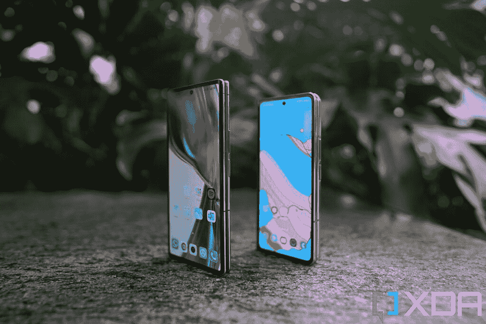

# 三星 Galaxy Z Fold 5:我们希望看到的五件事

> 原文：<https://www.xda-developers.com/samsung-galaxy-z-fold-5/>

三星是可折叠手机无可争议的先驱，其 [Galaxy Z Fold 4](https://www.xda-developers.com/samsung-galaxy-z-fold-4-review/) 确实是目前可购买的[最好的可折叠手机](https://www.xda-developers.com/best-foldable-phones/)。但如果我告诉你，三星实际上并没有制造最尖端的可折叠硬件，那会怎么样？Z Fold 4 在顶部的位置更多地与软件抛光和竞争对手缺乏市场供应有关，而不是实际的折叠机制。

比如小米的 Mix Fold 2，*明显更薄；* [Vivo 的 X Fold](https://www.xda-developers.com/vivo-x-fold-hands-on/) 和华为的 Mate X2 拥有更先进的相机系统，拥有更大的相机传感器和潜望镜变焦镜头。Oppo Find N 的屏幕几乎没有褶皱，充电速度也快得多。所有这些手机都可以完全折叠，而 Z Fold 4 仍然不能。

Z Fold 4 仍然是最好的，因为它有最精致的软件，最强的第三方应用支持，最实用的多任务系统，加上额外的安心功能，如官方 IP 防水评级。但不可否认的是，如果我们纯粹从硬件上来评判这些设备，特别是弯曲和折叠的部分，三星的可折叠手机落后于竞争对手。

作为一个几乎测试过所有发布的可折叠手机的人，我可以想到三星可以通过不可避免的 Z Fold 5 改进的一些事情。这五条中，前四条完全是合理的要求，因为其他品牌已经成功地把它们给了消费者。只有最后一个愿望，可以认为是一厢情愿。

## 更薄的折叠形式，没有间隙

 <picture></picture> 

Xiaomi Mix fold 2 (left) and Galaxy Z Fold 4 (right)

自 2019 年第一次 Galaxy Fold 以来，三星的可折叠产品一直无法完全折叠，在折叠点留下了一个缺口，增加了设备的厚度。考虑到 Galaxy Fold 的先锋性质，2019 年，甚至 2020 年的时候都情有可原。然而，现在是 2022 年，在这一点上，除了设计缺陷，它不能被称为任何东西。其他可折叠手机已经能够折叠平坦而没有任何明显的副作用至少两年了。

 <picture></picture> 

The Xiaomi Mix Fold 2 (right) is so, so much thinner than the Galaxy Z Fold 4. 

Galaxy Z Fold 4(左)和小米 Mix Fold 2(右)。

随着小米 Mix Fold 2 的发布，这个问题变得更加不和谐，小米 Mix Fold 2 薄得令人难以置信，展开时只有 5.4 毫米，折叠时只有 11.2 毫米。相比之下，Galaxy Z Fold 4 展开后的尺寸为 6.3 毫米，由于有间隙，其最厚处的厚度为 15.8 毫米。Fold 4 的铰链角与小米可折叠手机中较软的角相比也略尖，因此许多用户需要一个 [Fold 4 保护套，](https://www.xda-developers.com/best-samsung-galaxy-z-fold-4-cases/)不是为了防摔，而是为了软化铰链角。这里没有糖衣:Mix Fold 2 的手感明显好于 Z Fold 4，[正如我们在评论中发现的](https://www.xda-developers.com/xiaomi-mix-fold-2-review)。

不像平板手机，追求薄有时会感觉肤浅，大多数可折叠手机可以使用瘦身，因为它们可以感觉像两部手机堆叠在一起。我不会说小米的可折叠手机已经完全解决了这个问题，但它在折叠状态下比之前的任何可折叠手机都更接近“普通”手机。在使用了几个星期后，回到 Fold 4 是不和谐的和令人讨厌的。三星不得不将其可折叠设计瘦身。

## 去掉显示器的折痕

 <picture></picture> 

The Galaxy Z Fold 2 screen showing a deep crease next to a Huawei foldable without a crease. Even now, the Z Fold 4 has made no progress on this front. 

另一个从第一天开始就存在的明显的设计缺陷是非常明显的折痕。这也是我们作为消费者在早期接受的必要妥协，但在此后的几年里，几款可折叠手机使用了相同的内部折叠设计，但不知何故，成功地使屏幕折痕更加不明显。看看这里一个三星可折叠旁边一个华为和 Oppo 可折叠的照片就知道了。

 <picture></picture> 

A Samsung foldable display crease (right) next to a Chinese foldable with a far less prominent crease. 

Z 形折叠中出现严重折痕的原因是由于折叠机制:三星的铰链设计使显示屏折叠在一个点上，就好像你将一张纸对折，然后在折叠点上按下。几乎所有其他可折叠手机，如 Oppo Find N，都采用了所谓的“水滴”设计，即显示屏塞入铰链内置的空腔中，可以以更柔和的角度折叠，如下图所示。

 <picture></picture> 

A marketing render showing the so-called waterdrop folding mechanism used by almost all non-Samsung foldables. 

当这种水滴折叠设计首次在 2019 年的摩托罗拉 Razr 和 2021 年的华为 Mate X2 中推出时，仍有理由支持三星的设计，因为摩托罗拉和华为的铰链都不能保持在中间折叠的位置(三星称之为“灵活模式”)。但现在已经不是这样了。像 Oppo Find N 和 Vivo X Fold 这样的手机提供了 Flex 模式，同时保持了无褶皱、水滴设计。三星没有充分的理由继续坚持客观上更丑陋的折叠设计。

## 给 Fold 5 你最好的相机系统，三星

 <picture></picture> 

The Galaxy Z Fold 4's camera system is much improved but it's still not Samsung's best possible camera offering. 

尽管 Galaxy Z Fold 系列是三星最昂贵的移动产品系列，并且显然是该公司认为移动产品的未来发展方向，但它从未获得三星最好的相机系统。事实上，直到 Fold 4，Galaxy Z Fold 系列的相机硬件与三星的中端手机不相上下。直到今年的 Fold 4，三星才最终将相机光学系统升级到足以被称为旗舰相机的水平，但即使如此，这些也只是三星的基本型号旗舰规格。

Galaxy Z Fold 4 的相机系统基本上与标准 Galaxy S22 上使用的系统相同，它本身与标准 Galaxy S21 基本上没有变化。这些相机能够覆盖通常的广角、超广角和长焦范围，但缺乏三星 Galaxy S22 Ultra 中使用的大型传感器和潜望镜魔术。

不要认为 Fold 4 没有大型传感器主摄像头或潜望镜变焦镜头与技术限制有任何关系，因为华为和 Vivo 的可折叠产品再次实现了这一点。如果这些公司能做到，三星当然也能。我希望通过 Fold 5，三星将不再阻碍其最高端手机的光学系统，而是尽可能给我们最好的相机技术。我们希望在文件夹 5 中放大 10 倍空间！

## 再扩大一点宽高比

三星今年对 Galaxy Z Fold 4 进行了一项微妙的改进，即加宽了显示屏的纵横比。这是一个不到 2mm 的非常微妙的增加，但它提高了外部“覆盖显示器”的可用性，主要是因为三星为 Galaxy Z Fold 2 和 3 选择的长宽比太窄了。

对于 Fold 5，三星应该考虑变得更宽，至少宽一点，这样折叠形式的手机会感觉更接近普通手机。对我来说，Fold 4 的外部屏幕仍然有点太窄，无法舒适地输入，Instagram 等应用在这样一个细长的显示器上看起来仍然很奇怪。

## 给 S Pen 一个专用插槽

Galaxy Z Fold 系列在 2021 年获得了对三星 S Pen 的支持，但与流行的 Galaxy Note 系列不同，S Pen 没有包含在手机中，而且 Fold 的机身中没有放置触控笔的地方。这意味着 S Pen 不仅是一个额外的购买，而且大多数用户还必须购买一个特殊的外壳，以便将手写笔放在手机上。

如果三星只是在 Fold 5 的底座里建一个筒仓，S Pen 可以去的地方，那不是很好吗？毕竟，这是 Galaxy Note 系列的主要卖点之一，Fold 系列在某种程度上取代了它。

然而，我知道在折叠手机上添加专用的触控笔插槽比在典型的平板手机上添加更困难，因为折叠手机的构造过程更复杂，移动部件更多。还有前面提到的可折叠材料的厚度/重量问题，给包装增加专用触控笔只会增加负担。在 Fold 机身内留出手写笔的空间也会占用宝贵的空间，这些空间可以用于更重要的组件，比如更大的电池或更好的扬声器。

这就是为什么我称之为一厢情愿的想法，因为我不会为了一支 S Pen 而牺牲电池寿命或薄度/重量。但是，嘿，随着智能手机技术不断取得突破，这可能会在 Fold 6 上实现。

* * *

三星为什么还落后？部分原因是，至少部分原因是三星有意识的决定。该公司一直在努力使其可折叠手机更加主流，为此，降低价格比追求新的突破更重要。事实上，竞争对手的可折叠手机虽然硬件可以说更好，但在中国以外的任何地方都没有销售，这使得三星更容易做出每年适度升级硬件的决定。

希望 2023 年事情有所改变。随着 Honor 等中国品牌确认将在全球推出可折叠手机，以及传言 Oppo/一加也将采取同样的做法，再加上传言中即将出现的谷歌可折叠手机，也许这些都会迫使三星最终在即将到来的 Z Fold 5 上进一步拓展边界。

Galaxy Z Fold 4 带回了 Fold 3 的所有优点，外加一个更好的相机系统，一个稍宽的外部屏幕和更智能的软件。