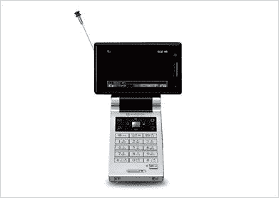
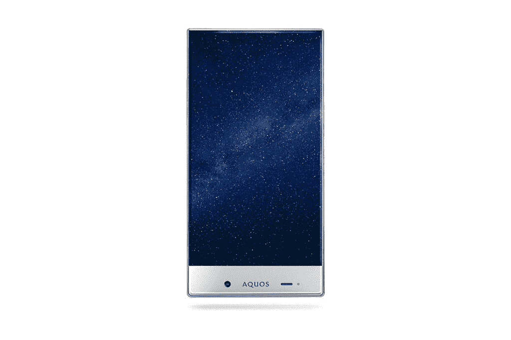
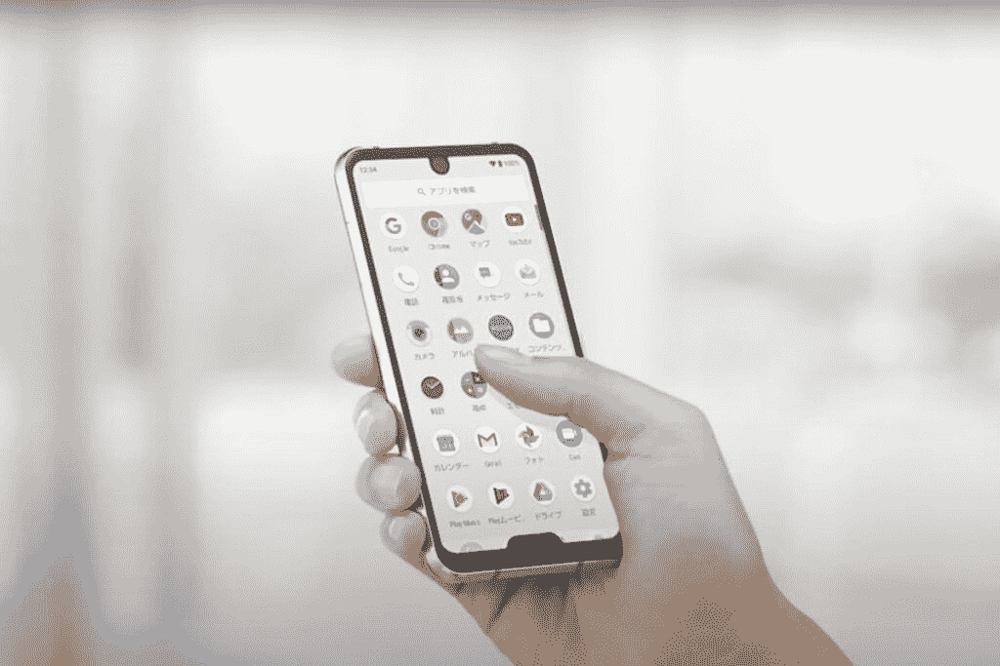
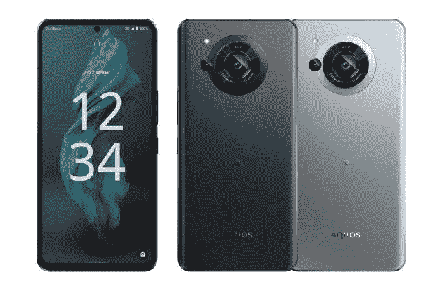

# 夏普 Aquos R7 手把手:夏普需要为成为第一名而获得更多荣誉

> 原文：<https://www.xda-developers.com/sharp-aquos-r7-hands-on/>

当我们谈论处于创新前沿的智能手机原始设备制造商时，我们不会特别经常地重复“夏普”这个名字，尽管它对今天的手机行业做出了贡献。虽然开始有点模糊，但夏普被认为是首批推出手机集成摄像头的公司之一，允许日本人在旅途中拍摄照片并发送给亲人。简单地说，这是革命性的。过去三十年来，夏普一直致力于创新，创造了许多“世界第一”的时刻。然而，我们很少谈论公司。随着夏普 Aquos R7 的发布，我们认为这将是庆祝这款手机和公司的最佳时机，让它有更多的时间处于聚光灯下。

## 夏普的历史及其创新

关于哪家公司生产了第一款集成摄像头的手机，有很多争论，但在谈话中总是出现的一个名字是夏普。该公司于 2000 年底在日本无线运营商 J-Phone (Softbank Mobile)上首次推出了 J-SH04，它具有 0.11 兆像素的传感器和 256 色显示屏。该公司多年来不断推动技术进步，在 T-Mobile 上推出了夏普 TM150，并成为美国市场上第一款 1MP 手机。

 <picture></picture> 

Sharp Aquos 905SH | Sharp Japan

后来，夏普推出了一款可以将显示屏旋转 90 度的手机，这是世界上第一款允许用户在进行多任务处理(打电话和编写电子邮件)的同时横向观看电视的手机。尽管现在多任务处理很普遍，但你可以想象在 2006 年这是多么的重要。

 <picture></picture> 

Sharp Aquos Crystal | Sharp Japan

转向 Android 手机，夏普在其 IGZO 显示技术的基础上实现了几项创新。夏普 Aquos Crystal 以其无边框设计让消费者一瞥智能手机的未来。虽然它从未真正达到伟大的高度，但这个设备是惊人的。夏普在设计上加倍努力，发布了水晶 2 和进一步完善的后续产品，夏普 Aquos Xx。

## 冒名顶替可以吗？有关系吗？

夏普采取了另一个飞跃，再次利用其显示技术，推出了首款 120Hz 显示屏的 Android 智能手机。该设备于 2015 年抵达日本，早于 Razer 手机，Razer 手机在 2017 年发布时宣称其技术是“世界首创”。当然，这款手机也依赖于夏普的技术，但没有太多关于该公司或其技术的信息。然而，我们在广泛的 [Razer 手机显示分析](https://www.xda-developers.com/razer-phone-display-analysis/)中强调了这一事实。

2017 年，夏普成为世界上第一个在显示器上推出泪珠图案的公司，这是一种必不可少的打击。夏普的加入不会被注意到，主要是因为它不是在一个全球舞台上，Essential 的公关机器在引人注目方面做得很好。

 <picture></picture> 

Sharp Aquos R2 Compact | Sharp Japan

夏普推出的 Aquos R2 紧凑型智能手机再次掀起波澜，这款智能手机向世界介绍了双剪切显示屏。该公司选择这条路线是因为它想最大化其设备的屏幕尺寸。当然，这是一种后天养成的习惯，但至少夏普在设计和功能方面突破了极限。

夏普习惯性地让别人因自己是第一个创新者而获得荣誉

夏普 Aquos R6(T1)来来去去，但它的 1 英寸摄像头传感器让社区兴奋了一会儿。从技术上来说，它不是第一个这样做的，但它是第一个在智能手机的机身上这样做的。该相机是与徕卡合作制造和校准的。它提供顶级规格，如 240 赫兹显示屏，在徕卡首次亮相之前，它与其他任何产品都不一样，这就是[莱茨手机 1](https://www.xda-developers.com/leica-letiz-phone-1-launch/) 。虽然它对手机做了一些表面上的改变，但基础与夏普 Aquos R6 一样。

夏普 Aquos R7 于 5 月发布，但直到最近才首次在日本零售。尽管提供了顶级的处理器，但这款手机的主要吸引力在于其 240 赫兹的显示屏和 4700 万像素的摄像头，这是由徕卡联合开发的。夏普 Aquos R7 有一个 1 英寸的索尼 IMX989 传感器，虽然该公司在技术上是第一个上市的，但小米已经采取了自己的[来吹捧](https://m.weibo.cn/detail/4785669886448679)它最近宣布[小米 12S Ultra](https://www.xda-developers.com/xiaomi-12s-ultra-hands-on/) 实际上是第一个。这里有一个技术性问题，因为夏普很可能将传感器裁剪成使用更小的镜头格式，而小米没有，这使得两家公司在不同方面都是“第一”。但夏普仍然需要一些信任。

## 夏普 Aquos R7 的实际操作

While we don't have a thorough hands-on of the Sharp Aquos R7, we did get some time with it at the local store in Japan (and a longer review is coming soon!). Since the device is a bit on the pricier side, it did take a couple of tries to be able to check out a live unit, as some stores just had dummy units. From a first impressions perspective, the phone is large but feels comfortable in hand. The exterior wasn't cold to the touch or slippery, and the staff informed me that it was made from "擦りガラス" or frosted glass (while I know the phone claims to have Gorilla Glass Victus on the front and back). The aluminum sides of the phone are squared off but have a soft edge that makes the phone a pleasure to hold.

在室内光线充足的环境下，手机的显示屏看起来很棒。虽然很难看到每个小细节，但由于夏普的 IGZO 有机发光二极管显示器，颜色看起来很有冲击力。手机上甚至有一个演示，允许用户将亮度提升到 2000 尼特的最大潜力，并启用 240 赫兹的刷新率。除此之外，设置菜单被锁定。和身边的工作人员说着话，他们给我看了盒子，很纤薄。从我的反应来看，他们让我知道零售盒子里只有几本手册，一个 USB-C 到 USB-A 的适配器，可悲的是，没有充电适配器或电缆。

这款手机的价格相对较高，为 189，360 美元，换算成美元约为 1400 美元。目前，日元相当疲软，即便如此，价格也令人眼红。正因为如此，大多数日本人可能永远不会购买它。对于那些真正感兴趣的人，日本的无线运营商提供了一个 48 个月的还清计划。这相当于一部智能手机四年内每月支付 3945 英镑(28 美元)。

幸运的是，我们大多数人都不必争论是否要买这部手机。我们永远不会看到或接触到这款设备，因为夏普永远不会把它带给全球观众。虽然夏普已经并将继续提供令人惊叹和印象深刻的设备，但它从未打算在其本土或世界其他地区推动该行业。它将让索尼、小米或其他任何公司因成为第一个创新者而获得荣誉。这是夏普多年来扮演的一个角色，我认为现在，你可能已经看到了这种模式。

 <picture></picture> 

Sharp Aquos R7

##### 夏普 Aquos R7

夏普 Aquos R7 是市场上少数几款配备 1 英寸摄像头传感器的智能手机之一。

夏普已经完成了许多“世界第一”，并且还在继续前进。它永远不会成为智能手机世界的领导者(从金钱业务成功的角度来说)，但我认为，花这个时间来认可夏普是没问题的，即使这只是一小段时间。谢谢夏普，继续创新。