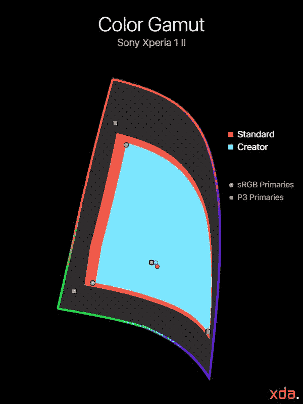
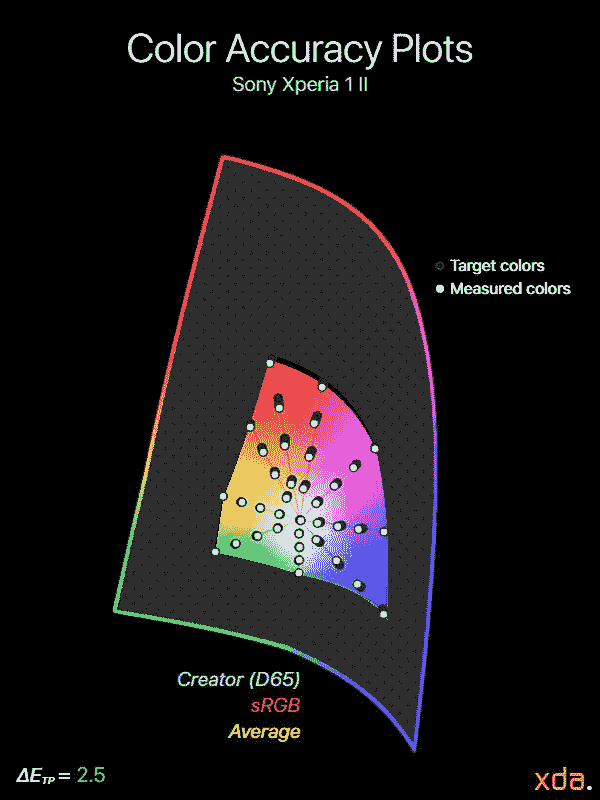

# 索尼 Xperia 1 II 显示器分析:内容创作者，当心

> 原文：<https://www.xda-developers.com/sony-xperia-1-ii-display-review/>

索尼公司是多媒体行业的巨人，它生产的电子产品在许多不同的层次和类别中都很受尊敬。从消费音频设备到 prosumer 相机和专业参考显示器，人们会认为索尼可以制造出一款结合该公司众多专业领域的手机。

不幸的是，他们过去的几部手机却不是这样。虽然索尼在单个产品部门取得了成功，但在将所有产品整合到一部手机中时，似乎缺乏协调。去年，[我评测了索尼第一款 Xperia 1 设备](https://www.xda-developers.com/sony-xperia-1-display-review/)的显示屏，这是一款索尼迎合内容创作者的手机。虽然对于大多数消费者来说，显示器本身看起来还不错，但我对索尼在校准方面采取的方向感到失望。对我来说，期望与索尼的主显示器(他们声称灵感来自于此)处于同一水平是不合理的，但我确实期望至少与他们的高端电视有一些相似之处。当我看到根本没有的时候，我很失望。

对于那些没有看过[评论](https://www.xda-developers.com/sony-xperia-1-display-review/)的人来说，索尼 Xperia 1 的显示屏缺乏真正符合 sRGB 标准的色彩配置；提供的创建者模式没有校准到 D65 白点，并且它(不一致地)为所有内容设定了 2.4 伽马功率的目标。虽然这并不意味着显示器校准不良(手机显示器不应该一开始就以 2.4 伽马功率为目标)，但手机不能在互联网同意使用的相同颜色标准内呈现内容，因此该设备不能与其他设备在相同标准下进行基准测试。索尼已经注意到了这个问题，我很高兴看到它在第二代 Xperia 1 设备索尼 Xperia 1 II(“马克 2 号”)中成功解决了这个问题。

## **索尼 Xperia 1 II 显示器评测集锦**

赞成的意见

*   最清晰的显示，没有任何彩色边缘
*   使用 D65 预设，在“创建者模式”下获得出色的色彩准确度
*   良好的 HDR 回放
*   “标准”配置文件中精确一致的对比度

骗局

*   峰值亮度落后于同价位的其他手机
*   Creator 模式下的平面图像对比度
*   没有高刷新率面板
*   接近最低亮度时，颜色一致性会下降

#### **所有像素**

索尼 Xperia 1 II 继续支持索尼在其旗舰智能手机中放置超宽 4K 显示屏的选择。在舒适的观看距离和显示器尺寸下，在 4K 分辨率面板上观看 4K 内容与在 1440p 面板上观看相同内容相比，差别很小。对于非 4K 本地的内容和应用程序，手机以 1440p 的分辨率呈现，以保留一些处理能力。由于增加像素密度的回报递减和 4K 的更高功耗，如果我现在设计智能手机显示屏，这不是我个人会做出的决定。然而，我知道索尼 Xperia 1 II 是一款小众产品，适合那些花大量时间监控 4K 内容的人。

#### **运动模糊减少**

With the Xperia 1 II, Sony added a new display feature called "Motion blur reduction" which helps reduce ghosting in fast-moving content. Most forms of effective motion blur reduction are achieved by inserting a black image in-between frames or by strobing the backlight of the display. However, that doesn't seem to be how it works on the Sony Xperia 1 II. Sony told [*Engadget Japan*](https://japanese.engadget.com/we-asked-sony-mobiles-developers-about-the-cameras-on-the-xperia-1-ii-and-their-thoughts-on-bringing-back-the-headphone-jack-082511658.html) that the Xperia 1 II "will increase the voltage in time with the activation of the OLED pixels when displaying an image," and that "even if you send the instruction to activate a pixel it takes some time to switch from black to white, which can result in the pixel looking grey." YouTuber [忍の動画](https://www.youtube.com/channel/UC8-vhKbviRe0LOru6hug8hQ) uploaded a handy [video](https://www.youtube.com/watch?v=pSARiAHZZ00) that compares the Sony Xperia 1 II's display with the motion blur reduction feature on and off:

[https://www.youtube.com/embed/pSARiAHZZ00](https://www.youtube.com/embed/pSARiAHZZ00)

视频

Motion blur comparison / Credit: [忍の動画](https://www.youtube.com/channel/UC8-vhKbviRe0LOru6hug8hQ)

虽然我们还没有得到官方的确认，但似乎索尼的功能旨在改善像素转换时间，而不是改善图像的持久性。这个角度的问题是，有机发光二极管上发光像素的过渡时间(G2G)几乎是瞬时的，持续时间(MPRT)是运动模糊的主要原因，索尼的功能没有改善。然而，在有机发光二极管上，黑色或接近黑色的颜色到类似色调的过渡时间实际上相当慢。这有时可以被视为显示器上黑色移动元素后面的蓝色或紫色拖尾，这是有机发光二极管显示器问世以来的结果。我很想知道索尼的功能是否改善了拖尾，但从我的测试来看，没有什么不同。我发现索尼的运动模糊减少是没有启发性的，无效的，不值得进一步研究。实现一个实际有效的运动模糊减少功能会削弱显示器的亮度，索尼 Xperia 1 II 没有太多的可用空间。无论如何，更高刷新率的面板每次都是更好的选择。

#### **显示面板**

索尼 Xperia 1 II 的显示硬件似乎是更早一代的三星面板。它仍然是 8 位面板，具有与去年相同的输出能力。根据 APL 的不同，面板的典型峰值亮度约为 550-650 尼特，其色域仅超过 DCI-P3。这在 2017 年和 2018 年被认为是三星面板的高端，但他们现在已经超过了这一水平-大约 750-900 尼特是你可以从今天的面板中预期的。我猜想索尼已经决定推迟更新的面板，也许是因为三星还没有生产 4K 分辨率的面板。

屏幕似乎不像竞争对手那样贴在玻璃顶部。虽然这种品质不会出现在测量中，但它可以被微妙地注意到，尤其是在一个角度上。面板的角色偏也不像我们目前的旗舰 OLEDs 那么低，尽管它无论如何都不是令人讨厌的。

#### **颜色配置文件**

 <picture></picture> 

Gamut for Creator+Standard

索尼保持简单，只有两种颜色配置文件。默认的“标准”配置文件比 sRGB 标准稍高一点的颜色饱和度，并将白点移动到相当冷的位置。“创建者模式”配置文件是显示器的颜色精确配置文件，旨在让内容创建者忠实地查看他们的工作。这两个分布图似乎都以相同的 2.20 伽马功率为目标，但是正如稍后评估的那样，这两个分布图之间的实际对比度是不同的。

“标准”配置文件显示冷 7800 K 白点(可能针对 D75)，其原色介于 sRGB 和 P3 颜色标准的原色之间。与 sRGB 相比，标准配置文件最多大 21%。它的红色增加了 13%,明显偏向橙色。绿色最多大 14%，保持相同的色调。蓝色大约大 9%，稍微偏向洋红色。如前所述，配置文件的色调映射类似于创建者模式的色调映射，其目标是 2.20 的标准灰度系数。

“创建者模式”的本意是“准确”的配置文件，最初在白点处错过了标记。默认情况下，该配置文件的白点约为 7100 K，明显低于标准的 6504 K。在这个白点上，该配置文件的颜色准确度不起眼；所有的色调都变蓝，但是，颜色混合看起来很好地适应了给定的白点。为了获得最精确的图像，必须将配置文件的白平衡设置为 D65。虽然这确实提高了色彩准确度，但面板和显示器配置文件实际上应该在工厂就已经校准到 D65，以获得最高的精确度。

这两种配置文件都允许用户调整白点，并将颜色校正(PCC)应用于单独的 RGB 颜色通道。索尼还提供标准光源的白点选择，即 D50、D55、D65、D75 和 D93。这是一个很好的补充，其他 OEM 应该提供一个选项，允许内容创作者在其他标准光源中看到他们的工作。

**采集数据的方法论**

为了从索尼 Xperia 1 II 的显示器中获得定量的颜色数据，我将特定于设备的输入测试模式放置到手机中，并使用 X-Rite i1Display Pro 测量显示器产生的发射，X-Rite i1Pro 2 分光光度计在其高分辨率 3.3 纳米模式下进行测量。我使用的测试模式和设备设置针对各种显示特性和可能改变我们所需测量的潜在软件实现进行了修正。除非另有说明，我的测量通常是在禁用显示相关选项的情况下进行的。我使用

*constant power*

模式(有时称为

*equal energy*

图案)，与大约 42%的平均像素水平相关，以测量传递函数和灰度精度。测量发射型显示器不仅要测量恒定的平均像素水平，还要测量恒定的功率模式，因为它们的输出取决于平均显示器亮度。此外，恒定的平均像素水平并不固有地意味着恒定的功率；我使用的模式满足这两者。我使用更高的平均像素水平(接近 50%)来捕捉较低像素水平和许多白色背景的应用程序和网页(像素水平较高)之间的中点。我使用最新的色差度量δ

*E[TP]* [(ITU-R BT.2124)](https://www.itu.int/dms_pubrec/itu-r/rec/bt/R-REC-BT.2124-0-201901-I!!PDF-E.pdf)

，这是一个

[overall better measure for color differences](https://www.ibc.org/publish/specifying-colour-tolerances-for-hdr-and-wcg-displays-/2449.article)

比δ

*E* [00]

这在我早期的评论中使用过，目前仍在许多其他网站的展示评论中使用。那些还在用δ的

*E* [00]

对于颜色误差报告，鼓励使用δ

*E[ITP.]*

Δ

*E[ITP]*

通常在计算中考虑亮度(强度)误差，因为亮度是完整描述颜色的必要组成部分。然而，由于人类视觉系统分别解释色度和亮度，我将我们的测试模式保持在恒定亮度，并且在我们的δ中不包括亮度(I/强度)误差

*E[ITP]*

价值观。此外，在评估显示器的性能时，将这两种错误分开是有帮助的，因为就像我们的视觉系统一样，它们属于显示器的不同问题。这样，我们可以更彻底地分析和理解显示器的性能。我们的颜色目标是基于 ITP 颜色空间，它比 CIE 1976 UCS 具有更好的色调线性，在感知上更均匀。我们的目标以 100 cd/m 的基准在整个 ITP 色彩空间中大致均匀地间隔开

²

白色级别，以及 100%、75%、50%和 25%饱和度的颜色。颜色是在 73%的刺激下测量的，假设伽马功率为 2.20，这相当于约 50%的亮度。在索尼 Xperia 1 II 显示器的整个亮度范围内测试了对比度、灰度和颜色准确性。在 PQ 空间中，亮度增量均匀分布在最大和最小显示亮度之间。图表和图形也绘制在 PQ 空间中(如果适用),用于正确表示对亮度的实际感知。δ

*E[TP]*

值大约是 3

× the magnitude of Δ*E*[00] values for the same color. The metric assumes the most critically-adapted viewing condition for the observer: A measured Δ*E[TP]* color difference value of 1.0 denotes a just-noticeable-difference for the color, while a value less than 1.0 signifies that the measured color is indistinguishable from perfect. For our reviews, a Δ*E[TP]* value of less than 3.0 is an acceptable level of accuracy for a reference display (suggested from ITU-R BT.2124 Annex 4.2), and a Δ*E[TP]* value greater than 8.0 is noticeable at a glance (tested empirically, and the value [8.0] also nicely lines up with a roughly 10% change in magnitude for luminance, which is generally the percentage needed to notice a difference in brightness at a glance).

HDR 测试模式是针对

[ITU-R BT.2100](https://www.itu.int/dms_pubrec/itu-r/rec/bt/R-REC-BT.2100-2-201807-I!!PDF-E.pdf)

使用感知量化器(ST 2084)。HDR sRGB 和 P3 图案与 sRGB/P3 原色均匀间隔，HDR 参考水平白色为 203 cd/m

² [(ITU-R BT.2408)](https://www.itu.int/dms_pub/itu-r/opb/rep/R-REP-BT.2408-2017-PDF-E.pdf)

，并且对于其所有模式，PQ 信号电平为 58%。所有 HDR 模式都是在 HDR 平均 20% APL 下用恒定功率测试模式测试的。

### **亮度**

索尼 Xperia 1 II 的峰值亮度与最初的 Xperia 1 相比几乎没有变化，如果不是稍微变暗的话。降低的原因是 Xperia 1 II 现在使显示器亮度与屏幕 APL 相等，导致当内容改变时，显示器白色水平几乎没有感知变化。这有助于提高内容对比度的准确性，但在某些情况下会牺牲亮度。与 Android 手机一样，只有在强光下，显示屏的实际峰值亮度才能在自动亮度模式下获得。在手动模式下，索尼 Xperia 1 II 的全屏(100% APL)亮度被限制在 350 尼特左右。

日光下 50% APL 亮度的中值平均约为 600 尼特，而最初的 Xperia 1 为 630 尼特。对于 HDR 内容，Xperia 1 II 的显示器将稍微提高小面积白色区域的亮度，峰值为 710 尼特，适用于 20% APL。这些值是三星 2017-2018 代面板的典型值，虽然它们仍然不错，但与拥有 800 尼特全屏亮度和真正 1000 尼特 HDR 高光的设备相比，它们没有竞争力，这是我们对这个价格的手机的期望。

我发现 Xperia 1 II 的另一个烦恼是，索尼仍然使用线性亮度值映射，当在较低水平调整亮度(手动或自动亮度)时，会导致明显的跳跃。不是太重要，但是表现出了一些打磨的不足。

### **对比度和色调映射**

Xperia 1 II 的显示屏最大的不同在于它的对比度。较新的索尼 Xperia 1 II 现在默认以标准的 2.2 伽马功率为目标，这是一个受欢迎的变化。最初的 Xperia 1 的目标是 2.4 伽马功率，这通常用于暗室电视校准。这对于真正的电影制作人(或那些填补空白的人)可能是有用的，但它不适合其他条件和大多数在智能手机上观看的内容。在正常情况下，较高的灰度系数会产生较陡的对比度和较暗的颜色。这里显而易见的选择是给用户一个选择的机会，这是索尼在任何一代设备中都没有做到的。然而，当在媒体播放器应用程序中观看视频时，显示器现在色调映射到 2.4 的伽马幂。如果能提供选择，那就更好了，但索尼的解决方案是一个坚实的中间地带，让我感到惊讶。

关于色调还原的表现，索尼 Xperia 1 II 显示器中的实际对比度很成问题。根据恒定 APL 和恒定功率模式进行评估，我测量了 Creator 模式，它显著提升了阴影，尤其是在较高亮度下。由于这一点，黑色挤压不是问题，但它会导致内容看起来褪色。最能描述 Xperia 1 II 传递函数的最合适的伽马幂将接近 1.90，这远低于 2.20 的标准。从好的方面来说，提升的阴影可以在更亮的光线下提高内容的可读性，但在典型的使用中，它只会产生更平坦的图像。如果变亮的阴影确实是为了让阳光更容易辨认，那么色调映射应该是环境照明的函数(我在暗室中测量显示器)，而不仅仅是显示器的亮度。Xperia 1 II 的显示屏对比度与第一代 Xperia 1 完全不同，第一代 Xperia 1 的对比度对于普通内容来说太大了。不幸的是，我没有时间在视频内容中测试显示器 2.40 伽马功率的准确性。

另一方面，标准模式似乎具有更精确和更好控制的图像对比度。这是矛盾的，因为标准模式并不意味着是精确的颜色配置文件，然而它在内容结构的基本再现中表现得更好。在较低的亮度下仍然有轻微的提升，在大约 80%的 PQ 亮度下有轻微的挤压，但因为它的相对色调准确性，我建议使用 Creator 模式上的标准配置文件进行色调映射阴影，同时使用 Creator 模式监控颜色饱和度。

### **白平衡和灰度精度**

标准配置文件和创建者模式的相应平均白点分别为 7800 K 和 7100 K。这两者都明显比 6504 K 的 D65 标准冷。鉴于 Creator mode 应该遵循内容创作者的颜色标准，像索尼那样冷校准白点是没有意义的。但是，白点是可调的，选择 D65 预设会将白点移近约 6600 K，总体颜色误差更小。

当在不同的系统亮度下显示相同的颜色时，我们的索尼 Xperia 1 II 显示出普通的颜色漂移，高于旗舰显示器应该显示的颜色漂移。两个配置文件的色差标准偏差都大于可察觉的阈值(δ*E[TP]*>3.0)，这意味着许多颜色位于平均测量色温之外。较低亮度下的较暗色调基本上是绿色，导致阴影和深色界面元素看起来平坦和倾斜。制造公差确实对较暗颜色的精度起着很大的作用，其他索尼 Xperia 1 II 显示单元可能会显得更一致(或更差)。然而，即使是较浅的颜色之间的适度传播表明，这可以是索尼质量控制的预期行为。

### **色彩准确度**

 <picture></picture> 

sRGB color accuracy for Creator (D65)

由于 D65 白点是我们的标准色彩空间的必要基础，Creator 模式的默认白点的冷校准最初并不准确。使用配置文件的默认白点，平均颜色误差δ*E[TP]*为 3.9，高于我们明显的阈值δ*E[TP]*>3.0。选择 D65 白平衡预设确实会显著改善测量，并且在大多数情况下会产生显著的颜色校准，平均颜色误差δ*E[TP]*为 2.5。然而，我发现在最低亮度附近有一个红色的不饱和，这在夜间观看时洗去了显示器的外观。我之前的灰度测量也显示面板的较暗色调偏向绿色，我们还可以看到我的较低亮度测量的白点偏向绿色。

### **HDR 回放**

随着我们最喜爱的流媒体服务平台上 HDR10 和杜比视界的数量稳步增长，我们可以更经常地利用我们高端显示面板的全部潜力。回放 HDR 内容目前是显示器输出能力的最佳展示，并且很容易成为消费者印象最深刻的显示体验。索尼 Xperia 1 II 的显示屏具有符合许多影院格式的长宽比，通过消除对信箱的需要，创建了无边框的电影观看体验。它还可以录制 HDR 格式的视频(尽管是在 HLG)，虽然我们距离采用和标准化还有很长的路要走，但它仍然令人印象深刻，让我们可以立即访问展示显示器性能的内容。

索尼 Xperia 1 II 很好地再现了标准的 HDR ST.2084 曲线，除了在接近黑色的颜色上略有凸起。Xperia 1 II 在 HDR 内容中的峰值典型亮度高达约 710 尼特，虽然没有达到 1000 尼特的标准，但足以在黑暗的观看环境中提供令人信服的明亮高光。此外，与我测试过的其他 Android 手机不同，索尼的 HDR 色彩管理系统实际上似乎对 1000 尼特 HDR 内容的峰值亮度应用了高达 75% PQ 信号水平的色调映射；其他 Android 手机通过滚降高达 100%的 PQ 信号电平来浪费亮度余量。对 BT.2100 显示器的 P3 色域进行短暂的饱和度扫描显示，其 HDR 色彩准确度尚可，尽管在红色和绿色方面略有不饱和。我还注意到，索尼的 HDR 显示模式不符合 Android 的标准色彩管理系统，只有少数白名单应用程序可以正确渲染 HDR 视频(主要是[谷歌照片](https://www.xda-developers.com/tag/google-photos/)和[网飞](http://xda-developers.com/tag/netflix))。许多其他媒体播放器，如 [VLC](https://www.xda-developers.com/tag/vlc/) ，不支持索尼 Xperia 1 II 上正常的 HDR 播放。我无法测试 Dolby Vision 的性能或兼容性(尽管据说第一代支持它)，但我认为它的性能与 HLG 类似。

### **结论**

索尼 Xperia 1 II 的售价约为 1200 美元，它的显示屏还不足以让我觉得它可以与三星、一加或苹果等公司竞争。手机的其他部分可以是完美的，但如果显示屏对我来说不够吸引人，那么它就没有用。鉴于创作者模式下色调映射的问题，我不能说它成功地填补了作为所有内容创作者的移动监控工具的空白。色调映射阴影可能非常微妙，与实际的参考显示器相比，Xperia 1 II 的显示器上看到的阴影太亮了。遗憾的是，我没有测量它的 Rec.709 视频播放输出(应该以 2.40 伽马功率为目标)，但如果它像它的通用色调映射一样，那么它对电影制作人来说就没用了。由于我认为对比度是图片准确性中最重要的因素，我只能建议在这部手机上使用白平衡设置为 D65 的标准配置文件，即使它的颜色有所增加。

去年，马克 2 号在阻止其前身被认为是顶级手机之一的领域有所改善，但它后退了两步，整整一年后，显示技术又向前迈出了一步。运动模糊减少在更高的刷新率面板面前绝对没有讨价还价的余地，4K 分辨率很容易被忘记，除非你经常在手机上使用 4K 内容。那些想要监控 HDR 内容的人可能也会因为看到它缺少近 300 尼特的高亮净空而感到不安。对于普通用户来说，在标准模式下，显示器是体面的，没有令人不快的问题，但无论是否是内容创作者，我认为它不值得 FOMO(害怕错过)，尤其是当你可以获得更便宜的手机和更好的显示器时。

**[索尼 Xperia 1 II 论坛](https://forum.xda-developers.com/sony-xperia-1-II)**

### 索尼 Xperia 1 II

通过 Xperia 1 II，索尼瞄准了内容创作者这一细分市场。虽然索尼自去年的 Xperia 1 以来确实提高了显示质量，但对于内容创作者来说，还有更好的选择。不过，索尼 Xperia 手机的普通用户和粉丝不会觉得这款显示器令人不快，因此可能会觉得 Xperia 1 II 值得购买。

**Affiliate Links**

Amazon

[View at Amazon](https://www.amazon.com/smartphone-autofocus-technology-enhanced-features/dp/B088MLX7C1?tag=xda-38b7vsc-20&ascsubtag=UUxdaUeUpU29429&asc_refurl=https%3A%2F%2Fwww.xda-developers.com%2Fsony-xperia-1-ii-display-review%2F&asc_campaign=Short-Term)

| **规格** | **索尼 Xperia 1 II** |
| --- | --- |
| **类型** | 有机发光二极管（Organic Light Emitting Diode 的缩写）五边形菱形像素 |
| **制造商** | 三星显示公司。 |
| **尺寸** | 6.0 英寸乘 2.6 英寸6.5 英寸对角线15.3 平方英寸 |
| **决议** | 3840×1644(本地)2560×1096(渲染)21:9 像素宽高比 |
| **像素密度** | 每英寸 455 个红色子像素每英寸 643 个绿色子像素每英寸 455 个蓝色子像素 |
| **像素锐度距离** *视力为 20/20 的可分辨像素距离。典型的智能手机观看距离约为 12 英寸* | < 7.6 英寸为全彩图像< 5.3 英寸为消色差图像 |
| **黑色削波阈值** *要削波的黑色信号电平* | <最大亮度 0.8%<1.2% @ min brightness |

| **规格** | **创建者模式** | **标准模式** |
| --- | --- | --- |
| **亮度** | **最小值:** 1.9 尼特**峰值 100% APL:** 602 尼特50% APL 峰值: 613 尼特峰值 HDR 20% APL: 711 尼特 | 最小: 1.8 尼特**峰值 100% APL:** 556 尼特**峰值 50% APL:** 564 尼特峰值 HDR 20% APL: 711 尼特 |
| **伽玛** *标准是 2.20 的直线伽玛* | 1.74–2.04 平均 1.92 | 1.99–2.25 平均 2.10 |
| **白点** *标准是 6504 K* | 7067kδ*E[TP]*= 5.2**D65:**6633kδ*E[TP]*= 1.2 | 7838kδ*E[TP]*= 8.8 |
| **色差***δ*E[TP]** | **sRGB:** 平均值δ*E[TP]*= 3.9**sRGB (D65):** 平均δ*E[TP]*= 2.5*优秀* | **比 sRGB** 的色域大 21%+13%红色饱和度，轻微移动橙色+14%绿色饱和度+9%绿色饱和度，略微移动洋红色 |