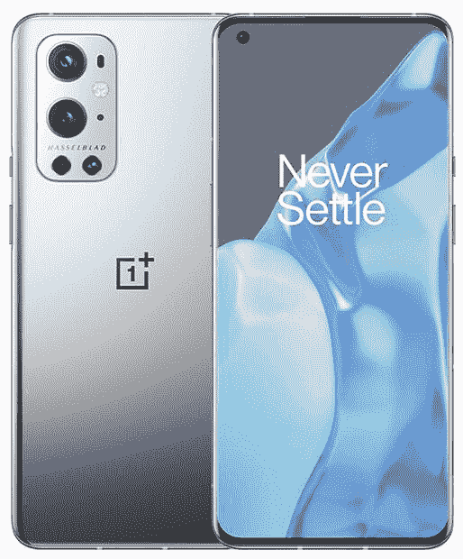

# TCL 20 Pro 5G vs 一加 9 Pro 5G:该买哪款旗舰？

> 原文：<https://www.xda-developers.com/tcl-20-pro-5g-vs-oneplus-9-pro-5g/>

几周前，TCL 将他们的 20 系列带到了美国。该系列最初于今年早些时候发布，包括 [TCL 20 SE、TCL 20S 和 TCL 20 Pro 5G](https://www.xda-developers.com/tcl-20/) 。TCL 20 Pro 5G 是该集团的顶级产品，发布时的建议零售价为 499.99 美元。如果你正在考虑这款手机，你可能会想知道它如何与更昂贵的旗舰产品相媲美，如[一加 9 Pro 5G](https://www.xda-developers.com/oneplus-9-pro-review/) 。

显然，这两款手机有很多共同点。如果你只看名字，你可以清楚地看到他们都支持 5G。但相似之处不止于此。这两款设备都采用了光滑的设计，漂亮的 AMOLED 显示屏和 4500 毫安时的电池。另一方面，一加 9 Pro 的价格是 TCL 20 Pro 的近两倍。额外的 500 美元真的值得吗？让我们找出答案。

**[TCL 20 Pro 5G XDA 论坛](https://forum.xda-developers.com/f/tcl-20-pro-5g.12221/) ||** **[一加 9 Pro 5G XDA 论坛](https://forum.xda-developers.com/f/oneplus-9-pro.12153/)**

## TCL 20 Pro 5G vs 一加 9 Pro 5G:规格

| 规格 | TCL 20 Pro 5G | 一加 9 Pro 5G |
| --- | --- | --- |
| **尺寸&重量** | 

*   6.47 英寸 x 2.87 英寸 x 0.35~0.36 英寸
*   6.7 盎司

 | 

*   163.2 x 73.6 x 8.7 毫米
*   197 克

 |
| **显示** | 

*   6.67 英寸 Dotch 显示屏
*   AMOLED 3D 玻璃
*   FHD+ (2400 x 1080)
*   20:9 60 赫兹

 | 

*   6.7 英寸 QHD+ LTPO AMOLED
*   3216 x 1440
*   525 PPI
*   20.1:9 宽高比
*   120 赫兹刷新率

 |
| **处理器** | 

*   高通骁龙 750G (SDM7225)
*   高通 Adreno 619 在 800 兆赫

 | 高通骁龙 888 |
| **风筒&储存** | 

*   256GB ROM / 6GB RAM
*   最高 1TB 的 microSDXC

 | 

*   8GB 内存+ 128GB 存储
*   12GB 内存+ 256GB 存储空间

 |
| **电池&充电** | 

*   4500 毫安时
*   最高 18W 高通快充 3.0
*   高达 15W Qi 无线充电

 | 

*   4500 毫安时电池
*   65W 翘曲充电有线快充
*   50W 无线快速充电
*   包括翘曲充电 65T 充电器

 |
| **安全** | 显示屏内指纹传感器 | 显示屏内指纹传感器 |
| **自拍相机** | 

*   32MP FF
*   液晶闪光灯
*   4K @ 30fps 视频

 | 

*   16MP，f/2.4
*   FF、EIS
*   1080p 视频，每秒 30 帧
*   时间流逝

 |
| **后置摄像头** | 

*   主要:4800 万像素(索尼 OIS)
*   中学:16MP(超宽)
*   高等教育:5MP(宏观)
*   四进制:2MP(深度)
*   双 LED 闪光灯
*   HDR、OIS、EIS
*   4K @ 30fps 视频

 | 

*   初级:4800 万像素，f/1.8
*   二级:50MP，超宽，f/2.2
*   第三代:800 万像素，3.3 倍长焦，f/2.4
*   四元:2MP，单色传感器
*   双 LED 闪光灯
*   HDR、OIS、EIS
*   8K @ 30fps 视频

 |
| **耳机插孔** |  |  |
| **音频** | 

*   扬声器箱
*   带噪声消除功能的双麦克风
*   超级蓝牙(一次连接 4 台设备)

 | 

*   双立体声扬声器
*   噪声消除支持
*   杜比大气

 |
| **连通性** | 

*   C 型，USB 2.0 USB OTG
*   蓝牙 5.1
*   没有双卡
*   WiFi 6
*   国家足球联盟
*   全球（卫星）定位系统

 | 

*   LTE 4×4 MIMO
*   SA/NSA 5G
*   Wi-Fi 6 2×2 MIMO(双频带)
*   蓝牙 5.2
*   国家足球联盟
*   全球（卫星）定位系统

 |
| **软件** | 安卓 11 | 搭载氧气操作系统的 Android 11 |
| **其他特性** | 

*   有月尘灰和海蓝色可选
*   显示屏内指纹传感器
*   5G 仅限于美国的 T-mobile

 | 

*   有松绿色和晨雾色可选
*   IP68 防尘防水等级
*   警报滑块

 |

**About this comparison:** *I received the TCL 20 Pro 5G from TCL for review. I purchased the OnePlus 9 Pro 5G at launch. Neither TCL nor OnePlus had any input in this article. *

## 设计和展示

把 TCL 20 Pro 5G 从盒子里拿出来，是一款非常好看的设备。我收到了月尘灰色，但我个人喜欢海洋蓝色的外观。手机两侧的弧形边缘给人一种圆滑的感觉，让我想起了 Galaxy S6 Edge。在背面，你会看到一个双色调的外观，相机一侧有光泽，其他地方无光泽。

一加 9 Pro 5G 的设计非常相似。两侧的弧形边缘与背部无缝衔接。在背面，一加的设备更简单一些。没有双色设计，而是根据颜色选择，获得简单的光泽或哑光表面。一加标志装饰在背面的正中央。这两款设备看起来都不错，但在一个充满相似外观智能手机的环境中，它们显然毫无吸引力。

在 TCL 20 Pro 上，四个摄像头传感器完全在后玻璃下面，这意味着没有烦人的摄像头驼峰。虽然我理解相机凸起有时对于提高照片质量是必要的，但完全平齐的背后的可爱美学值得注意。

有了一加 9 专业版，你会得到一个相当大的相机驼峰。如果你把手机放在一个平坦的表面上，这个凸起会导致打字时不稳定。就设计美学而言，这是 TCL 的胜利。

TCL 20 Pro 5G 在没有外壳的情况下也非常容易抓握，这要归功于前面提到的双色表面(尽管我在拍摄手机时进行了一次无意的跌落测试，稍后会有更多介绍)。根据我的经验，Oneplus 9 Pro 在没有外壳的情况下非常滑。我在家里摔过手机好几次，谢天谢地，只摔在地毯上。

这些弯曲的边缘在两款手机上都看起来非常漂亮，但它们确实让手持手机有点不舒服，老实说在许多情况下很棘手。对于这样一个戏剧性的曲线，几乎不可能消除无意的边缘触摸，所以这是需要考虑的事情。长时间拿着手机也会因为侧面的锋利而不太舒服。

TCL 20 Pro 有两个突出的设计特点，使其与一加 9 Pro 真正区分开来——3.5 毫米耳机插孔和红外发射器。考虑到这两种东西在五年前是多么常见，写下这句话很奇怪，但如今你在旗舰设备中真的看不到它们。我真的很喜欢有一个红外发射器。这是一个很酷的功能，实现起来不需要太多成本，而且可以为你的手机增值。小米 stills 在其手机中添加了 IR blaster，但这些并没有在美国正式销售，这使得 TCL 20 Pro 成为大洋彼岸非常罕见的产品之一。

对于一加来说，手机右侧的提醒滑动条对许多用户来说是一件大事。我总是发现这种微妙的接触有助于控制一整天的通知声音。

TCL 在 TCL 20 Pro 5G 中确实在显示面板上全力以赴。有机发光二极管屏幕变得异常明亮，色彩还原非常好。即使在户外明亮的阳光下，视角也相当合理。与一加 9 Pro 相比，亮度和颜色看起来不太令人印象深刻，但我们也在谈论这两款手机的 MSRP 相差 500 美元。一加 9 Pro 的更高分辨率很好，但这真的不会动摇我的想法。

TCL 20 Pro 显示器的主要缺点是刷新率和 TCL 在软件中包含的“阳光模式”。刷新率是标准的 60Hz，在 2021 年的这种口径的设备上看到这一点令人失望。阳光模式功能提高了户外的亮度，但这是以牺牲屏幕上的色彩再现和清晰度为代价的。我原本期待该功能类似于三星的亮度提升，但它似乎根本没有那么好。

考虑到这一点，TCL 在这方面做得很好。我仍然认为一加凭借更高的刷新率、更好的颜色和更亮的面板赢得了这一类别，但这比你仅从价格差异上所想的更接近。

## 性能和电池寿命

在比较这两款手机时，处理器类别无疑是规格表上突出的一项。一加 9 Pro 在这方面有明显的优势，里面有旗舰骁龙 888。另一方面，TCL 20 Pro 采用了骁龙 750G，这是一款明显的中端处理器。然而实际上，在完成日常任务时，这种优势并不明显。

我不太确定骁龙 750G 在性能方面会有什么表现。这种芯片并不经常进入美国，所以这是我第一次使用内置这种芯片的手机。总的来说，表演令人印象深刻。TCL 20 Pro 5G 可以轻松处理我扔给它的任何应用，包括最受欢迎的安卓游戏。我花了很长时间玩沥青 8 和 PUBG，很少打嗝。当然，一加 9 专业版也可以毫无问题地处理所有这些游戏。

我在 TCL 设备上遇到的一个问题是多任务处理。这可能是内存太少的问题，或者只是 TCL 的快速切换手势故障，但我在多个应用程序之间切换时经常会有一些滞后。一加在处理多任务方面做得更好，也许这是骁龙 888 显而易见的一个关键领域。

软件是这两款设备的另一大区别。在 TCL 20 Pro 上，你得到的是顶部带有 TCL UI 的 Android 11。用户界面不一定难看，但有一堆不必要的应用程序和选项没有意义。许多 TCL 股票应用程序重复了大多数用户更喜欢的 Google apps 已经提供的功能。一些应用程序图标链接到纯粹的设置页面，如 NXTVISION 应用程序链接到设置页面，提供 TCL 设备上的图像和视频增强功能。

一加 9 Pro 在 Android 11 的基础上运行 Oxygen OS 11。尽管 Oxygen OS 在过去几年中变得有点臃肿，但它仍然比 TCL 的 UI 精简了不少。Oxygen OS 中的大多数选项和通用 UI 对我来说都有意义，但当然，软件美学有点主观。至少，一加最大限度地减少了重复安装的应用程序的数量，这一点我想每个人都可以欣赏。

归根结底，软件和性能是一加在这场战争中轻松占据优势的两个类别。如果你正在寻找绝对流畅的开箱体验，你应该明确选择一加 9 专业版。

至于电池寿命，两款手机都很中庸。在正常使用 TCL 20 Pro 的情况下，我每天能够挤出大约 5 - 5.5 小时的屏幕时间。一加 9 Pro 稍微好一点，每天大约有 6-7 个小时的屏幕时间。

通常情况下，我用手机处理社交媒体、工作(Slack、Outlook、Gmail、Asana、Chrome 中的研究资料)、YouTube 和 Spotify。大多数时候，我也会花 30-45 分钟在这些设备上玩游戏。按照这种使用模式，我会在晚上 9 点左右剩余 10-20%的电量，这已经足够我一整天了。我敢肯定地说，电池寿命是这两款设备的弱点。如果你将这两款手机与[三星 Galaxy S21 Ultra 5G](https://www.xda-developers.com/samsung-galaxy-s21/) 或[小米 Mi 11 Ultra](https://www.xda-developers.com/xiaomi-mi-11/) 进行比较，电池寿命令人失望。

谢天谢地，你确实在 TCL 20 Pro 5G 上获得了高达 18W 的快速充电，在一加 9 Pro 上获得了 65W 的翘曲充电。曲速充电是我个人在美国使用的最快的手机充电方式。500 美元以下的手机很难在保持低价的同时在这一类别中竞争，但 TCL 20 Pro 的充电速度在这个价格点上是值得尊敬的。不管怎样，如果你是一个重度用户，你可能会想要一个[便携式电池充电器](https://www.xda-developers.com/best-portable-chargers/)来搭配这两款手机。

## 摄像头和音频

当你看到 500 美元价位的安卓手机时，摄像头往往是它们最大的弱点。大多数中档手机根本拍不出很好的照片。老实说，一加 9 Pro 在相机部门几乎击败了 TCL 20 Pro 5G。

尽管与其他 1000 美元以上的旗舰产品相比，一加 9 Pro 相机相当弱，但它显然是这里的赢家。你可以在上面和下面的对比照片中看到我的意思，这些照片大多是在弱光场景下拍摄的。

虽然 TCL 20 Pro 在技术上拥有四个摄像头，但深度传感器和微距摄像头都完全没有用。主摄像头为 4800 万像素，但默认情况下会拍摄 1200 万像素的入库照片。在亚利桑那州明亮的阳光下，我能够捕捉到一些不错的镜头，但这绝对是例外而不是规律。

在室内，效果就没那么令人印象深刻了，颜色一直很柔和，细节也很少。你可以在下面的 Flickr 相册中查看 TCL 20 Pro 5G 的一些样品。

一加 9 Pro 拍摄的照片明显更好，但在室外条件下，有优质的照明，竞争非常激烈。你可以在一加在弱光下拍摄的照片中看到细节和对比度的明显差异。对于室内照片来说，差别是非常大的。TCL 20 Pro 在几种情况下很难捕捉细节。例如，一加 9 Pro 在微距拍摄中捕捉树叶轮廓的表现要好得多。在下面的 Flickr 相册中查看一加 9 Pro 的全分辨率样本。

TCL 20 Pro 5G 上的音频还过得去。底部的单个扬声器没有一加 9 Pro 的声音大，但比我预期的要好。这两款设备都没有低音，但在高音量下也没有太多失真。你应该很乐意在这两款手机上观看网飞或 YouTube，但在音频方面也不例外。拿起一副高质量的耳机认真听。

## 结论

两款手机都没有惊人的电池续航时间，但一加 9 Pro 拥有更好的软件、更亮的显示屏、更高质量的摄像头和更好的多任务处理性能。如果这些东西对你来说值 500 美元，那么一加 9 Pro 肯定是更好的选择。

 <picture></picture> 

OnePlus 9

##### 一加 9 专业版

一加 9 Pro 5G 拥有你想要的旗舰产品的一切。凭借出色的摄像头、令人印象深刻的高刷新显示屏和 5G，这款手机是一个庞然大物。有点贵，但是你花的钱是值得的。

尽管 TCL 20 Pro 5G 在上述类别中存在一些缺点，但如果你预算有限，我真的认为它 499 美元的价格非常值得。在美国，你找不到太多的手机在这个价位上有这么好的显示屏和性能，不会让你拔头发。然而，如果你在这场战斗中寻找底线赢家，显然是一加 9 Pro 5G。

 <picture></picture> 

TCL 20 Pro 5G

##### TCL 20 Pro 5G

TCL 的旗舰设备提供了令人印象深刻的性能和出色的有机发光二极管显示。摄像头和软件还有待改进，但如果你预算有限，这款不到 500 美元的手机值得考虑。