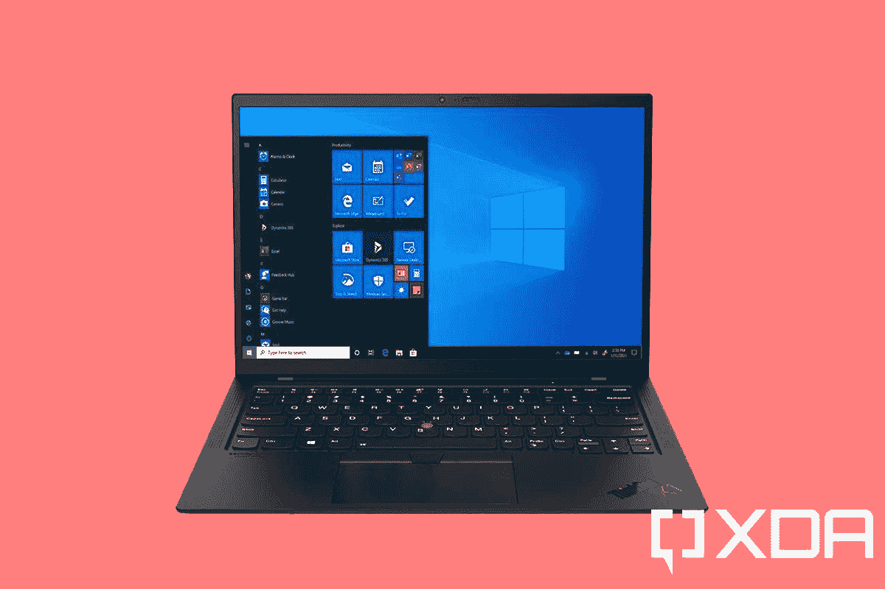

# 联想 ThinkPad X1 Carbon vs X1 Nano:你能走多轻薄？

> 原文：<https://www.xda-developers.com/thinkpad-x1-carbon-vs-thinkpad-x1-nano/>

多年来，联想 ThinkPad X1 Carbon 的重量一直不到 2.5 磅(约 2.5 公斤)，一直以来都是超轻的 ThinkPad。事实上，它从未为实现这一目标做出妥协。但是现在有了一个新的冠军，ThinkPad X1 Nano，重量不到 2 磅。如果你正在寻找一款轻薄的 ThinkPad，你可能会有一些疑问。为什么 ThinkPad X1 Nano 不只是新的 ThinkPad X1 Carbon？如果我选择更小更轻的 X1 Nano，我会放弃什么？

我们在这里回答所有这些问题。一个很好的起点是规格。

## 联想 ThinkPad X1 Carbon 和 ThinkPad X1 Nano:规格

|  | 

ThinkPad X1 碳纤维

 | 

ThinkPad X1 Nano

 |
| --- | --- | --- |
| 

中央处理器

 | 多达 11 个^第代英特尔酷睿 i7-1185G7 博锐处理器(3.00 GHz，睿频加速高达 4.80 GHz，4 个内核，8 个线程，12 MB 高速缓存) | 多达 11 个^第代英特尔酷睿 i7-1180G7 博锐处理器(2.20 GHz，睿频加速高达 4.60 GHz，4 个内核，8 个线程，12 MB 高速缓存) |
| 

制图法

 | 虹膜 Xe | 虹膜 Xe |
| 

身体

 | 

*   314.5 x 221.6 x 14.9 毫米(12.38x8.72x0.59 英寸)
*   起始重量为 1.13 千克(2.49 磅)

 | 

*   非触控型号 292.8 x 207.7 x 13.87-16.7 毫米(11.53x8.18x0.55-0.66 英寸)
*   触控型号 292.9 x 207.8 x 14.27-17.2 毫米(11.53x8.18x0.56-0.68 英寸)
*   非触摸:907 克(1.99 磅)
*   触摸型号:969 克(2.14 磅)
*   WWAN 非触摸型:939 克(2.07 磅)
*   WWAN touch:1001 克(2.21 磅)

 |
| 

显示

 | 

*   14 英寸 FHD+ (1920 x 1200) IPS，防眩光，触摸屏，低功耗，400 尼特
*   14.0 英寸 FHD+ (1920 x 1200) IPS，防眩光，低功耗，400 尼特
*   14 英寸 FHD+ (1920 x 1200) IPS，防眩光，触摸屏，隐私保护，500 尼特
*   14.0 英寸 UHD+ (3840 x 2400) IPS 镜面 500 尼特

 | 

*   13.0 英寸 2K (2160 x 1350) IPS、防反光、防污迹、带杜比视觉的触摸屏、450 尼特、100% sRGB
*   13.0 英寸 2K (2160 x 1350) IPS，杜比视觉防眩光，450 尼特，100% sRGB

 |
| 

港口

 | 

*   2 个 USB 4 Type-C，带 Thunderbolt 4(显示端口/数据传输/供电)
*   2 个 USB-A 3.2 第 1 代
*   耳机/麦克风组合
*   HDMI 2.0
*   可选:Nano SIM 卡插槽

 | 

*   2 个 USB4 Thunderbolt 4(电力输送)
*   耳机/麦克风组合

 |
| 

储存；储备

 | 高达 1TB 的 PCIe 固态硬盘 | 高达 1TB 的 PCIe 固态硬盘 |
| 

随机存取存储

 | 最高 32GB LPDDR4x 4266MHz(焊接) | 最高 16GB LPDDR4x 4266MHz(焊接) |
| 

电池

 | 

*   长达 16.7 小时 57 瓦时(MM18)
*   快速充电(需要 65W PSU 或更高)

 | 

*   长达 13 小时 48 瓦时(MM18)
*   包含快速充电

 |
| 

声音的

 | 

*   杜比 Atmos 扬声器系统
*   4 个 360 度远场麦克风
*   杜比语音专业会议解决方案

 | 

*   杜比 Atmos 扬声器系统
*   4 个 360 度麦克风

 |
| 

安全性

 | 

*   离散可信平台模块(dTPM) 2.0
*   可选:带红外摄像头的人体感应传感器
*   集成电源按钮的智能开机指纹识别器(片上匹配)
*   网络摄像头隐私快门
*   肯辛顿锁槽

 | 

*   离散可信平台模块(dTPM) 2.0
*   使用 Windows Hello & IR 摄像头检测人的存在
*   片上匹配指纹读取器
*   网络摄像头隐私保护罩

 |
| 

照相机

 | 

*   720p 高清，带网络摄像头隐私快门
*   可选:混合红外(IR) / 720p 高清，带网络摄像头隐私快门

 | 混合红外(IR) / 720p 高清，带网络摄像头隐私保护盖 |
| 

连通性

 | 

*   英特尔 AX201 Wi-Fi 6 802.11AX (2 x 2)和蓝牙 5.2
*   英特尔 AX201 Wi-Fi 6 802.11AX (2 x 2)和支持博锐技术的蓝牙 5.2

 | 

*   可选:WWAN LTE 5G / LTE 4G CAT9
*   无线局域网:WiFi 6 AX201 802.11AX (2 x 2)
*   蓝牙 5.2
*   基于博锐处理器的博锐技术

 |
| 

颜色

 | 

*   黑色
*   可选:顶盖上的碳纤维织物

 | 

*   黑色
*   黑色，顶盖采用碳纤维编织(仅适用于触控型号)

 |

## 设计:ThinkPad X1 Nano 更小、更薄、更轻

起初，ThinkPad X1 Nano 听起来像是 X1 Carbon 的一个更小更轻的版本。不完全是这样。Nano 的重量在 1.99 到 2.21 磅之间，取决于你得到的型号。碳含量为 2.49 磅，对于笔记本电脑来说仍然非常轻。

先说清楚。无论是哪一种，它都足够轻，当它在你的包里时，你会忘记它在那里。坦率地说，我有点惊讶，当联想已经有了超轻的 ThinkPad X1 Carbon 时，它仍然决定将事情提升一个档次。

两者之间的一个关键区别是端口。使用 ThinkPad X1 Nano，您只需获得两个 Thunderbolt 4 端口，与其他[顶级 Thunderbolt 4 笔记本电脑](https://www.xda-developers.com/best-thunderbolt-4-laptops/)一样。ThinkPad X1 Carbon 更适合拥有两个 Thunderbolt 4 端口、两个 USB Type-A、HDMI 2.0 等功能的传统用户。

虽然端口只是两台电脑之间的一个区别，但它们代表了这一点。ThinkPad X1 Nano 更现代，因为它更薄更轻，仅使用了现代端口。ThinkPad X1 Carbon 适用于那些需要 USB Type-A 和 HDMI 等传统端口的用户。这是 X1 纳米没有取代 X1 碳的关键原因。企业用户需要这些传统端口，但这并不妨碍联想开发新的产品。

## 显示屏:ThinkPad X1 Carbon 的屏幕更大

ThinkPad X1 Nano 发布时的一个关键新功能是它有一个 16:10 的显示屏。它比我们一直使用的 16:9 显示屏更高更大，这太棒了，但随后 ThinkPad X1 系列的其他产品在 1 月份获得了 16:10 屏幕，包括 Carbon。

尺寸上的区别是，X1 Nano 的屏幕为 13 英寸，X1 Carbon 仍为 14 英寸。所以，是的，你肯定会有更多的碳空间。

然而选择是不同的。用 ThinkPad X1 Nano，分辨率是 2160 x 1350，你能得到的也就这些了。450 尼特，有触摸和非触摸两种口味。

ThinkPad X1 Carbon 为您提供了更多选择。请记住，ThinkPad X1 Nano 是新产品，而 X1 Carbon 是受欢迎的产品，已经经历了九代。像这样的商用笔记本电脑为众多客户提供服务是很自然的事情。

四个选项中，有三个是 FHD+，意思是 1920 x 1200。其中有两块是低功耗的 400 nit 面板，一块是触控的，一块是非触控的。还有一个 500 尼特的触摸屏和 PrivacyGuard。最后，还有一个 500 尼特的非触摸面板，尺寸为 3840 x 2400。

ThinkPad X1 Carbon 是唯一一款配备 PrivacyGuard 显示屏的笔记本电脑，如果这是你选择的话。另一方面，Nano 有一个自定义的显示分辨率，这使它比 FHD 更好，但分辨率不够高，因此很难延长电池寿命。

## 键盘:ThinkPad X1 Nano 的按键较浅

联想的 ThinkPads 以拥有一些最好的键盘而闻名。近年来我发现的一件事是，按键越来越让人觉得太深了。其他公司正在继续制造更浅的键盘，因此 ThinkPads 开始有所不同。

ThinkPad X1 Carbon 有 1.5mm 的按键，这是 ThinkPad 的标配。事实上，这在很长一段时间内都是行业标准。ThinkPad X1 Nano，正如我们在 ThinkPad X1 Titanium Yoga 上看到的那样，有 1.35 毫米的按键。

我个人认为，ThinkPad X1 Nano 拥有出众的键盘，联想应该将这一点带到其他产品中。该公司对我很清楚，它在这些事情上进展缓慢，这并不奇怪。1.35 毫米的按键感觉更现代，但没有牺牲联想闻名的质量。

换句话说，它感觉不像是一个*不同的*键盘，因为它的设计是一样的。只是感觉键盘更好。

不过 ThinkPad X1 Carbon 的触摸板更大。这是今年有所改变的事情。它比以前更宽了。它实际上并没有更高，因为联想有那些巨大的物理按钮，它们的存在是为了补充 TrackPoint。

## 性能:ThinkPad X1 Carbon 拥有更好的处理器

ThinkPad X1 Carbon 最高可配英特尔酷睿 i7-1185G7 处理器，而 X1 Nano 最高可配酷睿 i7-1180G7 处理器。如果你不知道这是什么意思也没关系。英特尔真的解决了混淆产品名称的问题。

X1 Carbon 中的 CPU 来自 Tiger Lake UP3 系列，而 X1 Nano 中的 CPU 来自 UP4 系列。这些是英特尔第 11 代处理器的新术语。UP3 是 U 系列的继任者，U 系列是历史上在超极本和大多数笔记本电脑中发现的 15W 芯片。

UP4 是 Y 系列的继任者，之前称为 Core m。Y 系列是为无风扇笔记本电脑制造的，多年来，TDP 从 4.5W 增加到 5W，然后增加到 7W。

y 系列一直被认为是应该远离的东西，但这一代人越来越喜欢它了。T2 真的变得很好。它并不比 UP3 更好，因为那没有任何意义，但它可以用于各种任务，而不会后悔你的购买决定。这些芯片现在是四核的，它们有更高的 TDP (7W - 15W)，并且它们配有 Iris Xe 显卡。

虽然两者都是生产力很高的机器，X1 Nano 内部的处理器也很棒，但 X1 Carbon 的处理器更好。事实上，在我测试过的所有 Tiger Lake UP3 设备中，X1 Carbon 是最好的。

|  | 

ThinkPad X1 CarbonCore i7-1185G7

 | 

ThinkPad X1 NanoCore i7-1160G7

 |
| --- | --- | --- |
| 

PCMark 8:主页

 | 4,532 | 3,919 |
| 

PCMark 8:创意

 | 4,910 | 4,419 |
| 

PCMark 8:工作

 | 4,144 | 3,864 |
| 

PCMark 10

 | 5,168 | 4,586 |
| 

极客工作台 5

 | 1,489 / 5,280 | 1,346 / 4,891 |
| 

电影院长凳

 | 1,303 / 4,224 | 1,296 / 4,052 |

此外，关于内部结构，这两款电脑都支持 4G LTE 或 5G，因此它们肯定在我们的[最佳蜂窝笔记本电脑](https://www.xda-developers.com/best-4g-lte-laptops/)列表中名列榜首。

## 结论:应该买哪款 ThinkPad？

联想 ThinkPad X1 Carbon 和 ThinkPad X1 Nano 都是非凡的笔记本电脑。我很容易推荐他们中的任何一个。归结起来就是偏好和你的需求。

ThinkPad X1 Nano 是超便携电脑，重量不到 2 磅。不过它只有两个 Thunderbolt 4 端口，所以你可能会不时需要一个加密狗。端口数量少，但质量不高。您仍然可以使用一个端口连接两个 4K 显示器，因为 Iris Xe 图形可以处理它。如果您需要更多，其中一个端口可以连接到外部 GPU。

 <picture></picture> 

Lenovo ThinkPad X1 Nano

##### 联想 ThinkPad X1 Nano

最薄最轻的商用电脑之一，重量不到两磅，但仍然搭载英特尔第 11 代处理器。

另一方面，联想 ThinkPad X1 Carbon 是我所说的安全赌注。它已经流传了九代了，是粉丝们的最爱。称之为安全赌注并不是否定它或者说它无聊。它仍然是一台不可思议的笔记本电脑。它的重量不到 2.5 磅，拥有更强大的处理器，更大的屏幕，并拥有您可能需要的传统端口。

 <picture></picture> 

Lenovo ThinkPad X1 Carbon Gen 9

##### 联想 ThinkPad X1 Carbon Gen 9

ThinkPad X1 Carbon 的重量不到 2.5 磅，配备了强大的处理器和您需要的所有端口。