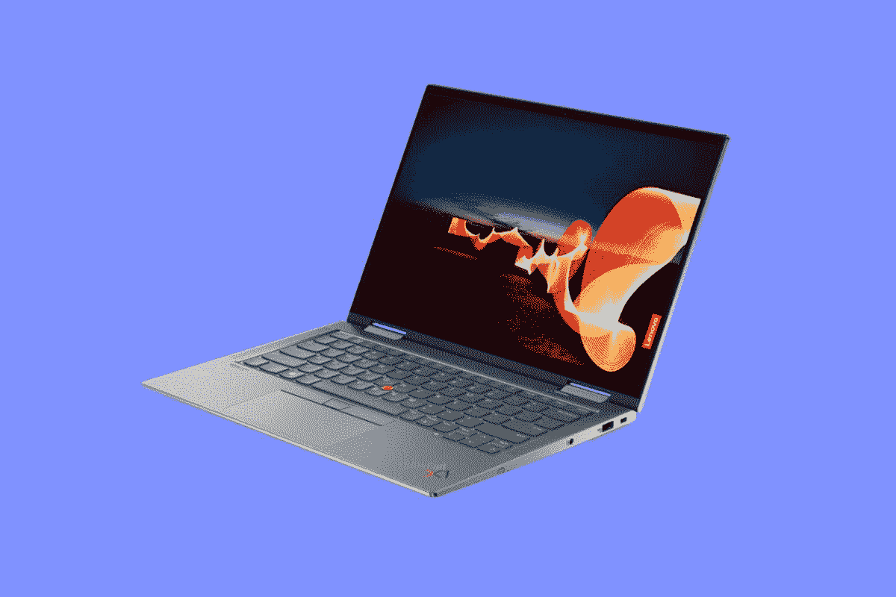

# 联想 ThinkPad X1 Yoga 评测:卓越改进，传统支持

> 原文：<https://www.xda-developers.com/thinkpad-x1-yoga-gen-6-review/>

在过去的一年里，联想通过其旗舰产品 ThinkPad X1 系列做了很多工作。它

[went all in on innovative designs that weren't possible a year ago](https://www.xda-developers.com/lenovo-thinkpad-x1-titanium-nano-interview/)

，像 ThinkPad X1 Nano 和 ThinkPad X1 Titanium Yoga。不过，它还是推出了更传统的 ThinkPad X1 Carbon 和 ThinkPad X1 Yoga。它们提供了英特尔 Tiger Lake UP3 的全部功能，并且仍然拥有企业所需的所有端口。

事实上，我们的目标是年复一年地迭代，而不是像我们在 Titanium 上看到的那样发布一个激进的新设计。这并不意味着 ThinkPad X1 Yoga 不好。事实上，它仍然是我最喜欢的敞篷车之一。我只是想打破两者之间的差异。如果你想要超薄超轻、3:2 屏幕和专为平板电脑设计的敞篷车，一定要看看 X1 Titanium Yoga。但如果你想要的东西仍然有 USB Type-A、HDMI 和笔库，这就是 ThinkPad X1 Yoga 的用武之地。

我们在新款 ThinkPad X1 Yoga 中看到的改进与我们在 X1 Carbon 中看到的相同。它有一个更大的 14 英寸 16:10 显示屏，新的第 11 代处理器的规格也有很大提高。

## 规范

| 

中央处理器

 | 英特尔酷睿 i7-1185G7 处理器(3.0/4.8 GHz) |
| 

制图法

 | 英特尔 Iris Xe 显卡 |
| 

身体

 | 314.4 x 223 x 14.9 毫米(12.38x8.78x0.59 英寸)，1.35 千克(3 磅) |
| 

显示

 | 14 英寸 UHD (3840 x 2400) IPS、500 尼特、HDR 400、杜比视界 |
| 

记忆

 | 2 个 8GB LPDDR4-4266 |
| 

储存；储备

 | 512GB 固态硬盘 |
| 

港口

 | 2 个 Thunderbolt 4，Type-C(电源、DP 1.4a、数据)1 个 USB-A 3.2 Gen 1(一个始终开启)1 个 3.5 毫米耳机/麦克风组合音频插孔 1 个 HDMI 2.0 |
| 

连通性

 | 英特尔 Wi-Fi 6 AX201 11ax +蓝牙 5.2 |
| 

声音的

 | 杜比 Atmos 扬声器系统认证 2 个 2W 扬声器和 2 个 0.8 w 四阵列麦克风，360°远场 |
| 

投入

 | 6 排 LED 背光、防泼溅多媒体 Fn 键，带统一通信控制(F9–F11)玻璃表面多点触控 4.33 英寸触摸板、跟踪点 |
| 

安全性

 | 分立可信平台模块(dTPM) 2.0、集成了电源按钮的智能开机指纹读取器(片上匹配)、ThinkShutter Webcamprivacy 快门、带红外摄像头的人体存在检测传感器 |
| 

电池

 | 57Wh |
| 

颜色

 | 风暴灰色 |
| 

材料

 | 铝金属 |
| 

操作系统（Operating System）

 | Windows 10 专业版 |
| 

价格

 | $1,624.50 |

所列价格是撰写本文时 Lenovo.com 的最新价格。这些价格是波动的，因为该公司几乎从不收取它所列的全价。事实上，它有一些产品没有打折，所以你可以以两倍于 T3 的价格*买到带 FHD 显示屏的酷睿 i5 型号。不管怎样，关键是 Lenovo.com 的价格是波动的。*

## ThinkPad X1 Yoga 设计、显示屏和键盘

### 全铝设计变化不大

这是铝制的第三代产品。在此之前，ThinkPad X1 Yoga 非常像 X1 Carbon，但有一个 360 度铰链。是的，它看起来和它的风暴灰色几乎一样，尽管它已经改变了。14.9 毫米薄的机箱比第 5 代机型的 15.2 毫米机箱略薄。尺寸也有所改变，以适应更高但更窄的显示屏。

这是一个微小的变化(对我们来说，我肯定不是对 ThinkPad 团队来说)，但标志是不同的。新的标志与风暴灰色的底盘融为一体，而不是第三代首次亮相并在车队改用铝制时出现的黑色标志。

重量差不多。第五代和第六代型号都被列为 1.35 千克，分别转换为 2.99 磅和 3.0 磅。鉴于它是什么，它令人印象深刻的轻。毕竟，它是由铝制成的，这是一种很重的材料，它拥有你想要的所有铃铛和哨子。

这包括您习惯的所有传统端口。在左侧，有一个 USB 3.2 Gen 1 Type-A 端口，一个 3.5 毫米音频插孔和一个 Kensington 锁插槽。右侧有两个 Thunderbolt 4 端口，另一个 USB 3.2 Gen 1 Type-A 端口，以及 HDMI 2.0。这对于需要传统支持，并且无法迁移到只有两个 Thunderbolt 端口的 ThinkPad X1 Titanium Yoga 等产品的企业来说尤为重要。

每个 Thunderbolt 端口都能够支持双 4K 显示器、一个 8K 显示器、一个外部 GPU 或一大堆其他东西。如果你想插入的东西有一个单电缆解决方案，Thunderbolt 支持它。对于这款产品，Thunderbolt 4 和前几代产品的雷电 3 端口没有任何区别，因为联想使用了所有四个通道来实现 40Gbps 的数据传输速度。

你会发现的另一件事是内置的笔车库。这实际上是我最喜欢的 X1 Yoga 的功能之一，因为这是一种让笔随时充电的简单方法，而且它不会妨碍你。

### 更大的新型 16:10 显示屏

联想的 ThinkPad X1 系列正在获得 16:10 的待遇，谢天谢地，这种待遇现在在整个 PC 领域变得很普遍。你可能会注意到屏幕尺寸仍然是 14 英寸，但我说它更大了。值得记住的是，屏幕尺寸是按对角线测量的，所以如果我们谈论不同的长宽比，它们并不总是代表总表面积。越接近正方形，表面积就越大。

由于 16:10 的宽高比，屏幕更高，但更窄，因为对角线尺寸没有增加。通过增加高度，你可以获得更大的表面积，但是你在侧面做了一点牺牲。你的里程数可能会有所不同，但普遍认为这是正确的做法。事实上，联想表示，它一直认为这是笔记本电脑的正确长宽比。

它有 FHD 和 UHD 两种选择，联想发给我的是 UHD 风味。正如你所料，它超级漂亮，还支持杜比视觉 HDR。但是除了大小和尺寸之外，质量之类的东西自去年的型号以来就没变过。

这也是一个很好的屏幕，你可以从上面的图片中看到。它支持 100% sRGB、89% NTSC、91% Adobe RGB 和 97% P3。印象非常深刻。视角也是整整 178 度，所以你可以从任何角度观看，没有任何明显的失真。

在顶部挡板中，有一个网络摄像头和一个可选的红外摄像头。遗憾的是，重新设计的产品中，网络摄像头仍然是 720p。有这么多人在家工作，1080p 显然是你想要的。出于某种原因，在价值数千美元的个人电脑中仍然很少看到 FHD 网络摄像头，而 300 美元的智能手机则有可以以 60fps 录制 1080p 的前置摄像头。

### 键盘和触摸板

键盘没变。它仍然有你习惯的 1.5 毫米按键。个人认为要走的路是 1.35mm，现在已经被 ThinkPad X1 Nano 和 ThinkPad X1 Titanium Yoga 惯坏了。

虽然有一些适度的设计变化，但它们是审美的。上一代的触摸板上的按钮下方有一些红色的装饰。这一次，联想似乎要采取更微妙的方式。

TrackPoint 还在，爱它也好，恨它也罢。它也不会去任何地方，所以如果你不喜欢它，你要么忽略它，要么买一个不是 ThinkPad 的东西。

这也意味着精密触摸板上面有物理按钮。这一代的触摸板也更宽了，更大的触摸板总是一件好事。尽管这些按钮占据了宝贵的空间，但确实让人们更加注意到它们的存在。它们是为了配合 TrackPoint 使用的，尽管我实际上也配合触摸板使用。

音频质量有了很大的提升。现在有四个杜比全景声扬声器，其中两个是 2W，放在键盘的两侧。以前，沿着铰链有一个音棒。设备底部还有两个 0.8W 扬声器。比以前更强大，更清晰。

## 性能和电池寿命

联想发给我的设备包括英特尔酷睿 i7-1185G7、16GB 内存和 512GB 固态硬盘。处理器来自英特尔的 Tiger Lake UP3 系列，它大约是你对这样一台机器的期望。这也是我评测的 ThinkPad X1 Carbon 的芯片。当我们进行基准测试时，您会看到结果几乎相同，这是一件好事。

英特尔的 U 系列处理器仍然是四核处理器，而 AMD 和高通等竞争对手的超极本芯片将达到八核。但英特尔目前的优势在于其对集成显卡的重新重视。的确，Iris Xe 不错；真的很好。它让您可以使用超极本做以前没有专用显卡时不想做的事情。你可以在 FHD 玩游戏，做一些视频编辑(甚至在 4K 30fps，如果你想)，等等。

当然，你买 ThinkPad X1 Yoga 不是为了做这些事情。你买它是为了提高工作效率。英特尔 U 系列处理器一直是为提高工作效率而设计的，因此您不会错过任何机会。你只会得到更多。

对于基准测试，我使用了 PCMark 8、PCMark 10、3DMark、Geekbench 和 Cinebench。

|  | 

ThinkPad X1 YogaCore i7-1185G7

 | 

Yoga 9i 酷睿 i7-10750H，GTX 1650 Ti

 | 

惠普 Envy 14Core i5-1135G7，GTX 1650 Ti

 | 

戴尔 XPS 15 9500 酷睿 i7-10875H，GTX 1650 Ti

 |
| --- | --- | --- | --- | --- |
| 

PCMark 8:主页

 | 3,980 | 3,936 | 3,939 | 3,652 |
| 

PCMark 8:创意

 | 4,737 | 4,693 | 4,862 | 4,839 |
| 

PCMark 8:工作

 | 3,551 | 3,817 | 3,929 | 3,322 |
| 

PCMark 10

 | 5,158 | 5,159 | 5,156 | 5,136 |
| 

3DMark:时间间谍

 | 1,781 | 3,643 | 3,333 | 3,742 |
| 

极客工作台

 | 1,592 / 5,518 | 1,232 / 5,608 | 1,384 / 4,604 |  |
| 

电影院长凳

 | 1,473 / 4,807 |  | 1,357 / 4,495 |  |

我按照 PCMark 10 的分数对我的基准表进行了分类，因为这是一个全面的测试，你可以看到我的发现。这与一堆拥有专用显卡的电脑不相上下。此外，Yoga 9i 和戴尔 XPS 15 都有 45W 的 CPU，内核更多。

电池寿命不会因此受到影响，这很好。这都是拥有 U 系列处理器和集成显卡的一部分。让电池受损的是 UHD 显示器。它的像素是 FHD 显示器的四倍，可悲的是，联想不再选择 QHD。在正常的实际使用中，你会看到四到五个小时，这是在亮度约为三分之一，功率滑块比电池节电高一个档次的情况下。

## 结论:ThinkPad X1 Yoga 值得买吗？

在[ThinkPad](https://www.xda-developers.com/best-thinkpads/)的世界里，X1 系列已经尽善尽美了。这个问题的答案是肯定的，这是一款高端设备，拥有市场上最好的键盘之一，出色的 4K 杜比视觉显示屏，坚实的构建质量，以及一些智能功能，如内置笔。

当然，X1 家族变得有点复杂。如果你想要最好的翻盖 ThinkPad 或最好的可折叠 ThinkPad，你不能只说要 X1。现在每种都有两个。对于蛤壳，有 X1 碳和 X1 纳米。对于敞篷车，有 X1 瑜伽和 X1 钛瑜伽。就我个人而言，联想 ThinkPad X1 Titanium Yoga 是目前市场上我最喜欢的笔记本电脑。

但它不适合所有人，也不应该适合所有人。这两种设备都达到了它们的目的。钛金属实际上是 X1 平板电脑的替代品，因此它实际上被设计成一款令人惊叹的平板电脑和笔记本电脑。X1 Yoga 首先是一台笔记本电脑。它可以用作平板电脑，但这不是主要的使用案例。它还可以挂在 USB Type-A 和 HDMI 等传统端口上，这两个端口对企业客户来说都非常重要。

坏消息是。首先，它仍然有一个 720p 的网络摄像头，这是一个真正的耻辱。在居家办公的时代，高端的 ThinkPad 需要做得更好。另一件事是不再有 QHD 显示选项，我实际上认为这是分辨率和电池寿命之间的完美平衡。我可以在这里上一堂 ThinkPad 的历史课，但 14 英寸的 Yoga 曾经在 QHD(也是有机发光二极管)达到最大值，然后 UHD 出现了 QHD 选项，现在他们终于淘汰了 QHD。

但这是一款非常棒的全能产品。除了网络摄像头，你不会对它的任何部分不满意。这就是联想 ThinkPad X1 Yoga 年复一年的工作方式。它是周围最好的之一。

 <picture></picture> 

Lenovo ThinkPad X1 Yoga Gen 6

##### 联想 ThinkPad X1 Yoga Gen 6

联想新的旗舰商务敞篷车有更大的屏幕，更大的触摸板，和更多的权力。