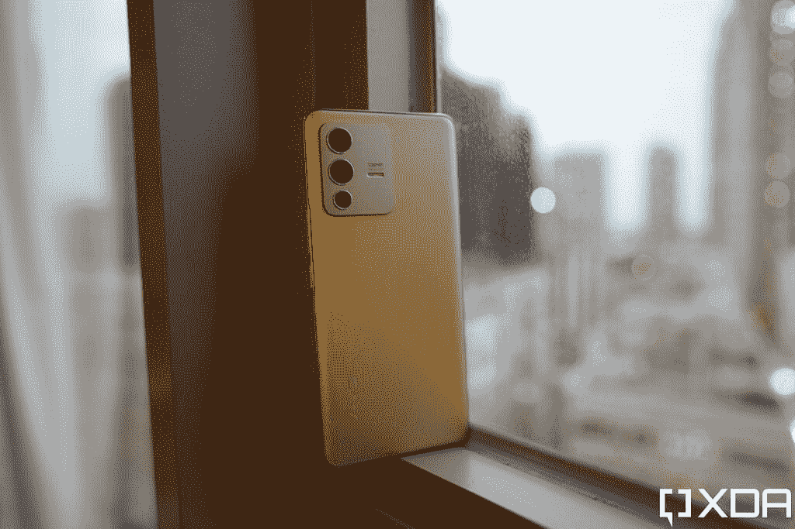
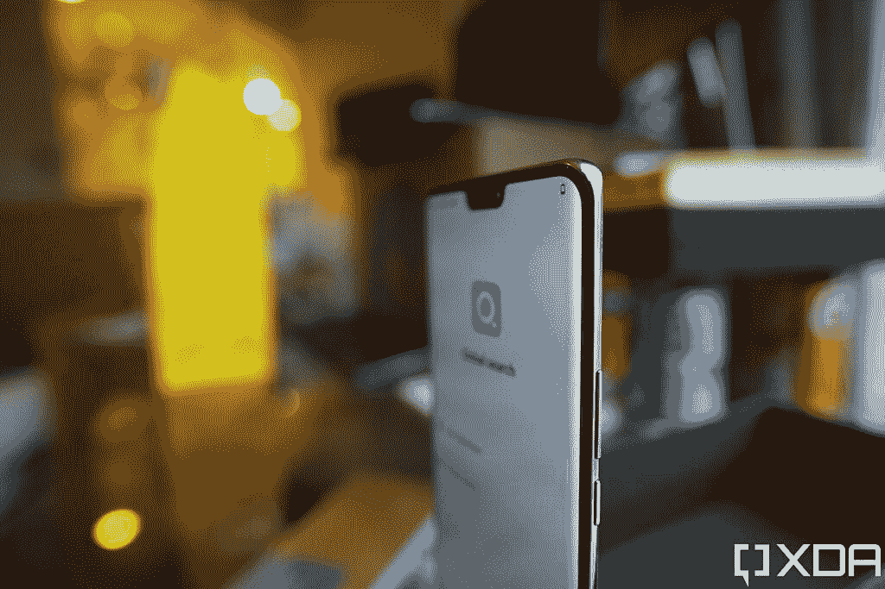
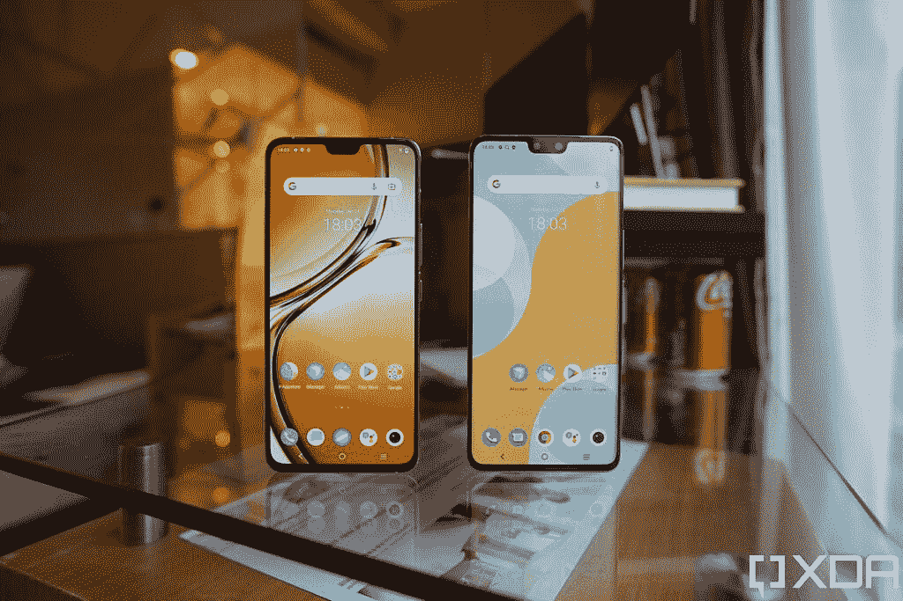
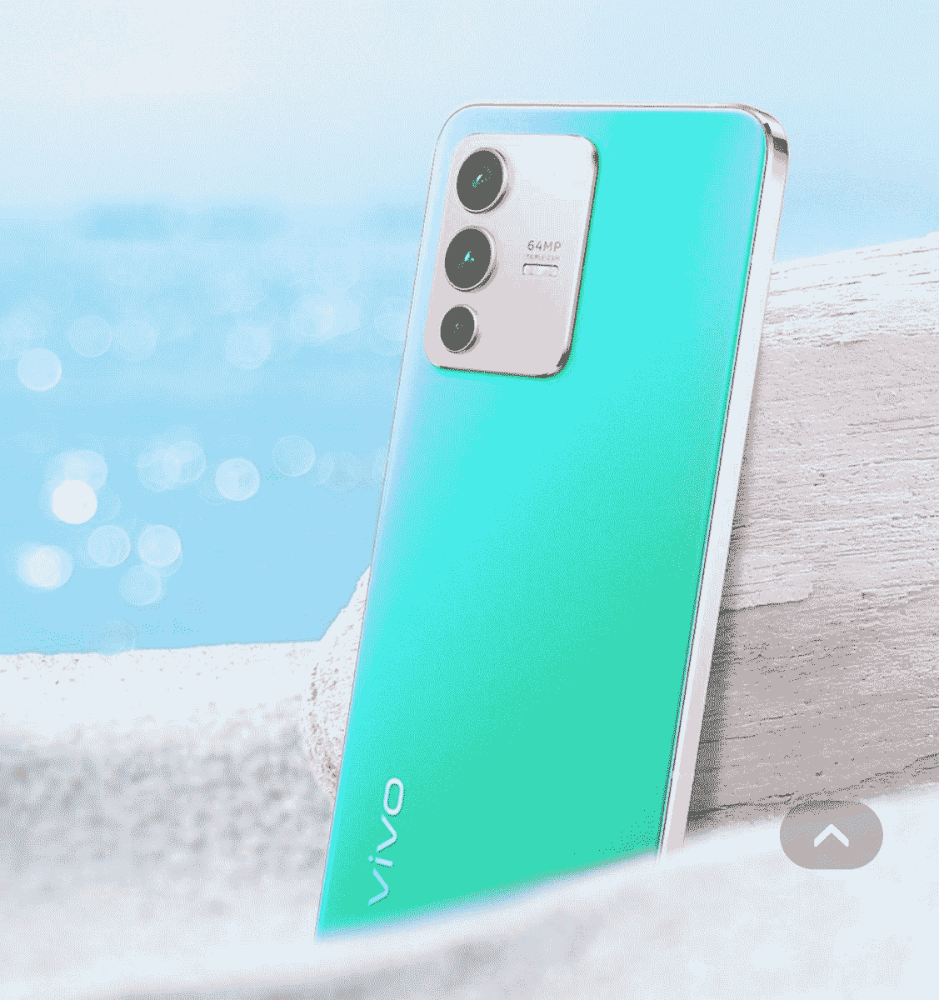
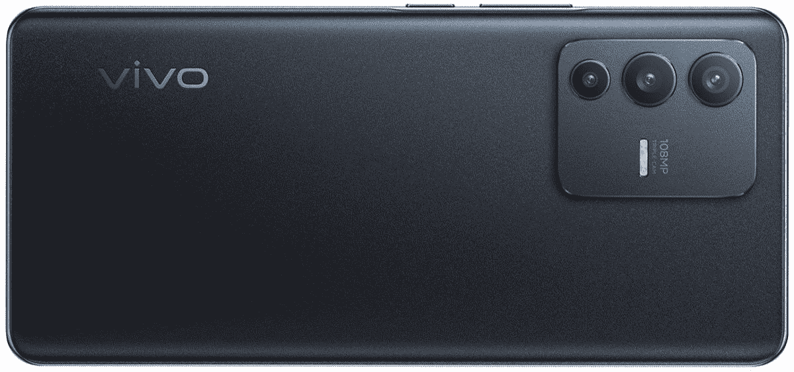

# Vivo 的 V23 系列是面向抖音一代的以自拍为中心的手机

> 原文：<https://www.xda-developers.com/vivo-v23-pro-hands-on/>

Vivo 的 V 系列主要以几件事闻名:其多产的一年两次的发布时间表，以及以自拍相机为中心的硬件。当其他人都在 800 万像素时，这是一条生产 2000 万像素前置摄像头的生产线；以及其他自拍相机在用 12MP 拍摄时的 32MP 和 44MP 自拍器。

最新的更新版本[V23 系列](https://www.xda-developers.com/vivos-new-mid-range-phones-in-india-feature-color-changing-backs-and-mediatek-dimensity-1200/)再次提升了数字游戏，V23 Pro 和 v 23 标准型号都包装了一个双自拍相机系统，由一个 50MP，f/2.0 自拍相机和一个 8MP 超宽自拍镜头组成。这一次，新设备与众多中端智能手机相比又多了一个卖点:变色后盖。

### Vivo V23 系列规格:点击展开

## Vivo V23 系列:规格

| 

规格

 | 

Vivo V23 Pro

 | 

Vivo V23

 |
| --- | --- | --- |
| **尺寸&重量** | 

*   159.46 x 73 x 7.36mm 毫米
*   171g

 |  |
| **显示** | 

*   6.56 英寸 AMOLED
*   FHD+ (2376 x 1080)
*   60Hz 刷新率

 | 

*   6.44 英寸 AMOLED
*   FHD+ (2400 x 1080)
*   60Hz 刷新率

 |
| **SoC** | 

*   联发科天玑 1200:八核(最高 3.0GHz)
*   ARM G77 MC9 GPU
*   6 纳米工艺

 | 

*   联发科尺寸 920
*   Adreno Mali-G68 GPU
*   6 纳米工艺

 |
| **RAM &存储** | 

*   8GB/12GB
*   128GB/256GB 存储空间

 | 

*   8GB/12GB 内存
*   128GB/256GB 存储空间

 |
| **电池&充电** | 

*   4300 毫安时电池
*   44W 快速充电支持

 | 

*   4，200 毫安时电池
*   44W 快速充电支持

 |
| **安全** | 显示指纹扫描仪 | 显示指纹扫描仪 |
| **后置摄像头** | 

*   **初级**:108 兆华氏度/1，88
*   **二级** : 8MP f/2.2 超宽
*   第三级 : 2MP 宏

 | 

*   **初级** : 64MP f/1.89
*   **二级** : 8MP 超宽 f/2.2
*   **第三级** : 2MP 宏

 |
| **前置摄像头** | 

*   50MP 自动对焦 f/2.0 初级
*   800 万像素 f/2.28 超宽

 | 

*   50MP 自动对焦 f/2.0 初级
*   800 万像素 f/2.28 超宽

 |
| **端口** |  |  |
| **其他特性** | 

*   5G NR
*   双频 Wi-Fi
*   蓝牙 5.2

 | 

*   5G NR
*   双频 Wi-Fi
*   蓝牙 5.2

 |
| **软件** | 

*   安卓 12 的 Funtouch OS 12

 | 

*   安卓 12 的 Funtouch OS 12

 |

***关于这次动手:** Vivo 把 V23 和 V23 Pro 都发给我测试了。Vivo 在这篇文章中没有任何投入。*

* * *

## Vivo V23 系列:硬件和设计

Vivo V23 和 V23 Pro 是中端手机，分别在₹29,990 和₹38,990 首次销售，这些价格分别为 403 美元和 524 美元。Vivo 已经证实，这些设备将“很快”登陆亚洲其他地区，包括马来西亚、泰国和欧洲。

 <picture></picture> 

Vivo V23 Pro

如上所述，两款手机都有相同的前置摄像头系统，以及相同的 8MP 超宽和 2MP 宏观传感器。它们也运行相同的软件，并具有相同的变色背面技术。

先把这个说回来。这不仅仅是渐变颜色的玻璃涂层，它根据角度的不同反射不同的光。相反，这项技术使用一种新型玻璃(萤石 AG 玻璃)，当受到紫外线照射时，会发生化学反应，导致颜色变化。默认情况下，这种颜色是橙色的，但当它吸收足够的紫外光时，它会变成这种蓝色的绿色。

因为玻璃板确实在吸收光线的过程中发生色素变化，这意味着你可以通过覆盖玻璃的一部分来改变颜色，可以说是给手机添加了晒痕。我用一张纸盖住它，就能在电话上得到一个 X。

这不仅仅是涂层背面的渐变色；相反，背面真的会变色

如果你更有创意，你可以在手机上获得更复杂的图案，就像 Vivo 提供的这张宣传图片一样。

如果你不喜欢变回原来的颜色，V23 系列还有第二种颜色，一种更微妙的标准黑色，只是保持黑色。

### 显示器、处理器和主摄像头

两款手机之间的主要区别在于机箱设计:V23 Pro 有一个典型的(在 Android 领域)弯曲显示屏，融入了一个窄边框。与此同时，标准的 V23 采用了四四方方的设计，正面、背面和侧面都很平——没错，这就是 iPhone 12/13 的设计。

 <picture></picture> 

The Vivo V23 Pro has a familiar curved screen.

我通常喜欢曲面屏幕——我发现它们可以提供更好的手感和更身临其境的屏幕——但我必须说，V23 的方形设计是一股新鲜空气，主要是因为在过去几年中，我已经处理了至少 100 台采用 V23 Pro 机身类型的设备。

与苹果不同的是，Vivo 给 V23 的边角赋予了微妙的倒角，结合 V23 更窄的宽度，使得手感比 iPhone 13 Pro 更舒适。

Vivo V23 Pro 的 6.56 英寸屏幕比 V23 的 6.44 英寸屏幕略大，但因为 Pro 在两侧弯曲，所以手机的屏幕尺寸感觉相同。两个面板都是有机发光二极管，刷新频率为 90Hz。它们看起来足够有活力，分辨率为 1080 x 2400，但都没有我们对旗舰 Android 手机的期望那么亮。而且没错，2022 年出现一个缺口是很不雅观的，但是 Vivo 确实在前置系统上投入了很多硬件。这是一个具有实际有用功能的凹口。

 <picture></picture> 

Vivo V23 (left) and V23 Pro (right).

Pro 型号由一个[联发科天玑 1200](https://www.xda-developers.com/mediatek-dimensity-1100-1200-flagship-5g-chip-launched/) SoC 驱动，而标准型号有一个[尺寸 920](https://www.xda-developers.com/mediatek-dimensity-920-dimensity-810/) 。这两款芯片对于日常休闲智能手机的使用都非常强大，尽管它们显然无法与[高通骁龙 888](https://www.xda-developers.com/qualcomm-snapdragon-888-explained-specs-features/) 相提并论，更不用说即将开始在 Android 旗舰领域普及的[骁龙 8 Gen 1](https://www.xda-developers.com/qualcomm-snapdragon-8-gen-1/) 了。

V23 Pro 的主背部摄像头也比标准 V23 有所提升:一个 108MP，f/1.9 的摄像头，而标准 V23 上的传感器为 64MP，f/1.9。在大多数情况下，两个主摄像头在价格范围内都是可靠的拍摄者，但如果在更具挑战性的照明条件下拍摄，Pro 的传感器可以捕捉更好的动态范围。

### 自拍相机

最终，这场秀的明星是前置摄像头系统。当我测试最后两款 V 设备( [V20](https://www.xda-developers.com/vivo-v20-pro-selfie-camera-review/) 和 [V21](https://www.xda-developers.com/vivo-v21-5g-review/) )时，我发现它们的自拍相机确实比顶级的苹果和三星手机拍出了更有活力、光线更好、更平衡的自拍，特别是在直接面对刺目阳光等挑战性条件下拍摄时。

在寻找合适的曝光和平衡方面，Vivo V23 系列的自拍相机比 iPhone 做得更好

不幸的是，我现在被困在隔离区，所以我只有有限的场景和照明条件来测试相机，但我们再次可以看到，Vivo V23 系列的自拍相机在找到适当的曝光和平衡方面比 iPhone 做得更好。这个镜头很有挑战性，我是在我脑袋后面的一半有强烈的背光的情况下拍摄的，而另一半更暗，被窗帘遮住了。所以自拍相机不仅要为我的脸曝光，还要为窗户和电脑屏幕曝光。iPhone 13 Pro 完全吹灭了窗口的光线。

在黑暗的条件下，由于像素宁滨，Vivo V23 自拍相机还可以吸收稍微更多的光线。

超宽自拍相机可以更好地融入画面，但与 50MP 主相机相比，细节明显更柔和。

还有许多额外的自拍相机功能，如可以充当补光灯的双前置闪光灯，无数的人像风格和美化滤镜，以及录制 4K/30 自拍视频的能力。老实说，这对我这样的人来说有点太多了，我从来不喜欢那些可以美白皮肤，让鼻子更苗条，光滑皮肤等的重度美化滤镜。然而，不可否认的是，有很大一部分人对这些东西感兴趣:只需在抖音或斗印(中国版的抖音)上滚动几分钟，你就会看到几十个视频，里面的人明显使用了重型滤镜。这是一个市场，Vivo 正在迎合这个市场。

* * *

## Vivo V23 系列:软件

V23 和 V23 Pro 都运行 [Android 12](https://www.xda-developers.com/android-12/) ，上面有该公司自己的 FunTouch 12 软件皮肤。软件体验还好。与过去几年相比，FunTouch 12 有了长足的进步，修复了许多奇怪的问题(还记得 Vivo 的软件曾经将通知面板与切换按钮分开吗？).Android 12 的一些视觉特征，如通知卡的圆角，以及重要的改进，如当应用程序访问手机的摄像头或麦克风时，状态栏会发出警告。

BKK 手机多年来提供的所有额外定制选项仍然存在，例如启动应用程序的屏幕关闭快捷手势，三指向下滑动以抓取屏幕截图，以及三指向上滑动以启动分屏模式。

总的来说，这款手机的表现与之前的 Vivo 手机一样，这意味着该软件反应灵敏，充满活力。Android 纯粹主义者可能仍然不喜欢这种美学。

* * *

## Vivo V23 系列:早期印象

Vivo 的 V 系列价格一直略高——在大约 400 美元至 500 美元的价格范围内，你可以在一些竞争对手的设备上买到高通 800 系列 SoC，这个缺口的存在对我来说是一个眼中钉。

但 Vivo 每半年就推出这些 V 手机的事实意味着，这些手机显然有一个将自拍相机性能和闪亮外观置于一切之上的受众。在当今日益痴迷自拍的社交媒体文化中，一部将所有功能都集成到前置系统中的手机应该会对年轻人群有吸引力。

 <picture></picture> 

Vivo V23

##### Vivo V23

Vivo 的 V23 是一款价格实惠的中游侠，配有 50MP 自拍摄像头和变色背面。

 <picture></picture> 

Vivo V23 Pro

##### Vivo V23 Pro

Vivo 的 V23 Pro 拥有相同的 50MP 自拍摄像头和变色背面，但升级了 108MP 主摄像头和 Dimensity 1200 SoC。

我确实认为，或许是时候让 Vivo 考虑放缓其 V 系列的发布周期了。我第一次测试 Vivo V 手机是在 2017 年 2 月，用的是 V5。所以在不到四年的时间里，这个系列已经跃升到第 23 位了！按照这个速度，我们将在几年内使用 Vivo V100。仅在过去的一年里，我就测试了 Vivo V20、V21 和 V23，每一款都只是对之前的型号进行了迭代升级。Vivo 在旗舰产品方面做了一些非常令人兴奋的事情——在我看来，Vivo X70 Pro Plus 是 2021 年最好的拍照手机——V 系列是时候休息一下了，直到更多重大创新出现。