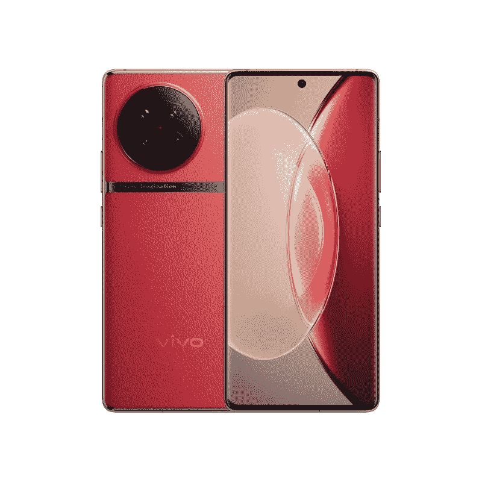

# Vivo X90 Pro Plus 是第一款采用骁龙 8 Gen 2 的手机

> 原文：<https://www.xda-developers.com/vivo-x90-series-launch/>

尽管距离高通发布骁龙 8 代 2 代才一周时间，Vivo 已经发布了首款搭载新 SoC 的旗舰产品。Vivo X90 Pro Plus 是一款以相机为中心的设备，它集成了骁龙 8 Gen 2 SoC，比去年的 [Vivo X80 Pro](https://www.xda-developers.com/vivo-x80-pro-review/) 有几处相机改进，以及其他一些值得注意的变化。这也是第一款搭载 Android 13 的非谷歌手机，但目前仅限于中国市场。

如果你错过了 Vivo 的直播，这里有你需要知道的关于 Vivo X90 Pro Plus 和它更实惠的兄弟姐妹 Vivo X90 Pro 和 Vivo X90 的一切。

## Vivo X90 系列:规格

| 规格 | Vivo X90 Pro Plus | Vivo X90 Pro | Vivo X90 |
| 尺寸和重量 | 

*   164.35 x 75.29 x 9.7mm 毫米
*   221g

 | 

*   164.07 x 74.53 x 9.34mm 毫米
*   215 克

 | 

*   164.1 x 74.44 x 8.88mm 毫米
*   196 克

 |
| 显示 | 

*   6.78 英寸 AMOLED
*   20:9 宽高比
*   3200 x 1440p 分辨率
*   120 赫兹刷新率
*   高达 300Hz 的触摸采样率
*   直接热轧制

 | 

*   6.78 英寸 AMOLED
*   20:9 宽高比
*   2800 x 1260p 分辨率
*   120 赫兹刷新率
*   高达 300Hz 的触摸采样率
*   直接热轧制

 | 

*   6.78 英寸 AMOLED
*   20:9 宽高比
*   2800 x 1260p 分辨率
*   120 赫兹刷新率
*   高达 300Hz 的触摸采样率
*   直接热轧制

 |
| 社会学 | 高通骁龙 8 第二代 | 联发科天玑 9200 | 联发科天玑 9200 |
| RAM 和存储 | 

*   12GB LPDDR5X 内存
*   256GB UFS 4.0 存储空间

 | 

*   12GB LPDDR5 内存
*   256GB UFS 4.0 存储空间

 | 

*   12GB LPDDR5 内存
*   256GB UFS 4.0 存储空间

 |
| 电池和充电 | 

*   4700 毫安时
*   80W 有线快充支持
*   50W 无线快速充电支持

 | 

*   4，870 毫安时电池
*   120W 有线快充支持
*   50W 无线快速充电支持

 | 

*   4，810 毫安时电池
*   120W 有线快充支持

 |
| 安全性 | 

*   高通 3D Sonic Max 显示指纹传感器
*   软件支持的面部解锁

 | 

*   光学显示器内指纹传感器
*   软件支持的面部解锁

 | 

*   光学显示器内指纹传感器
*   软件支持的面部解锁

 |
| 后置摄像头 | 

*   主要:50MP 索尼 IMX989，f/1.75，OIS
*   纵向:50MP 索尼 IMX758，2 倍变焦，f/1.6，固定焦距
*   潜望镜:64MP Omnivision OV64B，3.5 倍变焦，f/3.5
*   超宽:48MP 索尼 IMX589，f/2.2，114 度 FoV

 | 

*   主要:50MP 索尼 IMX989，f/1.75，OIS
*   纵向:50MP 索尼 IMX758，2 倍变焦，f/1.6，固定焦距
*   超宽:12MP 索尼 IMX663，f/2.0

 | 

*   主要:50MP 索尼 IMX866，f/1.75，OIS
*   人像:50MP f/1.98
*   超宽:12MP 索尼 IMX663，f/2.0

 |
| 前置摄像头 | 32MP f/2.45 | 32MP f/2.45 | 32MP f/2.45 |
| 端口 | USB 类型-C | USB 类型-C | USB 类型-C |
| 声音的 | 双扬声器 | 双扬声器 | 双扬声器 |
| 连通性 | 

*   5G
*   4G LTE
*   802.11 ax Wi-Fi
*   蓝牙 5.3
*   国家足球联盟
*   双纳米 SIM 卡

 | 

*   5G
*   4G LTE
*   802.11 ax Wi-Fi
*   蓝牙 5.3
*   国家足球联盟
*   双纳米 SIM 卡

 | 

*   5G
*   4G LTE
*   802.11 ax Wi-Fi
*   蓝牙 5.3
*   国家足球联盟
*   双纳米 SIM 卡

 |
| 软件 | 基于 Android 13 的 OriginOS 3 | 基于 Android 13 的 OriginOS 3 | 基于 Android 13 的 OriginOS 3 |

## Vivo X90 Pro Plus

Vivo X90 Pro Plus 是新 X90 系列的最高端型号，也是该系列中唯一一款采用新骁龙 8 Gen 2 芯片的手机。它配备了 6.78 英寸的大型三星 E6 AMOLED 显示屏，分辨率为 3200x1440p，刷新率为 120Hz，12GB 的 LPDDR5X 内存和 256GB 的快速 UFS 4.0 存储。

像它的前辈一样，Vivo X90 Pro Plus 是一款以相机为中心的智能手机。它提供了令人惊叹的相机硬件，这将轻松确保它在我们明年在全球推出的最佳智能手机相机名单中占有一席之地。

 <picture></picture> 

Vivo X90 Pro Plus

设备背面的四摄像头设置包括 50MP 索尼 IMX989 1 英寸传感器、50MP IMX758 2x 人像拍摄器、64MP 3.5x 倍潜望镜变焦摄像头和 48MP 超宽传感器，具有 114 度 FoV。在正面，它有一个 32MP 的自拍相机。除了令人印象深刻的相机硬件，Vivo 还在旗舰上提供了大量独特的软件功能，如手持天文摄影、微型模糊、地平线校正、镜头眩光人像模式等。

其他值得注意的功能包括 4,700mAh 电池，支持 80W 有线和 50W 无线快速充电，IP68 防尘防水，以及高通的 3D Sonic Max 显示指纹传感器。

## Vivo X90 和 X90 Pro

普通的 Vivo X90 和 X90 Pro 取代了骁龙 8 Gen 2，采用了联发科的旗舰产品 Dimensity 9200 芯片组。虽然这两款机型都像高端机型一样配备了 6.78 英寸的显示屏，但它是一个 FHD+ (2800 x 1260p)面板，刷新率为 120Hz。这两款设备都配备了 12GB LPDDR5 内存和 256GB UFS 4.0 存储。

 <picture></picture> 

Vivo X90 Pro

在摄像头方面，Vivo X90 Pro 安装了与高端机型相同的主摄像头和人像摄像头，但它缺少一个潜望镜变焦摄像头，并配备了一个 12MP 超宽传感器。不出所料，标准型号的相机设置是最差的，有一个 50MP IMX866 主传感器，一个 12MP 超宽相机和一个 12MP 2x 人像相机。

就电池容量和充电能力而言，Vivo X90 Pro 包装了 4,870mAh 电池组，支持 120W 有线和 50W 无线快充。另一方面，Vivo X90 拥有 4,810mAh 电池组，120W 有线，不支持无线快充。

 <picture></picture> 

Vivo X90

其他值得注意的功能包括 Pro 型号的 IP68 防尘和防水等级，标准型号的 IP64 等级，以及两者的光学指纹扫描仪。

Vivo X90 系列的三款设备都运行 Vivo 基于 Android 13 开箱即用的定制 OriginOS 3 Android 皮肤。但当这些设备在国际上推出时，很可能会运行基于 Android 13 的 FuntouchOS 版本。

## 定价和可用性

如前所述，Vivo X90 系列目前仅限于中国市场。Vivo 还没有分享任何关于国际发布的细节，但我们预计明年年初这些设备将在更多地区推出。

如果你不想等待并打算从中国进口这些设备，你可以以 6，499 元人民币(约合 910 美元)的起价购买 Vivo X90 Pro Plus。Vivo X90 Pro 和 Vivo X90 的基本款将分别花费 4999 元人民币(约 700 美元)和 3699 元人民币(约 518 美元)。

*你对全新的 Vivo X90 系列有什么看法？请在下面的评论区告诉我们。*