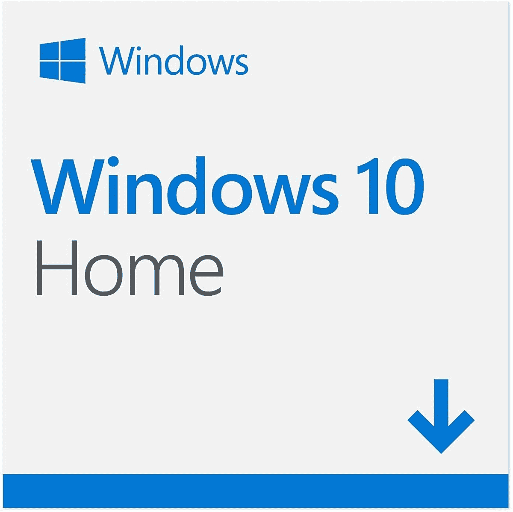

# 如何在苹果硅 Mac 上运行 Windows 10

> 原文：<https://www.xda-developers.com/windows-10-apple-silicon-mac/>

自从 Boot Camp 于 2006 年在 Mac 上推出以来，在 Mac 上运行 Windows 已经不是一件不寻常的事情了。Boot Camp 允许用户双启动 macOS 和 Windows，在裸机硬件上运行这两个操作系统。苹果芯片改变了这种情况。

尽管 Windows 10 和 macOS 现在都在 ARM 上运行，但 Boot Camp 无法与苹果的 M1 处理器兼容。是的，你仍然可以在苹果芯片上运行 Windows 10，比如在 M1 的 iMac 上。但是不行，你不能通过新兵训练营做到。你必须使用虚拟化软件。

## 你需要什么

*   苹果芯片的苹果电脑。英特尔驱动的 Mac 也能工作，但本指南是针对 ARM Macs 的。
*   Parallels Desktop，您可以[在这里](https://www.anrdoezrs.net/links/100122946/type/dlg/sid/UUxdaUeUpU2283/https://www.parallels.com/)下载。有免费试用，但你需要一个许可证。家庭版和学生版的价格为 79.99 美元，而专业版和商业版则是一年 99.99 美元的订阅模式。
*   一张 Windows 10 on ARM 的图片，[在此](https://www.microsoft.com/en-us/software-download/windowsinsiderpreviewARM64)预览。这些实际上是为了在 Hyper-V 虚拟机中运行而设计的，所以由于 ARM 上的 Hyper-V 仍处于预览阶段，因此 VHDX 映像也是如此。
*   Windows 10 许可证。你可以[在亚马逊这里](https://www.amazon.com/Microsoft-Windows-10-Home-Download/dp/B01019BM7O/?tag=xda-60mb7v7-20&ascsubtag=UUxdaUeUpU2283&asc_refurl=https%3A%2F%2Fwww.xda-developers.com%2Fwindows-10-apple-silicon-mac%2F&asc_campaign=Short-Term)购买一个，也可以通过微软商店购买一个。

## 如何在苹果芯片上运行 Windows 10

1.  安装 Parallels Desktop。这很简单，也很直接。只需打开安装文件，点击按钮安装它，并按照出现的几个指示。你会看到一个屏幕，告诉你不能在 ARM PC 上运行 x86 操作系统。单击继续。
2.  这将把你带到一个页面，询问你想创建什么。您会很快发现，虽然 Windows 是主要选项，但也有多种 Linux 选择。对于本教程，我们将重点放在 Windows 10 上，但 Linux 的过程应该是类似的。单击继续。
3.  选择 Windows 后，它会问你从哪里获取安装映像。它会自动搜索您电脑上的文件，所以如果您有很多图像，您可能需要手动选择。
4.  选择图像后，您将收到一条确认消息，告知您即将在 Mac 上安装 Windows 10。你可以不勾选“手动安装操作系统”选项，就像我在这个过程中前几次做的那样。我选中它只是为了显示更多的选项。
5.  只有当您选择手动安装 Windows 时，接下来的几个步骤才会出现。否则，跳到如下所示的下一步。现在，它会问你打算用 Windows 10 做什么。Parallels 将根据您在此选择的答案调整虚拟机在 Mac 上使用的资源。
6.  接下来，您将选择要在 Mac 上保存 Windows 虚拟机的位置。
7.  之后，你会看到一个进度条，显示 Windows 10 虚拟机正在你的 Apple Silicon Mac 上创建。
8.  接下来，您将看到您的虚拟机配置，有一个配置按钮来更改它的设置。
9.  像任何虚拟化软件一样，您可以根据需要更改任何资源。您可以在以后更改这些内容，但是要注意硬件选项卡。这将让您决定将 M1 Mac 的哪些资源分配给 Windows 10 虚拟机。
10.  完成后，您就可以启动 Windows 10 虚拟机了！
11.  由于我选择的选项，Parallels 将带我进入开箱即用的体验。如果您使用默认设置，您将从本地 Windows 帐户开始。
12.  一旦 Windows 10 在您的 M1 Mac 上通过 Parallels Desktop 第一次启动，您会看到一条成功的消息。
13.  这里有很多与 macOS 的集成。你可以从上面的图片中看到，我开始时在桌面上有一大堆图标。这是因为这些实际上是 macOS 桌面上的图标(它们实际上是你在这里看到的截图)。还有一个 OneDrive 文件夹，它与安装在 macOS 上的 OneDrive 挂钩，所以如果你从那个本地帐户开始，它仍然可以工作。您甚至可以将默认浏览器设置为 Safari。
14.  不过，您需要使用 Microsoft 帐户登录。为此，请进入“设置”->“帐户”并选择登录。
15.  你还需要通过设置->更新和安全->激活来激活 Windows 10。使用前面提到的产品代码。
16.  之后，窗口将被激活，你可以做的事情，如改变主题。Windows 将允许你在不激活它的情况下使用一段时间，但除非你只是为了好玩而在 M1 Mac 上安装 Windows 10，否则你可能希望让它运行一段时间。
17.  接下来，转到设置->更新和安全-> Windows Insider 程序，然后单击开始。你可能要打开一些数据收集的东西。
18.  确保使用您的帐户登录，并将其设置为开发频道。
19.  之后，在 Windows Update 选项卡下，检查更新。在秋季 Windows 10 功能更新之前，你将不得不使用预览版，并且你将获得每周版本。
20.  你已经准备好使用 Windows 10 了！一切都应该如你所料在你的 Apple Silicon Mac 上运行，Parallels 花了很多心思来确保你需要的集成都在那里。如果你正在考虑如何从 Windows 10 访问 macOS 文件，或者反之亦然，那就别想了。去做吧，很有可能它已经按照你希望的方式运行了。

需要注意的一点是，几乎每个 Windows 10 内置应用都会在你打开之前告诉你它正在更新。直到最近，这些应用程序还不能工作。这是因为这款 64 位 ARM 版本的 Windows 10 搭载了 32 位 ARM 版本的内置应用。这甚至与传统支持无关，因为 ARM PC 上从来没有 32 位 Windows。这些应用完全是为 Windows 手机设计的。

但苹果芯片不支持 32 位 ARM 应用，原因很简单，因为苹果生态系统中已经很久没有 32 位 ARM 应用了。现在，ARM 上的 Windows 实际上下载了 x64 应用程序(不，它们不是 ARM64，因为那样太有意义了)，并且它在仿真中运行。

无论如何，你可以在你的苹果 M1 Mac 电脑上安装 Windows 10。这是一个非常简单的过程，对吗？当我浏览虚拟机资源的不同设置时，我自己没有调整任何设置。苹果的统一内存和 M1 芯片组如此之好，以至于在默认的 4GB 内存下，Windows 10 在我的 Mac 上运行良好。我建议使用默认设置，如果出于某种原因这还不够，您可以稍后修改它。

如果你正在寻找一种双显示器设置，可以在一个屏幕上显示 Windows 10，在另一个屏幕上显示 macOS，请查看我们的指南[使用苹果硅 Mac](https://www.xda-developers.com/use-external-monitor-with-m1-imac/) 的外部显示器。有一些你可能没有想到的限制。

 <picture></picture> 

Parallels Desktop

##### Parallels 桌面

用于在 macOS 上运行 Windows 或 Linux 的 Parallels Desktop 虚拟化软件

 <picture></picture> 

Windows 11 Home

##### Windows 10 主页

Windows 10 家庭产品密钥

 <picture></picture> 

24-inch iMac with 4.5K display

##### 苹果 iMac (2021 年)

苹果的新一体机有 4.5K 显示屏，M1 芯片组，并且有漂亮的颜色