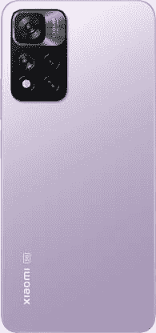

# 小米 11i 超充回顾:超越 120W 炒作

> 原文：<https://www.xda-developers.com/xiaomi-11i-hypercharge-review/>

早在 2015 年，小米就推出了专为印度市场定制的 Mi 4i - a [手机，名字中的字母“I”表示这款手机。然而，这个品牌很快就沉寂了，在这个系列中没有新的发布。快进到 2021 年，小米用](https://www.xda-developers.com/best-android-phones-india/) [Mi 10i](https://www.xda-developers.com/xiaomi-mi-10i-5g-review/) 复活了该系列，这一次采用了略有不同的方法。“I”现在代表*创新*，这是有意义的，因为 Mi 10i 是该细分市场中首批配备 108MP 摄像头的手机之一。在这些创新的基础上，小米现在推出了 2022 年的第一款手机——小米 11i HyperCharge，其关键创新是 120W 充电。

小米 11i HyperCharge 是印度第一款采用超快 120W 充电技术的手机。虽然这确实令人印象深刻，但还有其他几个支柱有助于使智能手机成为值得购买的产品。小米 11i HyperCharge 在这些方面有所表现吗？让我们超越 120W 的炒作列车，一探究竟！

***关于这篇评测:**小米印度给我们发来了小米 11i HyperCharge，在写这篇评测之前，该设备使用了一周的时间。小米没有对该评论的内容提供任何意见。*

## 小米 11i 和小米 11i 超充:规格

| 

规格

 | 

小米 11i 超充

 | 

小米 11i

 |
| --- | --- | --- |
| **构建** | 

*   带平边的聚碳酸酯框架
*   玻璃背面
*   IP53

 | 

*   聚碳酸酯框架
*   玻璃背面
*   IP53

 |
| **尺寸&重量** | 

*   163.65 x 76.19 x 8.34mm 毫米
*   204 克

 | 

*   163.65 x 76.19 x 8.34mm 毫米
*   207 克

 |
| **显示** | 

*   6.67 英寸全高清+ AMOLED
*   120 赫兹刷新率
*   360Hz 触摸采样率
*   HDR10
*   1200 尼特峰值亮度
*   康宁大猩猩玻璃 5

 | 

*   6.67 英寸全高清+ AMOLED
*   120 赫兹刷新率
*   360Hz 触摸采样率
*   HDR10
*   1200 尼特峰值亮度
*   康宁大猩猩玻璃 5

 |
| **SoC** | 

*   联发科天玑 920
*   马里 G68 MC4 GPU

 | 

*   联发科天玑 920
*   马里 G68 MC4 GPU

 |
| **闸板&存放** | 

*   6/8GB 内存
*   128GB 存储
*   可通过 microSD 扩展

 | 

*   6/8GB 内存
*   128GB 存储
*   可通过 microSD 扩展

 |
| **电池&充电** | 

*   4500 毫安时电池
*   120W 快速充电

 | 

*   5，160 毫安时电池
*   67W 快速充电

 |
| **安全** | 

*   侧装式指纹扫描仪
*   面部解锁

 | 

*   侧装式指纹扫描仪
*   面部解锁

 |
| **后置摄像头** | 

*   主要:108 兆三星 HM2，f/1.89
*   二级:800 万像素超宽，f/2.2
*   第三级:2MP 宏

 | 

*   主要:108 兆三星 HM2，f/1.89
*   二级:800 万像素超宽，f/2.2
*   第三级:2MP 宏

 |
| **前置摄像头** | 16MP，f/2.45 | 16MP，f/2.45 |
| **端口** | 

*   USB-C
*   3.5 毫米耳机插孔
*   红外线增强器

 | 

*   USB-C
*   3.5 毫米耳机插孔
*   红外线增强器

 |
| **音频** | 

*   立体声扬声器
*   杜比大气
*   高分辨率认证音频

 | 

*   立体声扬声器
*   杜比大气
*   高分辨率认证音频

 |
| **连通性** | 

*   混合 SIM 卡插槽
*   Wi-Fi 6 802.11 a/b/g/n/ac/ax
*   蓝牙 5.2
*   5G 频段:n40、n77、n78、n1、n3、n5、n8、n28

 | 

*   混合 SIM 卡插槽
*   Wi-Fi 6 802.11 a/b/g/n/ac/ax
*   蓝牙 5.2
*   5G 频段:n40、n77、n78、n1、n3、n5、n8、n28

 |
| **软件** |  |  |
| **颜色** | 太平洋珍珠、隐形黑、迷彩绿、紫雾 | 太平洋珍珠、隐形黑、迷彩绿、紫雾 |

**注:**小米 11i 和小米 11i HyperCharge 唯一的区别就是电池容量和充电速度。所以，除了这些部分，这篇评论也适用于标准的小米 11i。

## 电池和充电:15 分钟充满电？

让我们先解决房间里的大象。小米 11i 的包装盒中装有一个 120W 的充电器，据称可以在 15 分钟内将手机从 0-100%完全充电。我不确定小米在什么条件下测试了这一点，但我无法实现这一壮举。在我的使用过程中，我总共给手机充了 6 次电，从 2%到 100%,发现手机完全充满电平均需要 20 分钟左右。

手机充满电的平均时间约为 20 分钟

现在，虽然这也快得惊人，但 15 分钟的声明让我有了更高的期望。这是因为一些具有 65W 充电能力和类似电池容量的手机可以在大约 28 分钟内充满电。因此，瓦数翻倍的 8 分钟减速并不令人印象深刻。不过，这并不影响小米在这里取得的成就。如果几年前你告诉我，我可以在 20 分钟内给手机充满电，我不会相信。但当然，这是现在的现实。

当你的手机充电这么快时，这里 2-3 分钟和那里 2-3 分钟真的没什么区别，但我希望现实更接近营销。即使是 10 分钟，充电器也能给你带来近 70%的电量，这相当疯狂——只是没有小米声称的那么多。

注意，这些充电速度是在小米所谓的*升压模式*开启的情况下。升压模式允许手机以最高瓦数充电，而不必太担心热量。手机在充电时确实会变热，但不会变得异常热。我发现有点奇怪的是，小米在你买手机的时候默认禁用了 Boost 模式设置。埋在*设置下>电池&性能>电池>提升充电速度*。如果你想让你的手机尽快充电，你必须手动打开这个设置。

快速充电是该设备的主要亮点，禁用允许以最快速度给手机充电的设置似乎有点奇怪。事实上，你甚至会在充电时得到关闭升压模式的提示，这违背了让用户选择启用它的初衷。

小米表示这样做是为了控制热量，这是可以理解的。然而，在设置时，应该让用户选择充电速度更快还是产生的热量更少。普通用户甚至不会知道某个地方有一个升压模式，可以释放设备的全部充电潜力，这是他们额外支付的东西。

小米的广告宣传和最终用户的体验之间存在差距

在关闭升压模式的情况下，手机充电需要大约 25 分钟，这也很快，但比声称的 15 分钟时间高出 10 分钟。不了解升压模式的人可能会感到失望，因为他们的手机充电时间比广告宣传的长 10 分钟。虽然 10 分钟可能看起来不多，但这里的关键是小米的广告和最终用户的体验之间存在差距。

除了充电速度之外，在如此高的瓦特数下谈论快速充电还有两个方面需要讨论——安全性和电池健康。小米已经覆盖了这两个基地。小米 11i HyperCharge 拥有 34 项保护功能以及 TUV 莱茵认证，可实现安全快速充电。双重过充保护和实时温度监控系统是一些其他功能，即使在 120 瓦的功率下给手机充电也能确保安全。至于电池健康，小米声称在 800 次充放电循环(~2 年)后可以保留高达 80%的电池健康，这似乎很好。它在现实生活中有多好不是我们现在能回答的问题。

这种电池续航时间长、充电速度极快的组合非常罕见

除了充电速度极快的能力，小米 11i 超级充电还可以持续相当长的时间，这要归功于 4500 毫安时的电池。在适度使用的情况下，我经常能保持 6 个小时以上的屏幕打开时间，而在一天结束时，银行里有 20%的存款。你当然可以依靠这款手机持续一整天，这意味着你可以把你的能量银行留在身后。这种电池续航时间长、充电速度极快的组合很少见，因为手机经常用一个来证明另一个的缺乏。小米以一个相当实惠的价格集两者于一身，这是值得称赞的。

## 建造和设计

小米 11i 采用了类似于我们去年在 iPhone 12 上看到的平边。我个人很喜欢平边设计，但只是在小型手机上。拥有 6.7 英寸的显示屏意味着小米 11i HyperCharge 是一款大手机，当你将这种大尺寸与平边搭配时，握起来会有点不舒服。这款手机感觉很重，由于没有弯曲的手掌，这是一款双手设备。在使用案例时，这一点得到了进一步的强调。

由于没有曲线来包裹你的手掌，这是一个双手设备在任何时候

这不一定是件坏事，因为很多人似乎都喜欢大手机。握着手机实际上会给你一种实实在在的感觉，这是我喜欢的。尽管侧栏是塑料的，但它确实感觉像一部高级智能手机。虽然背面是玻璃，但这增加了设备的整体外观和感觉。说到外观，我们有太平洋珍珠配色的手机，看起来棒极了。它是由白色、蓝色、银色和一些闪亮元素组成的微妙色调，以多种方式反射光线。

就像该品牌最近的大多数手机一样，小米 11i HyperCharge 也有一个侧装式指纹扫描仪，速度非常快，非常准确。底部的 SIM 卡托盘可以容纳两个 SIM 卡或一个 SIM 卡和一个 SD 卡。两个 SIM 卡插槽都支持 5G。顶部有一个 IR blaster，以及心爱的 3.5 毫米耳机插孔和支持杜比音频的辅助扬声器。您还获得了 IP53 防溅等级，因此偶尔在雨中外出不会造成任何问题。

小米 11i 上的触觉技术无疑是该细分市场中最好的

小米 11i 的一个方面是我非常喜欢的，甚至在红米 Note 11T 5G 评论中谈到了触觉。小米在所有新设备的触觉方面做得非常出色。小米 11i 上的触觉技术无疑是该细分市场中最好的。这是你需要经历的事情，才能明白我在说什么。我发现自己有时会反复随机解锁和锁定设备，只是因为触觉如此令人满意！

## 显示

除了 haptics，小米在最近的手机上给我们留下深刻印象的另一个部门是显示屏。它始于配备 AMOLED 显示屏的 Redmi Note 10 系列，并一直延续至今。小米 11i HyperCharge 还获得了全高清+ AMOLED 显示屏，刷新率为 120Hz。该面板是 HDR 10+认证，并产生一些美丽的色彩。这是一个接近 6.7 英寸的巨大显示屏，这意味着观看内容是一种非常棒的体验。

6.7 英寸显示屏意味着观看内容是一种非常棒的体验

这款手机通过了 Widevine L1 认证，因此你可以在亚马逊 Prime 和网飞上观看全高清内容。事实上，你也可以通过这个设备在网飞欣赏 HDR 的表演和电影。即使当你只是滚动你的主屏幕或者在你的手机上做一些平常的事情，你也会意识到显示屏有多好，颜色有多流行。我注意到的另一件事是，自拍相机的打孔切口是我见过的任何手机中最小的。正是像这样的小事情让你欣赏在设计手机时投入的思想。

无论你打算在手机上做什么，你都会对小米 11i HyperCharge 的显示屏非常满意。无论是玩游戏还是狂吃你最喜欢的情景喜剧，你都会享受这种体验。

## 性能和软件

这里没有太多可以谈论的，除了联发科技最近在所有芯片组上都做得很好，小米 11i HyperCharge 上的 Dimensity 920 也不例外。我不打算深究基准数据，因为真实世界的性能才是最重要的。如果我必须给你一个我使用这款手机的体验要点，我只会说这是迄今为止我在₹25,000(～340 美元)价位使用过的最流畅的小米手机。这不仅与芯片组有关，还与 MIUI 在这款设备上的表现有关。

这是迄今为止我在₹25,000 价位使用过的最流畅的小米手机

Dimensity 920 是一款功能强大的芯片组，在执行任何日常活动时都不会出汗。滚动社交媒体订阅一如既往地流畅，在应用程序之间切换也很容易。在一些旧的小米设备上，我在以 120Hz 滚动时经历了一些滞后或抖动，但这款手机没有任何这些问题。甚至在电话上玩游戏也是一种很好的体验。BGMI 以流畅+极致的图形运行，所以你可以在小米 11i HyperCharge 上获得漂亮的 60fps 游戏。

我现在可以自信地推荐一款带有 MIUI 的手机，而不用担心广告或推广内容

基于 Android 11 的 MIUI 12.5 是你开箱即用的产品，虽然看到 Android 12 会很棒，但小米 11i 上的软件优化得非常好。就像我之前说的，这是我使用 MIUI 最流畅的体验之一。应用程序打开很快，动画很流畅，当你第一次启动设备时，没有太多不想要的臃肿软件。是的，有一些预装的应用程序，但体验已经比以前有了很大的改善。

一些奇怪的事情，比如表情键盘取代 Gboard 成为默认输入法，以及 GetApps 的不必要通知，仍然令人恼火，但这些都可以很容易地禁用，并不会真正影响最终用户的体验。我现在可以自信地推荐一款带有 MIUI 的手机，而不用担心广告或推广内容。

## 摄像机

虽然到目前为止，小米 11i 的大部分事情都是积极的，但这是它失去一些分数的地方。这不是小米第一次在手机上使用 108MP 传感器。事实上，小米推出第一款配备 108MP 摄像头的手机已经快两年了。即使在花了这么多时间进行图像处理之后，小米 11i HyperCharge 似乎也没有充分利用传感器。动态范围很好，但当你放大时，图像缺乏细节。相机还会使图像过度锐化，导致图片看起来不太舒服，尤其是当你放大时。颜色看起来也有点暗淡，我想这是因为手机对图像的饱和度不足。

令人惊讶的是，去年的 Redmi Note 10 Pro Max 在与小米 11i HyperCharge 进行比较时，似乎整体上产生了更好的图像。这可能是由于高通和联发科芯片的 ISP 不同，因此成像管道也不同。也可能是因为 Dimensity 920 是一款相对较新的芯片，小米还没有足够的时间来优化图像输出。就捕捉的光量而言，弱光表现似乎很好，但这里也可以观察到细节的缺乏。

这款手机的摄像头不是你所期望的那种水平，价格在₹25,000 以上

我想说的是，虽然图像输出并不是很差，手机仍然可以点击一些好的图片，但这并不是你所期望的价格高于₹25,000 的手机的水平。希望通过软件更新，图像处理算法可以得到改善，因为传感器本身比我们过去在小米自己的智能手机上看到的更有能力。

8MP 超宽射手也相当体面，但缺乏细节。更高分辨率的传感器肯定会有所帮助，但可以理解的是，小米在这些领域走了捷径，以适应充电技术，同时保持合理的价格。2MP 微距摄像头也是部分小米手机上 5MP telemacro shooter 的降级。自拍在颜色和动态范围方面看起来很棒，但肤色在大多数时候是成功或失败的。它还倾向于过度锐化面部，使图像有时看起来有点粗糙。不过，肖像模式下的边缘检测看起来不错。

## 判决:该不该买小米 11i 超充？

为了吹牛的权利，是的！不然呢？如果你想要一部大手机，拥有漂亮的显示屏、稳定的性能、良好的媒体消费体验和可靠的电池续航时间，那还是可以的。当然，120W 的充电是一个额外的奖励。标准的小米 11i 比₹2,000 便宜，配备了更大的 5160 毫安时电池，但充电速度“较慢”，为 67W。如果你不介意为你的手机多充电 10-15 分钟，这款手机更有意义，因为我会选择更大的电池而不是更快的充电。

不过这是主观的，所以如果你现在想要印度最快的充电手机，并且不介意在相机部门做出一点妥协，小米 11i HyperCharge 是值得一试的手机。如果你正在寻找一款更全面的手机，我会说小米 11 Lite NE 5G 可以说是类似价格的更好选择。它拥有漂亮的设计、更好的摄像头、相似的显示屏和稳定的性能。是的，你失去了超快的 120 瓦充电，但这是你为更好的相机和可用性所做的权衡。相应地选择你的毒药。

 <picture></picture> 

Xiaomi 11i HyperCharge

##### 小米 11i 超充

小米 11i HyperCharge 是印度首款支持 120W 快充的智能手机。

小米 11i 超级充电肯定不仅仅是 120W 的宣传

小米 11i 超级充电肯定不仅仅是 120W 的宣传。虽然有些人可能会认为这款手机的价格偏高，但重要的是要知道，像设备上的 120W 充电这样的新技术和创新需要大量的 R&D，因此价格昂贵。随着这项技术变得大众化，越来越多的品牌和产品开始使用它，它会变得更便宜。你实际上是在为一个非常新的功能付费，而这种独特性是有代价的。