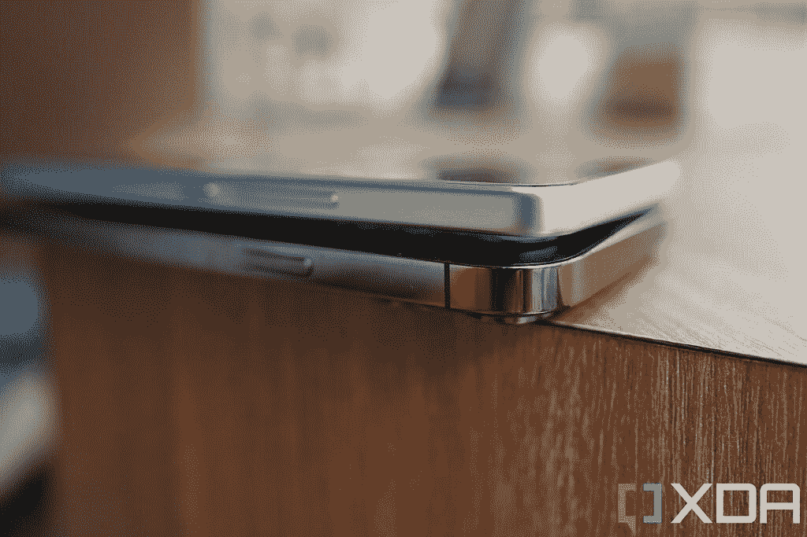

# 小米 12 Lite 评论:轻薄的 400 美元以上重量级手机

> 原文：<https://www.xda-developers.com/xiaomi-12-lite-review/>

本周早些时候，小米推出了[小米 12S 系列，](https://www.xda-developers.com/xiaomi-12s-series-launch/)正如“S”所暗示的那样，这是 3 月份推出的小米 12 系列的迭代更新。通常在智能手机领域，一旦一家公司更新了一个手机系列，之前的系列要么完全停产，要么淡出人们的视线。比如苹果发布 iPhone 5S 的时候，就停止了 iPhone 5 的推广。当华为推出 Mate XS 时，它停止了 Mate X 的销售

但小米不是，它有发布命名方案混乱的手机的习惯。这家多产手机制造商的最新设备是小米 12 Lite，这意味着这是 3 月份 12 系列的变体，而不是刚刚宣布的 12S 系列。

。bestawarddiv {

浮动:对；

宽度:20%；

边距:1em

边距-顶部:0；

}

迷茫？我们大多数人都是。但是不管你怎么说小米令人费解的命名方案，不可否认它制造了一些最好的中端手机。正如我在最近的 [Poco F4](https://www.xda-developers.com/poco-f4-review/) 评论中所说，小米 300-500 美元区间的中端手机通常比这个区间的任何手机都好，尤其是三星。

 <picture></picture> 

Xiaomi 12 Lite

## 小米 12 Lite:定价和可用性

小米 12 Lite 现已上市。不同地区的价格会有所不同，但大约相当于以下的美元价格。

*   6GB + 128GB，399 美元
*   8GB + 128GB，449 美元
*   8GB + 256GB，499 美元

 <picture></picture> 

Xiaomi 12 Lite

##### 小米 12 Lite

小米 12 Lite 是一款小巧的手机，性价比很高

* * *

## 小米 12 Lite:规格

| 

规格

 | 

小米 12 Lite

 |
| --- | --- |
| **打造** | 

*   康宁大猩猩玻璃 5
*   颜色:蓝色、紫色、灰色

 |
| **尺寸&重量** | 

*   159.3 x 73.7 x 7.3mm 毫米
*   173g

 |
| **显示** | 

*   6.55 英寸 FHD+ AMOLED
*   2400 x 1080 分辨率
*   120 赫兹刷新率
*   高达 360Hz 的触摸采样率
*   100% DCI-P3 覆盖率
*   HDR10+
*   杜比视觉认证

 |
| **SoC** | 高通骁龙 778G |
| **闸板&存放** | 

*   8GB LPDDR4X 内存+ 128GB UFS 2.2 存储
*   8GB + 256GB

 |
| **电池&充电** | 

*   4300 毫安时
*   67W 有线快速充电支持
*   含 67W 充电砖

 |
| **安全** | 

*   显示指纹扫描仪

 |
| **后置摄像头** | 

*   主要:1.08 百万法郎/1.79 OIS
*   超宽:800 万像素 f/2.2，119 度 FoV
*   宏:2MP f/2.45

 |
| **前置摄像头** | 32MP f/2.45 |
| **端口** | USB 类型-C |
| **音频** | 

*   双扬声器
*   杜比全景声认证
*   高分辨率音频认证
*   高分辨率音频无线认证

 |
| **连通性** | 

*   5G (SA/NSA)
    *   波段:n1/3/5/7/8/20/28/38/40/41/77/78
*   4G LTE
*   无线网络 6
*   蓝牙 5.2
*   国家足球联盟

 |
| **软件** | 基于 Android 12 的 MIUI 13 for Poco |
| **其他特性** | 

*   x 轴线性振动电机

 |

***关于这个评测:**小米给我发了一个小米 12 Lite 进行测试。这篇评论是在断断续续使用该设备三周后写的，其中一周是我的主要手机。小米在这次审查中没有投入。*

* * *

## 小米 12 Lite:硬件和设计

小米 12 Lite 是一款轻薄的手机，厚度为 7.29 毫米，重量仅为 173 克。虽然 6.55 英寸的屏幕仍然被一些人认为很大，但对我来说，这款手机感觉非常紧凑，有人习惯于携带重量超过 200 克的 6.7 或 6.8 英寸的旗舰产品。

这款手机的正面和背面都很平，这使得它比典型的 Android 手机更像一个盒子，而且非常容易拿着。我通常不太喜欢平板手机(我知道，我知道，我是科技评论领域的异类)，因为平板屏幕通常有尖尖的、稍微尖锐的边缘(显示器与机箱相遇的地方)，最好的例子是 iPhone 12 和 13 系列。

和去年的 11 Lite 一样，小米 12 Lite 通过在手机边缘添加微妙的倒角来解决这一问题，因此结果是一款平板手机，边缘仍然感觉略圆。它当然比 iPhone 13 Pro 手机更少让我着迷。

 <picture></picture> 

Look closely and you can see Xiaomi 12 Lite's edges (top) don't end in a sharp 90-degree angle like the iPhone 13 Pro Max's (bottom).

6.55 英寸的屏幕是一个 2400 x 1800 的 OLED 面板，具有对称的边框，这意味着底部下巴边框不会明显比顶部厚。这是 Android 领域相对较新的发展，通常只保留给旗舰产品。例如，三星和一加的旗舰手机给你对称的边框，但降低价格水平到 Galaxy As，Galaxy FEs 或一加诺德，你会看到更厚的下巴。这是三星和一加的一项成本削减措施，因为制造/组装没有额外下巴边框空间的手机需要更多的努力和技术技能。这是小米在中档价位提供*旗舰般的繁荣而其他品牌没有的例子。*

另一个领域是振动电机，这一点很清楚，至少对于像我这样的训练有素的评论家来说是这样，他知道在哪里挑剔。小米 12 Lite 的触觉非常出色，旗舰级别。同样，对于三星和一加的设备，你只能在旗舰级别获得出色的触觉效果。

对称的边框通常是为旗舰手机保留的，但小米正在以中档价格为你提供旗舰般的华丽

显示器下面有一个光学显示扫描仪，以及一个容纳 32MP 自拍相机的打孔机。这两个(扫描仪和自拍相机)都工作正常。与大多数最近的小米手机一样，扬声器格栅也位于手机的顶部和底部，与许多手机相比，声音输出更加对称。

翻转手机，你会得到一个有三种颜色的哑光玻璃表面。我喜欢我的单元上的淡蓝色，几乎是绿色。配色也在底盘上延伸，这样你就能得到统一的配色方案。虽然前屏幕受到大猩猩玻璃 5 的保护，但后玻璃面板只是普通的玻璃，没有任何特殊的加固。小米的包装中包括一个透明的果冻盒，不过对于那些可能想使用盒子的人来说。总体来说，我认为小米 12 Lite 的外观和手感都很棒，这不是我通常所说的非旗舰手机(是的我知道，我知道，我被宠坏了)。

### 内部构件

小米 12 Lite 由高通骁龙 778G 驱动，内存为 6GB 或 8GB，存储为 128GB 或 256GB。这是一种支持 5G 连接的 6 纳米硅。内存标准是我们看到的第一个偷工减料的迹象，因为它们不是最新的标准:LPDDR4X 和 UFS 2.2。这意味着这款手机加载东西的速度不会像使用 LPDDR5 或 UFS 3.1 的手机那么快。稍后，我将在性能部分详细讨论这一点。

有一块 4300 毫安的电池，可以以 67W 的快速充电速度充电，充电器包含在包装中。不过，这款手机不支持无线充电。

* * *

## 小米 12 Lite:相机

小米 12 Lite 的后置摄像头系统包括一个使用三星 HM2 传感器的 108MP 摄像头；一台 8MP 超宽；和一个 2MP 宏观传感器。

主摄像头使用 1/1.52 英寸的传感器，这是令人尊敬的——不算大，但也不算小。使用 f/1.8 光圈和小米成熟的软件处理，拍摄效果会非常好。甚至可能是未经训练的眼睛的旗舰质量。例如，看看下面的样本，由小米 12 Lite 和 iPhone 13 Pro Max 拍摄。小米的镜头其实噪音更小。

如果你想亲自查看全尺寸图像，我在下面的 Flickr 相册中上传了本文中显示的所有样本。

主相机拍摄的照片色彩鲜艳，动态范围稳定，如果我离主体/物体足够近，还会有点散景。到了晚上，手机会自动开启夜间模式，在这个价位上拍摄的照片还是相当不错的。你会看到更多的运动模糊，因为手机需要降低快门速度来吸收更多的光线。

像几乎所有中端手机的超宽手机一样，超宽手机最好只在白天使用，因为它的小图像传感器在晚上真的很难拍出细节非常柔和的夜间照片。

那个 200 万像素的微距传感器在这里大多只是装饰，产生的“微距”照片缺乏细节，甚至没有接近主体。iPhone 13 Pro 手机拥有目前智能手机中最好的微距镜头，你可以看到好的微距镜头和平庸镜头的区别。

自拍没问题；小米应用了一些皮肤平滑过滤器，但远没有三星手机那么强。快门速度有点慢，因为小米可能会使用更长的曝光时间来帮助进光。但是，如果有人/东西在你后面移动，这确实会导致运动模糊。

视频功能在这个价格范围内很好，但显然无法与更高价格的设备相比。这部手机可以拍摄高达 4K/60，但在 4K/60 甚至 4K/30 都没有稳定。但在 1080/30 拍摄，你会得到良好的电子稳定。我也是小米“克隆视频”拍摄模式的粉丝——这不是一个新功能，但本质上这种模式可以让你快速将两三个视频拼接成一个，这样同一个人就可以同时在视频中出现两三次。下面的视频包括白天和晚上的视频样本，以及一个“克隆视频”剪辑。

总的来说，小米 12 Lite 相机对于中距离相机来说已经非常令人满意了。

* * *

## 小米 12 Lite:性能和软件

2021 年，骁龙 778G 芯片将广泛应用于中档手机，这是有充分理由的。它是一个平衡的表现者，为日常任务和一些游戏提供足够的电力，但也不是一个功率猪，也不会太热。在我使用的日子里，我在日常任务方面没有遇到任何问题。应用程序从来没有冻结或结巴，我没有看到任何重大的减速，就像我在使用 [Galaxy A53](https://www.xda-developers.com/samsung-galaxy-a53-5g-hands-on/) 时一样。

GeekBench 和 PCMark 的基准测试分数都很稳定，但小米出于某种原因阻止了手机运行 3D Mark。

轻质、扁平的侧面和对称的扬声器使手机易于握持，当我在公寓里走动时，它是一个很好的 YouTube 观看机。

### 电池寿命

对于一款轻薄的手机来说，小米 12 Lite 电池还算过得去。在使用量较少的日子，比如工作日，当我一天中的大部分时间都坐在桌子旁时，12 Lite 可以轻松坚持一整天。但在周末，当我倾向于外出 12 或 13 个小时并大量使用手机(相机、社交媒体、流媒体 Spotify)时，12 Lite 的续航时间约为 11 个小时，大约有 4 个小时的屏幕打开时间(使用 120Hz 的刷新率设置)，这是可以接受的。这款手机带有 67W 充电器，充电速度很快:28 分钟就可以从 0 充电到 100，因此在傍晚或晚上 10 分钟的充电时间足以确保手机使用到凌晨。

### 软件

这款手机在 Android 12 上运行 MIUI 13，这是一个快速，丰富多彩，动画丰富的用户界面，可以做很多事情(动画很流畅，你可以通过滑动任何地方来拉下通知阴影，而不需要伸手到屏幕顶部，等等)，但小米的设置页面仍然不必要的复杂。MIUI 有三个不同的设置页面用于显示相关的问题:有一个通用的“显示”设置，“永远显示”设置，和“全屏显示”设置。最后两个不是主显示页面下的子部分，它们是独立的页面。每次我得到一部新手机，我都必须将屏幕超时设置为比默认时间长得多(通常为 30 秒)，因为我在拍摄产品时需要屏幕保持打开，而且我总是需要几分钟的时间才能找到小米手机的设置，因为它有三个显示页面。

你也不能在这里打开浮动窗口形式的应用程序。这似乎是小米在中端手机上施加的限制，因为 MIUI 肯定可以做到这一点。事实上，启动浮动窗口的按钮仍然存在，只是变灰为“不可用”我经常用手机进行多任务处理，我认为浮动窗口是 Android 常规分屏方法的一个更好的选择。

* * *

## 你应该买小米 12 Lite 吗？

评价小米 12 Lite 有两种方式。不可否认，399 美元，这是一个很好的价值产品。但是，这是一个多少好的价值取决于观点。如果你只是将小米 12 Lite 与其他品牌进行比较，那么最接近的竞争对手是 449 美元的 Galaxy A53、429 美元的 iPhone SE 3 或 450 美元左右的 iQoo Neo 6。

小米 12 Lite 几乎在所有重要的方面都击败了 Galaxy A53 更好的屏幕，更好的主摄像头，更好的处理器，更好的构建质量。在这种情况下，选择 A53 的唯一原因是，如果你只是喜欢三星或不喜欢小米。iPhone SE 是一个更棘手的比较，因为它是一个完全不同的生态系统，但 iPhone SE 在处理能力和视频录制方面胜出，但在显示、设计和摄影方面输得很惨。iQoo Neo 6 拥有更强大的骁龙 870 芯片，但摄像头和触觉功能较差，而且这款手机似乎不会在全球范围内广泛上市。因此，如果你将小米 12 Lite 与其他品牌进行比较，这是一个强有力的例子。

但是正如我最近在 F4 Poco 的评论中所写的，在这个价位上，小米最大的竞争对手似乎是它自己。小米 12 Lite 售价 399 美元，Poco F4 起价 410 美元，它拥有更好的骁龙处理器和更快的内存标准(LPDDR5 和 UFS 3.1)。小米 12 Lite 确实提供了略好的主摄像头和显示屏设计(对称边框)，但其他一切都差不多，包括那个无用的 2MP 宏观传感器。如果这两款手机在你所在的地区都能买到，我会说 Poco 是更好的选择。否则，小米 12 Lite 在真空中也是另一款非常非常好的中端手机。

 <picture></picture> 

Xiaomi 12 Lite

##### 小米 12 Lite

小米 12 Lite 是一款出色的中端产品，有很多功能可供选择。