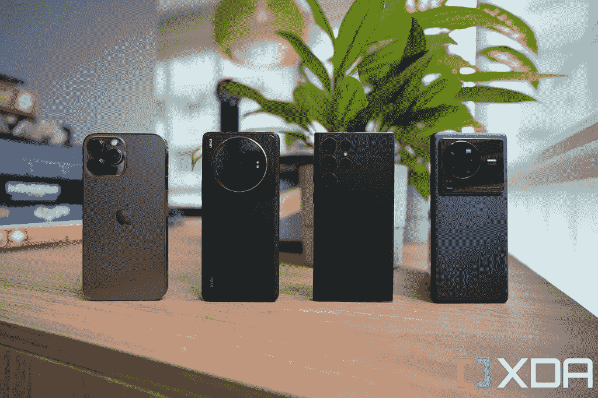
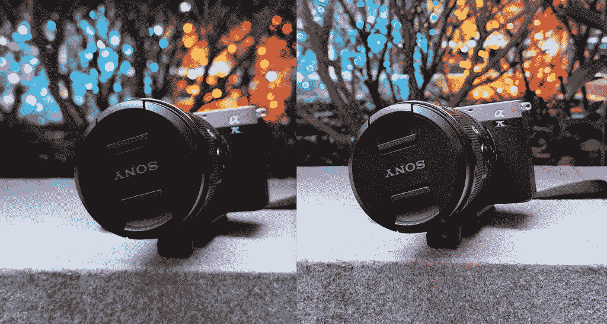
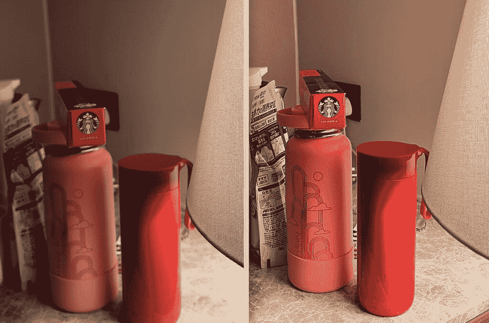

# 小米 12S 超评测:不负超炒作

> 原文：<https://www.xda-developers.com/xiaomi-12s-ultra-review/>

很长时间以来，小米一直被视为一个制造了一些相当好但不太好的手机的品牌。吸引人的是，小米的产品定价总是低于华为或三星，因此它们的性价比很有吸引力。在过去两年里，小米在摆脱这种声誉方面做了出色的工作，因为它现在被视为一个品牌，尽管仍提供超值的中端产品，如[小米 12 Lite](https://www.xda-developers.com/xiaomi-12-lite-review/) ，但也有能力制造绝对优质的旗舰手机，可以与世界上的苹果和三星进行交易，甚至击败它们。任何使用过去年[小米 Mi 11 Ultra](https://www.xda-developers.com/xiaomi-mi-11-ultra-review/) 的人都不会对此提出异议，小米 12S Ultra 延续了这一火爆势头。在迄今为止智能手机更新换代最多的一年里，小米 12S Ultra 在一些非常重要的智能手机领域取得了显著进步。

* * *

## 小米 12S Ultra:定价和供货情况

小米 12S Ultra 现已发售，但仅限中国。那些真正感兴趣的人可以研究一下进口选项，或者等着看小米是否在全球发布这个。从我们目前从外部渠道了解到的情况来看，小米没有计划在国际上发布。考虑到上一款小米 Ultra 设备在全球发布，而这是该公司第一款徕卡联合品牌设备，我们希望在这件事情上是不正确的，并祈祷稍后会有一个国际发布。

在中国，小米 12S Ultra 的售价为:

*   8GB 内存+ 256GB 存储空间 5999 元(约 892 美元)
*   12GB 内存+ 256GB 存储 6499 元(约 969 美元)
*   12GB 内存+ 512GB 存储 6999 元(约 1045 美元)

 <picture></picture> 

Xiaomi 12S Ultra

##### 小米 12S Ultra

小米 12S Ultra 是小米今年最好的平板产品，它带来了全新的 1 英寸传感器和徕卡光学相机。

* * *

## 小米 12S Ultra:规格

| 

规格

 | 

小米 12S Ultra

 |
| --- | --- |
| **打造** | 

*   IP68 防尘防水等级
*   颜色:
    *   经典黑色
    *   翠绿色的

 |
| **尺寸&重量** | 

*   163.17 x 74.92 x 9.06mm 毫米
*   225 克

 |
| **显示** | 

*   6.73 英寸三星 E5 AMOLED
*   杜比视觉真彩色显示器
*   3200 x 1440 分辨率，522 像素
*   1-120 赫兹自适应刷新率
*   1500 尼特峰值亮度
*   360 度环境光传感器
*   原生 10 位颜色深度
*   100% DCI-P3 覆盖率
*   HDR10+，HDR10，HLG

 |
| **SoC** | 高通骁龙 8 加第 1 代 |
| **风筒&储存** | 

*   8GB LPDDR5 内存+ 256GB UFS 3.1 存储
*   12GB + 256GB
*   12GB + 512GB

 |
| **电池&充电** | 

*   4860 毫安时
*   67W 有线快速充电支持
*   50W 无线快速充电支持
*   10W 反向无线充电支持
*   小米 Surge P1 充电芯片
*   小米浪涌 G1 电池管理芯片

 |
| **安全** | 显示指纹扫描仪 |
| **后置摄像头** | 

*   主镜头:5030 万像素 IMX989，f/1.9，8P 非球面镜头，octa-PD 自动对焦
*   超宽:48MP IMX586，f/2.2，徕卡 Summicron 1:1.9-4.1 / 13-120 非球面镜头，双 PD 自动对焦，支持微距模式
*   长焦:48MP IMX586，f/4.1，120 倍潜望镜变焦，远视
*   徕卡真实外观和徕卡活力外观摄影风格
*   徕卡生动，自然，BW 自然，BW 高对比度过滤器

 |
| **前置摄像头** | 32MP RGBW 图像传感器 |
| **港口** | USB 类型-C |
| **音频** | 

*   对称立体声扬声器
*   由哈曼卡顿调音
*   杜比全景声认证

 |
| **连通性** | 

*   双 5G
*   4G LTE
*   无线网络 6
*   蓝牙 5.2
    *   BLE 音频支持
    *   骁龙声音支持
    *   AAC/LDAC/LHDC/aptX 自适应

*   多功能 NFC

 |
| **软件** | 基于 Android 12 的 MIUI 13 |
| **其他功能** | 

*   x 轴线性振动电机
*   3D 冷却系统

 |

***关于这篇评测:**小米给我提供了一台小米 12S Ultra 来测试。这篇评论是在对这款手机进行了九天的测试后写的。小米在这次审查中没有投入。*

* * *

## 小米 12S Ultra:设计和硬件

*   主摄像头使用索尼开发的新 1 英寸传感器，光学元件来自徕卡
*   优质材料、结构和饰面
*   首批搭载高通骁龙 8 Plus Gen 1 的手机之一

这些年来，智能手机的摄像头模块越来越大，但小米 12S Ultra 真的拿走了蛋糕。我是说，看看这东西。它从背面也凸出了不少，所以如果你把这款手机平放在桌子上，它会倾斜放置，就好像你在支撑键盘一样。

如果这个相机模块还不够引人注目，还有一个 24k 的金环包裹着模块。然而，尽管采用了头重脚轻的设计，这款手机仍然可以独立站立，这要归功于它平坦的底部和顶部。

然而，这意味着小米 12S Ultra 的屏幕失去了小米 mi 10 Ultra 和 Mi 11 Ultra 的四曲面设计(顺便说一下，今年的手机没有 Mi 品牌)。

小米 12S Ultra 的形状非常典型的现代安卓旗舰产品:6.7 英寸的屏幕在左右两侧都是弯曲的，有圆角和最小的边框。这是一个三星 E5 LTPO 面板，这是目前移动显示技术中最好的。

小米 12S Ultra 屏幕是目前移动显示技术的最佳选择

它非常清晰(3200 x 1440)，可以在 1-120Hz 之间改变刷新率，并支持 100%的 DCI-P3 色域，10 位颜色，HDR 10+等。这款 12S Ultra 屏幕的峰值亮度为 1，500 尼特，甚至几乎与 Galaxy S22 Ultra 的显示屏一样亮，Galaxy S22 Ultra 此前在行业中遥遥领先。

机箱由铝制成:音量摇杆和电源按钮位于右侧，对称的扬声器格栅位于顶部和底部。它们也由哈蒙/卡顿调音。背面覆盖着这种抓地力人造革，类似于相机机身的手柄区域，顶部有一个巨大的相机模块。

小米 12S Ultra 比大多数 2022 年的旗舰产品重一点，厚 225 克，厚 9.06 毫米，但不会太大，感觉很笨重。

 <picture></picture> 

From left: iPhone 13 Pro Max, Xiaomi 12S Ultra, Samsung Galaxy S22 Ultra, Vivo X80 Pro

### 内部构件

这款手机配备了 4，860 毫安时电池，12GB 的 LPDDR5 内存，以及高达 512GB 的 UFS 3.1 存储空间——对于旗舰产品来说，这是非常标准的东西。新的和值得注意的是里面的硅三人组:[高通骁龙 8 加第 1 代](https://www.xda-developers.com/qualcomm-snapdragon-8-gen-1/) SoC，以及小米自制的 Surge G1 和 P1。读者应该熟悉骁龙 8 Plus Gen 1，这是高通对其旗舰芯片的最新更新，小米 12S Ultra 是首批搭载该芯片的手机之一。这是对骁龙 8 Gen 1 的一个非常有效的升级，每个可以选择采用 Plus 而不是 standard 的人都应该采用它，对于以前来自高通的 Plus 芯片，我们不能特别说什么。

与此同时，G1 和 P1 是小米设计的专用芯片，用于处理电池管理和充电。我不是电池专家，我不太确定你是否真的需要一个专用的硅来处理这样的每个任务，但我可以说小米 12S Ultra 是我测试过的所有安卓旗舰产品中电池续航时间最好的，配备了 120Hz，WQHD+屏幕。对我来说，这款手机可以持续使用整整 13 个小时，我是一个重度用户。我将在后面的性能部分详细阐述电池寿命。

这款手机的每个部分，从处理器到屏幕，从触觉到光学，都是顶级的。我唯一挑剔的是显示器内指纹扫描仪——它“只是”一个典型的光学显示器内扫描仪(可能来自深圳的 Goodix ),而不是 Vivo 在其旗舰产品中使用的高通 3D Sonic Max 超声波扫描仪。后者的扫描面积更大，速度明显更快。在使用了 [Vivo X80 Pro](https://www.xda-developers.com/vivo-x80-pro-review/) 和[Iqoo 9 Pro](https://www.xda-developers.com/iqoo-9-pro-review/)的扫描仪后，我很难再使用更小、更慢的光学扫描仪。我知道这完全是吹毛求疵，只适用于亚洲的评论者或手机爱好者，因为世界其他地区甚至还没有使用新的 3D Sonic Max 扫描仪的设备。

* * *

## 小米 12S Ultra:相机

*   50MP、1 英寸的徕卡光学传感器非常棒，拍出的照片有更自然的散景
*   48MP 超宽和 48MP 5X 潜望镜相机非常好，但不一定比竞争对手的产品更好
*   自拍相机和人像可以击中或错过

小米 12S Ultra 配备了四个摄像头——三个在后面，一个在前面——但显然，所有的注意力和兴趣都在主摄像头上:一个 50MP(实际上是 50.3MP)的摄像头，使用索尼新的 IMX989 1 英寸传感器。小米表示，它向索尼提供了 1500 万美元的资金来帮助开发这种传感器，但这种镜头并不是小米独有的——包括刚刚推出的[夏普 Aquos R7](https://www.xda-developers.com/sharp-aquos-r7-hands-on/) 在内的其他手机也使用这种传感器。

但这还不是这个主摄像头华丽的数字和大品牌名称的全部。这款主摄像头还使用了徕卡光学系统，这是一款新的 8P 镜头，小米称这是专为这款手机开发的。这台相机要拍的东西太多了，所以我将把我的发现分成几个部分。本文中的照片已被压缩，因此那些想查看全分辨率照片样本的人可以查看下面的 Flickr 相册。

### 1 英寸传感器意味着更强、更自然的散景

那么更大的传感器是做什么的呢？更大的图像传感器吸收更多的光，从而产生更大的动态范围和图像细节。它还为专业摄影师喜欢的景深散景效果制作了一个较浅的聚焦框。

如果你拍摄足够近的东西/人，现在的每部手机都会产生某种形式的散景，但小米 12S Ultra 的散景一直更强，焦点下降更自然。在下面的样本集中，即使你在手机屏幕上观看图像，你也可以看到小米的图像表现出明显更强的散景。

但如果你靠近点看，最好是在更大的屏幕上，你可以看到小米的图像不仅在相机和后面的植物之间展示了散景，而且在相机镜头和相机机身之间也展示了散景。较大的传感器能够在两者之间产生一些分离，因为镜头比机身更靠近相机五英寸。三星的图像在相机和植物之间提供了一些分离，但不完全是镜头和机身。这是一个更平的形象。

 <picture></picture> 

100% crops, 12S Ultra (left), Galaxy S22 Ultra (right).

由于 iPhone 13 Pro Max 的图像传感器尺寸小于 Galaxy S22 Ultra，因此与小米 12S Ultra 相比，景深的差异更加不协调。请注意第二组，特别是小米的图像不仅显示了前景(灯)和背景(瓶子)之间的分离，还显示了星巴克盒子和它下面的粉红色瓶子，因为盒子朝着镜头伸出了几英寸。

相比之下，iPhone 的图像看起来很平。

 <picture></picture> 

100% crops, 12S Ultra (left) and iPhone 13 Pro Max (right).

### 徕卡色彩科学真的很喜欢对比

你可能已经从迄今为止的样本中注意到，与 Galaxy S22 Ultra 或 iPhone 13 Pro 拍摄的照片相比，小米的图像显示出更深的阴影，对比度更高，这是徕卡启发的颜色科学的一部分，它故意让阴影更暗，以获得更明显的对比度。

你第一次启动相机应用程序时，手机会让你在两种徕卡颜色配置文件中进行选择:“徕卡正宗”和“徕卡活力”。这两个轮廓仍然保持阴影相当暗，但充满活力的将夸大亮点一点。我通常更喜欢真实的颜色配置文件。

我很高兴小米 12S Ultra 相机很自信，有自己的身份，而不是推出半通用，平面的图像。对于对比强烈的场景(比如有很多高楼的城市上空的晴天)，相机可以拍出一些非常大气的照片。您在一些示例中看到的徕卡水印是可选的，默认情况下是关闭的。

作为参考，下面是谷歌 Pixel 6 Pro 如何处理这种特殊的高对比度场景。这归结为一个偏好的问题，哪个镜头是“更好”

### 更大的传感器也意味着它不经常需要夜间模式

较大的传感器比较小的传感器收集更多的光，由于小米 12S Ultra 的传感器比任何主流旗舰都大，所以它应该自动成为低光拍照王，对吗？没那么简单。图像传感器大小只是允许智能手机相机收集光线信息以产生图像的许多方法之一。还有光圈大小，以及许多软件技巧，如像素宁滨和“夜间模式”，后者使用计算图像堆叠来重现真实相机的长曝光拍摄体验。

因为夜间模式已经变得非常非常好，而且大多数手机都是自动开启的，所以我发现，在大多数弱光场景下，小米 12S Ultra 的图像往往看起来不如竞争对手的手机亮。

这部分是因为 12S Ultra 的颜色科学喜欢让阴影更暗，但更大的原因是 12S Ultra *没有*使用夜间模式进行上述拍摄，而其他三款手机使用了夜间模式(它们自动打开)。你真的需要在漆黑的条件下拍摄才能触发夜间模式，而像 Pixel 6 Pro 或 iPhone 13 Pro 这样的设备会在太阳落山后立即打开夜间模式。iPhone 需要两秒钟的夜间模式才能捕捉到上面的镜头，而 12S Ultra 只是像平常一样抓拍。

在接下来的这一集，场景足够暗，小米终于打开了一秒钟的夜间模式，而其他两款手机的夜间模式为两秒钟。

我建议关心这些东西的读者，带着全尺寸的样本跳进 Flickr 相册，去像素窥视。但从我的检查来看，iPhone 的镜头在全尺寸观看时噪音极大，在操场区域灯光太吹了。实际上，我更喜欢三星的颜色，这是三种颜色中最好的。

所以我们可以看到，小米 12S Ultra 的夜间拍摄不会神奇地比竞争对手更亮，因为其他人只会求助于夜间模式。但是夜间模式并不总是理想的，因为你必须在几秒钟内保持静止(Pixel 6 Pro 特别可笑，有时需要整整五秒钟来拍摄夜间照片)，所以你将无法使用夜间模式拍摄移动的对象。小米的镜头因此更加有机，因为它经常只是一个简单的镜头，如果你像素窥视，它几乎总是更少噪音。在下图中，在一个全黑的房间里拍摄，光源来自窗户和显示器，你可以看到小米的图像表现出最少的噪音。然而，Vivo 的绝对不可思议的 HDR 仍然令人瞠目结舌，在小米和三星吹灭电脑屏幕的同时，成功地暴露了显示器、窗口和房间的其他部分。

这里有更多小米 12S Ultra 的夜拍样品，我真的很喜欢夜拍的相机，即使 [Vivo X80 Pro](https://www.xda-developers.com/vivo-x80-pro-review/) 仍然可以说是低光照片冠军。

### 徕卡人像滤镜质量有高天花板，低地板

因为小米 12S Ultra 的唯一变焦镜头是如此长的变焦(5X)，所以这款手机使用主摄像头拍摄人像，并以数字方式裁剪出更理想的焦距。默认情况下，相机拍摄的人像大约相当于 50 毫米。但是有三种徕卡人像风格(又名滤镜)模拟用不同的徕卡镜头拍摄:35mm 黑白；50mm 漩涡状散景；以及 90mm 柔焦。

我真的很喜欢 35mm 黑白滤镜，并且发现大多数照片都非常具有视觉吸引力。

但是其他两个过滤器错过的次数比他们击中的次数多，产生了如下的无用镜头。

如果我们恢复到标准的人像，那么 12S Ultra 就没问题，但边缘检测有点太激进了，iPhone 的人像模式显然更智能地识别前景和背景中应该有什么。在下面的第二组中，你可以看到小米人工散景在后面的第二个狮子雕像周围看起来非常不稳定。iPhone 正确地识别出第二只狮子在背景中更远的位置，并正确地应用了人工散景。这就像拍摄普通照片的反面，小米拍摄的照片看起来奇怪地平坦，而 iPhone 拍摄的照片具有(模拟的)深度。

### 变焦和超宽相机非常好，但不是最好的

小米 12S Ultra 带回了与去年的小米 11 Ultra 相同的 48MP 5X 潜望镜和超宽相机。我注意到较新的 ISP 和软件处理比去年改进了 5X 变焦，超宽在很大程度上可以捕捉到更详细的照片，并且在弱光条件下，比 iPhone 13 Pro Max 和 Galaxy S22 超宽更少噪音。

但是小米这里的相机并不是业界最好的。三星的 Galaxy S22 Ultra 的 10 倍变焦镜头更好——它不仅有两倍的光学焦距范围，而且即使我在 20 倍、30 倍变焦时，取景器也保持非常稳定。

12S Ultra 的超宽镜头也具有与其他两个镜头明显不同的色彩科学。

### 真实散景让视频看起来更专业

小米 12S Ultra 视频性能确实不错。它可以拍摄高达 8K 分辨率的视频，但我不在乎这个，大多数人也不应该在乎。相反，在 4K/30 拍摄，惊叹于清晰的视频和良好的稳定性，最重要的是，由于更大的传感器，明显的散景。请参见下面的示例。

我对视频的唯一挑剔是，与 Galaxy S22 Ultra 相比，音频记录有点低于标准。我的声音在小米的剪辑里比三星的稍微远一点。虽然一个主要的问题也是因为我在外面拍摄视频，在地球上最嘈杂的城市之一。安静地区的大多数人不会有这个问题。

### 自拍相机低于标准

有一个 32MP 的自拍摄像头，有点东拼西凑。我真的很喜欢第一个镜头，例如，强烈的对比，以及对我肤色和纹理的准确刻画。但是另外三张是在光线较暗的情况下拍摄的呢？快门速度明显慢了很多，因为每张照片都有点模糊，我的皮肤突然看起来非常柔软，三星风格。最后一张，我看起来像塑料。

当你考虑到自拍相机最多只能拍摄 1080p 的视频(不包括 4K)，那么可以肯定地说，这个镜头低于 2022 年旗舰标准。

### 小米 12S Ultra 是最好的拍照手机吗？

我一直非常直言不讳地将 Vivo X70 Pro Plus/X80 Pro [称为最好的拍照手机](https://www.xda-developers.com/best-smartphone-cameras/)(两个摄像头非常相似)，所以我问的唯一符合逻辑的问题是小米 12S Ultra 的主摄像头是否击败它。这听起来像一个 copout，但它真的取决于你的偏好。Vivo 的 HDR 仍然是最不可思议的，能够在每次拍摄的*中找到完美的平衡。在过去的 10 个月里，我用 Vivo 手机拍了 1000 多张照片，还没有看到它们打出高光。以下面这个场景为例:这是一个很难拍摄的场景——一个非常明亮的小吃摊位于黑暗的街角。*

Vivo 的 HDR 在这里简直令人瞠目结舌，它在主镜头和超广角镜头中完美地曝光了一切。商店的灯光不太刺眼，商店的招牌清晰可辨，街道有阴影但不太暗。小米的镜头对比吹灭了店灯，阴影很暗。但小米的镜头更自然，更好地代表了当时的坚韧不拔的氛围。Vivo 的镜头看起来太过加工了。

好了，最后一组样本。这是另一个艰难的场景，拍摄窗外刺目的阳光。再次注意，Vivo 的 HDR 是最好的——它是唯一一款不会吹出透过窗户的非常刺目的光线的相机，而且它还以自然的颜色照亮了阴影笼罩的橱柜和盒子。三星的镜头有一个奇怪的黄色投在内阁。小米的镜头选择了让那部分画面保持阴影覆盖。还有微软 Surface Duo 2？我只是把它放在这里，让你们了解一个糟糕的智能手机相机在这种非常艰难的情况下会做什么。

我能把这场小米 12S Ultra vs Vivo X80 Pro 相机大战最好的方式就是 Vivo 仍然抓住了最令人瞠目结舌的镜头，但小米的相机感觉更有机，感觉更像真相机，让我想更多地尝试拍摄。我绝对喜欢 1 英寸的大传感器，以及随之而来的所有自然散景。

* * *

## 小米 12S Ultra:软件和性能

*   这款手机在 Android 12 上运行 MIUI 13.0.3
*   快速、灵活的性能
*   非常好的电池寿命

### MIUI

小米 12S Ultra 在 Android 12 之上搭载了 MIUI 13.0.3。由于这款手机目前只在中国销售，所以软件是 MIUI 的中国 ROM 版本，其中包含了大量的中国臃肿软件。开箱即用，预装了百度、腾讯等中国公司的十几款应用和游戏。幸运的是，你可以卸载它们。该软件也没有搭载谷歌应用程序，但谷歌服务框架已经在这款手机中，所以只需简单安装谷歌 Play 商店(可直接在小米的应用商店中获得)就可以立即在手机上安装谷歌。

对我来说，卸载所有的膨胀软件应用程序并安装谷歌应用程序花了大约 15 分钟的时间，让这部手机感觉像是国际观众的标准小米手机。小米的中国 ROM 比中兴的干净得多，这意味着一旦我设置好一切，它就真的感觉像一个典型的全球 ROM，没有随机的中文字体留在用户界面上，也没有多余的中文通知或搜索栏占用空间。

MIUI 是一个以动画为主的用户界面，但一切都运行得非常快。应用程序立即启动，我很少看到任何动画口吃或丢帧，即使在三星的旗舰手机中也会出现这种情况。

我长期以来一直对 MIUI 的设置页面有问题，过于复杂，这里也是同样的情况。不是一个，不是两个，而是三个显示部分，这意味着如果你想设置分辨率，或者屏幕休眠前的时间，或者导航手势，你可以进入三个不同的设置页面。

我也不喜欢小米将通知面板和快捷切换分开，它们是两个独立的面板，通过从屏幕中间或右侧滑动来激活。在 MIUI 的国际版 ROM 中，你可以关闭这个(并且把两者结合起来，就像所有的安卓手机一样)，但是中国版 ROM 不让你这么做。

### 骁龙 8 加第 1 代

骁龙 8 Plus Gen 1 是骁龙 8 Gen 1 的“迭代”更新，高通承诺 CPU 和 GPU 性能提高 10%，但更重要的是，能效提高 30%。基准测试数据和真实世界的使用情况支持了改进的说法。在 GeekBench 中，小米 12S Ultra 的得分比 Galaxy S22 Ultra 高出不少。

PC Mark 和 3D Mark 的 Wild Life 极限压力测试分数都高于骁龙版 Galaxy S22 Ultra 的分数。

但实际上，骁龙 8 代 1——见鬼，甚至骁龙 888——足够强大，可以运行任何现代应用程序而不会出现任何问题。新芯片对我做的事情没有任何影响，比如滚动 Instagram、发送电子邮件和在 Slack 中打字。即使是输出 20 秒的 4K 短片，在新芯片上也能感受到类似的速度。

### 电池寿命和充电

相反，我认为不同之处在于前面提到的超级电池寿命。我不知道这其中有多少是新的 SoC 更高效，有多少是小米的 Surge G1 芯片，但我一直在一次充电后使用约 14 小时，屏幕打开时间略超过 6 个半小时。我将显示器分辨率和刷新率保持在尽可能高的水平，我是一个经常拍摄和拍摄的重度相机爱好者，这可以被认为是良好的电池寿命。

没有任何一款 120hz WQHD+屏幕的手机比小米 12S Ultra 的电池续航时间更长

没有任何一款 120hz WQHD+屏幕的手机，无论是 Galaxy S22 Ultra、[一加 10 Pro](https://www.xda-developers.com/oneplus-10-pro-review/) 还是 [Oppo Find X5 Pro](https://www.xda-developers.com/oppo-find-x5-pro-review/) ，都能提供 6 个半小时的屏幕打开时间。就在一年前，我还在感叹 120Hz 和 WQHD+分辨率的组合是电池杀手，去年的小米 Mi 11 Ultra 尽管比今年的手机电池更大，但对我来说却无法坚持一整天。我相信目前唯一能给我更好电池寿命的主流旗舰手机是 iPhone 13 Pro Max，而这款手机没有 WQHD+显示屏。

小米 12S Ultra 包括一个 67W 的充电器，根据我的测试，可以在 28 分钟内从 0 到 100%充满手机。还支持 50W 无线充电和 10W 反向无线充电。我没有测试 50W 无线充电所需的充电器，但标准 Qi 无线充电工作正常。

### 扬声器、触觉、热量、充电

这方面也很好。小米手机提供一些更响亮/更饱满的扬声器已经有几年了，这种趋势在这里继续。触觉和热学也很棒，尤其是后者。我很少感到手机太热，但也许人造革背也没有玻璃背反射热量多？骁龙 8 代 1 加也应该得到一些信贷。

* * *

## 如果小米 12S Ultra 没有在国际上发布，那将是一个真正的遗憾

小米最近的两款 Ultra 手机绝对是高端高端安卓手机，凭借其设计和原始功能在安卓手机的海洋中脱颖而出。小米 12S Ultra 延续了这一点，并将其提升到了另一个水平。

尽管我对中国手机品牌与欧洲传统相机制造商的合作趋势颇为关注，因为我永远无法确定这种合作在多大程度上是真正的合作，还是仅仅是一种授权游戏，但徕卡的合作似乎确实改善了小米相机的色彩科学和图像处理。以前的小米相机很好，甚至不错，但小米 12S Ultra 相机很自信，拍出的照片背后更有意图。这部手机让我想拍更多的街头照片。

小米 12S Ultra 展示了小米真正的能力

在中国和香港，这款手机是绝对容易推荐的，因为它的价格低于 Galaxy S22 Ultra 或 iPhone 13 Pro Max。但是那些进口的人将不得不支付加价，从而使价格更加接近。我可以从 Reddit 线程和 YouTube 评论中看到，许多发烧友已经在进口这款手机。但对于不那么铁杆的读者来说，他们最好推迟，看看小米是否会在全球发布这款产品。

 <picture></picture> 

Xiaomi 12S Ultra

##### 小米 12S Ultra

小米 12S Ultra 是小米今年最好的平板产品，它带来了全新的 1 英寸传感器和徕卡光学相机。

如果没有，那将是一个遗憾，因为这是一款真正展示小米能力的手机。