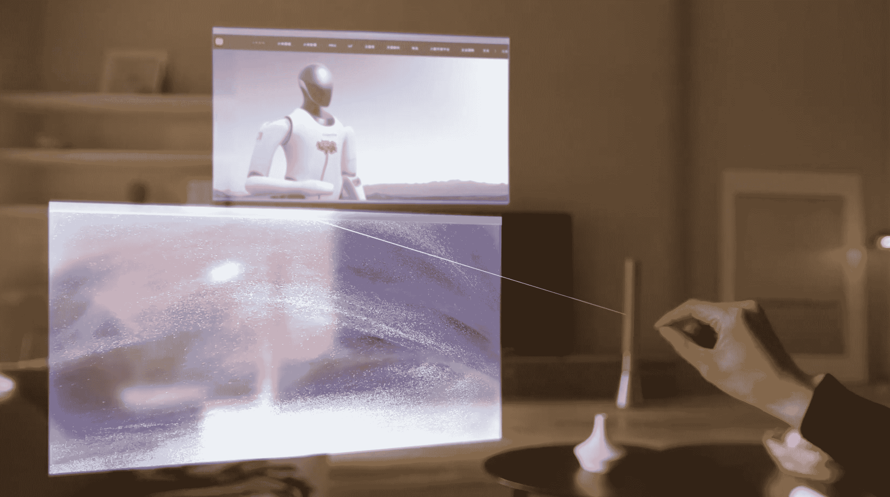
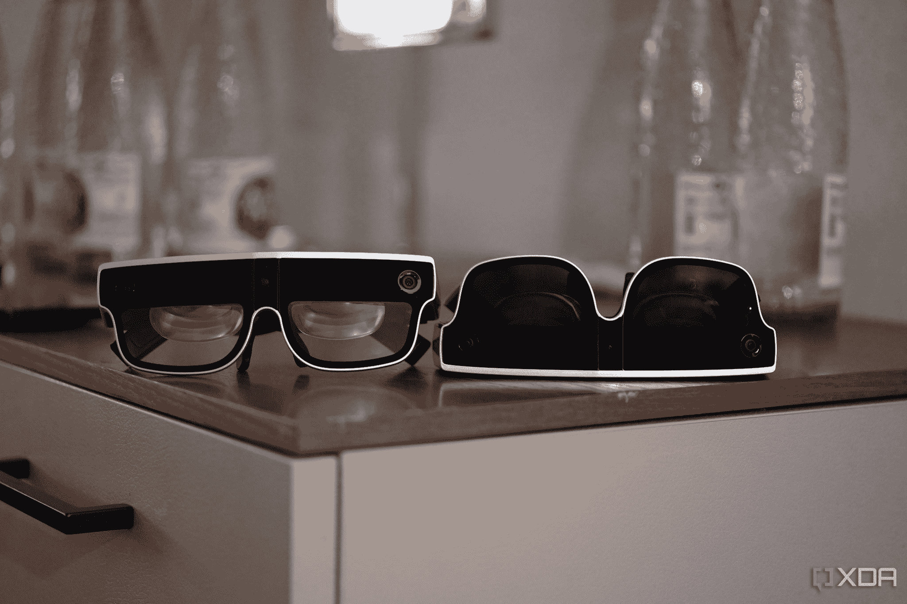

# 独家:这些是小米新推出的无线 AR 智能眼镜，它们看起来像来自未来

> 原文：<https://www.xda-developers.com/xiaomi-ar-smart-glass-hands-on/>

对于手机爱好者来说，世界移动通信大会是一场激动人心的贸易展，因为它不仅是商用产品的发布会，也是一些世界顶级科技品牌展示未来产品原型或创意的地方。虽然小米两天前刚刚为其[小米 13](https://www.xda-developers.com/xiaomi-13-and-xiaomi-13-pro-release/) 系列举行了一次实际的发布会，但它今天又有了一个令人惊讶的宣布:一副增强现实眼镜，比目前市场上任何现有的 AR 眼镜都更先进。

几天前，小米给了我该产品的独家闭门演示——据小米代表称，我是唯一一个在发布前接触和尝试样机的*媒体人——我离开时希望这是一个真正的产品发布会。*

## 五金器具

该产品的正式名称是小米无线 AR 智能眼镜探索者版，它看起来像一副超大的终结者太阳镜，采用银色饰面，而不是全黑。这款眼镜配有一对微有机发光二极管屏幕——每只眼睛一个——可以产生 1200 尼特亮度的全高清视觉效果。眼镜前面有三个前置摄像头，用于绘制佩戴者正前方的环境。

考虑到它相对较大的尺寸和内部的尖端组件，这款眼镜的重量为 126 克。小米表示，它通过使用碳纤维、镁合金和自主开发的硅氧阳极电池等轻质材料来保持较低的重量，这种电池比典型的锂离子电池更小。

这款眼镜运行在高通的骁龙 XR2 Gen 1 芯片上。它没有板载存储，所以它必须连接到主机设备(在我们的测试中，我们使用了小米 13)才能使用。到目前为止，我描述的一切都已经由现有的商业产品完成，如 nReal Light 或 Rokid Air。那么是什么让小米的眼镜与众不同呢？

## 小米无线 AR 智能眼镜能做什么？

顾名思义:这种眼镜完全是无线的。它通过该公司的“专有低延迟通信链路”(一名工程师告诉我，这是 WiFi 和蓝牙的结合)连接到智能手机，小米宣传的延迟仅为 50 毫秒，这足够快，以至于你无法察觉到明显的延迟。我戴着这款眼镜浏览抖音、Instagram 和观看 YouTube 视频的时间超过了 20 分钟，我没有发现延迟或任何图像质量下降。

仅此一点就让我大吃一惊。我测试了几款 AR 眼镜，包括前面提到的 nReal Light，Rokid Air，加上 [nReal Air](https://www.xda-developers.com/nreal-air-review/) 和 [TCL NXTWEAR S，](https://www.xda-developers.com/tcl-nxtwear-s-hands-on/)，我实际上每天都在使用 nReal Air。所有这些都需要电缆连接，电线可能会碍事，特别是当我躺在床上或狭窄的飞机座位上使用眼镜时。

在其最基本的形式下，小米的智能眼镜已经可以做 nReal Air 擅长的事情——给我一个漂浮在我面前的可穿戴屏幕——而无需任何电线。

但是小米的眼镜能做的不仅仅是播放视频。当我对 XDA 的 nReal Air 和 TCL NXTWEAR S 进行评测时，我得出的结论是，尽管它们被宣传为 AR 眼镜，但它们最终最好只是用作可穿戴显示器，因为 AR 应用程序的效果不太好。

即使在原型阶段，小米的 AR 应用程序也已经先进得多。在演示期间，小米代表展示了三个 AR 测试。第一个是运行一个交互式虚拟桌面，我可以打开多个窗口，让它们“映射”到我面前的现实世界环境中。我可以通过将连接的手机屏幕用作触控板来控制窗口——四处移动或调整大小，或者我可以伸出手臂并使用手势来物理移动窗口。当我伸出手臂，手掌朝外时，一束激光从我的手掌中射出，我可以用它作为指针。我可以用手指捏动来“抓住”一个窗口并四处移动它。

 <picture></picture> 

An official promo image provided by Xiaomi showing how the floating windows appear to the wearer. 

第二个演示是一个 AR 射击游戏，在这个游戏中，我可以在一个平面上种植一个虚拟的机枪站(对于我的演示，我使用了一个桌子)，我必须拍摄这些长相怪异的动物向我走来。我可以用手机或手控制瞄准。最后，第三个演示让我跳转到一个虚拟的小米之家 UI，在那里我可以用我的手和手指轻触虚拟开关来打开/关闭演示期间看到的现实生活中的小米灯。

显然，我不可能在照片中准确地显示出我眼睛看到的 AR 视觉效果，所以我最多只能在眼镜后面贴一部手机来捕捉我眼睛会看到的一部分。我可以说，小米的营销幻灯片和宣传视频是我所看到的公平的代表。

​​

小米无线 AR 智能眼镜还具有一个电致变色镜片，只需按一下按钮就可以变黑。这个想法是，当你戴着眼镜看 AR 内容时，你希望镜片是透明的，这样你就可以看到真实的世界。但是当你看电影的时候，你可能想让内容在黑屏上播放以获得更多的沉浸感。nReal 或 TCL 现有的 AR 眼镜都有一个物理镜头盖，你可以扣在眼镜上。小米的不需要实体外壳。

 <picture></picture> 

The Xiaomi Wireless AR Smart Glass in transparent mode (left) and Electrochromic mode (right). 

## 感觉可以发布的原型

总的来说，小米 AR 眼镜像广告宣传的那样工作，演示进行得很顺利，没有出现很多问题。从漂浮在我面前的视觉，到检测我的手/手臂手势的传感器，一切都足够好。即使 AR 应用有限，我现在也想拥有一副，只为了能够在没有线缆束缚的可穿戴显示器上观看电影或浏览 Instagram 和抖音。

小米拒绝透露为什么这是一个原型，因为这项技术似乎工作得很好。如果要我猜的话，我会怀疑可能是电池寿命或成本。在我们 30 分钟的演示过程中，眼镜没电了，必须充电。也许没有办法在不大幅增加重量或体积的情况下放置足够大的电池。另一种说法可能是，小米希望等到这些眼镜能够以更低的成本制造出来后再发布。无论如何，我很期待这款眼镜可以量产的那一天。我已经爱上了新鲜空气，每次旅行都带着它。这些小米眼镜就像是它的未来版本。