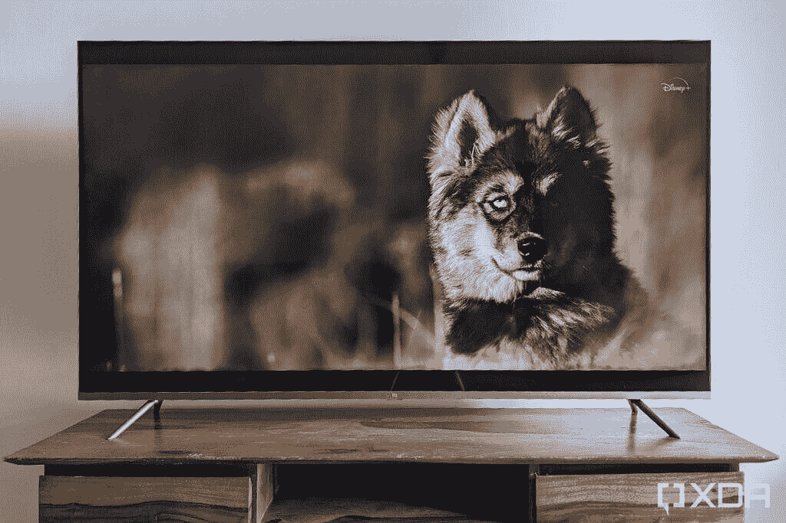
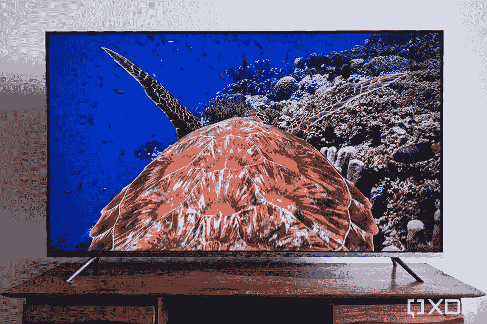
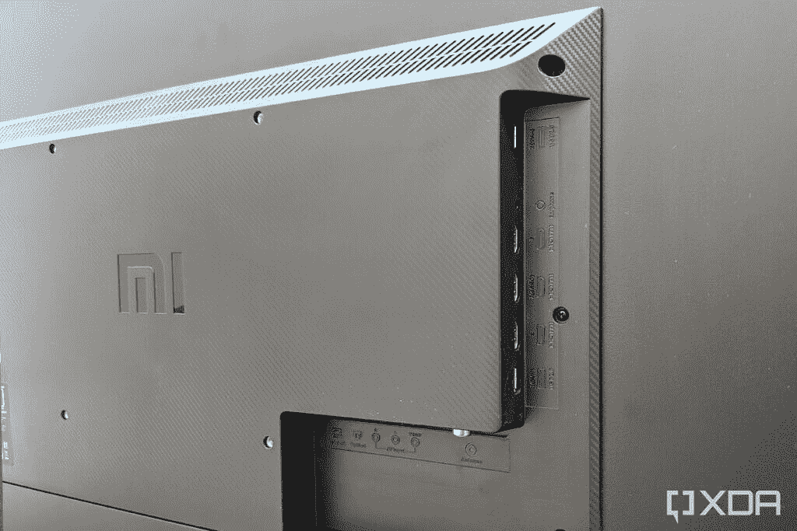
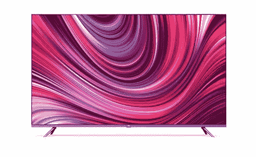

# 小米 Mi QLED 电视 4K 55 评论:价格合理的优质体验

> 原文：<https://www.xda-developers.com/xiaomi-mi-qled-tv-4k-55-review/>

智能手机市场已经饱和。在智能手机业务蓬勃发展之后，公司传统上扩展到其他消费产品类别——智能电视是其中之一——这正是小米遵循的轨迹。在印度，小米自 2018 年初以来一直在销售智能电视，在不到三年的时间里，由于其产品具有吸引力的价格，小米成为了智能电视市场的领导者。在凭借一系列不同的 LED 智能电视成为明星之后，小米又向前迈出了一大步，在印度推出了首款采用 QLED 显示屏的电视。小米 55 英寸 4K QLED 电视的价格仅为₹54,999，是印度价格最具吸引力的 QLED 电视之一。

由于 QLED 相对于 LED 的优势，Mi QLED 电视似乎具有引人注目的显示屏。小米还声称该团队对 Mi QLED 电视的视频和声音质量进行了优化。总的来说，它看起来是一个非常有吸引力的包，但是我们想在我们的评论中测试这一切。

## 4K 55 米 LED 电视规格

| 规格 | 4K 55 频道 |
| --- | --- |
| 显示 | 

*   55 英寸面板
*   3840 x 2160 像素
*   QLED 背光液晶面板
*   16:9 宽高比
*   杜比视界，HDR10+，MEMC

 |
| 处理器 | 

*   联发科 MT9611
    *   4 个 ARM Cortex A55 @ 1.5GHz
*   马里 G52 MP2 GPU

 |
| 随机存取存储 | 2GB |
| 储存；储备 | 32GB 闪存，26GB 可用容量 |
| 声音的 | 

*   30W 输出
*   4 个全频扬声器
*   2 个高音喇叭
*   杜比音频

 |
| 输入/输出和连接 | 

*   3 个 HDMI 2.1 端口
*   2 个 USB 接口
*   光学音频
*   以太网端口
*   3.5 毫米插孔
*   红外接收器
*   双频 Wi-Fi
*   蓝牙 5.0

 |
| 连接 | PatchWall 3.0 以及基于 Android 10 的 Android TV UI |

***About this review:** Xiaomi India loaned us the Mi QLED TV a week before its launch in India. This review is after almost two months of use. Xiaomi had no input on the content of this review.*

* * *

## 建造和设计

从正面看，小米电视 4K 55 看起来非常高端。由于薄的喷砂铝边框围绕着显示面板，这款电视的正面看起来与 2019 年 11 月在中国推出的[小米电视 5 Pro](https://www.xda-developers.com/xiaomi-mi-tv-5-pro-series-55-65-75-models-china-launch/) 惊人地相似。然而，小米确实澄清了这款机型是专为印度制作的，右边缘的“由小米设计”蚀刻——而不是米电视 5 系列上的雕刻——证实了这一点。

Mi QLED 电视的框架由边缘相接的不同条带组成，而不是包裹电视顶部、左侧和右侧边缘的单一连续条带。在这些交叉处，金属条没有完全对齐，并留下一些间隙，从电视的整体优质图像中扣除。虽然三面几乎没有边框，但沿着显示器的外围，前玻璃下有近 1cm 厚的黑色条带。这些波段不是显示屏的活动部分，在不使用电视时会与面板融合在一起。

虽然 Mi QLED 电视上几乎没有挡板，但底部边缘有一个薄下巴。这款下巴也是用同样的金属制成，中央浮雕有“MI”的 logo。

Mi QLED 电视的背面由塑料制成，与正面材料截然不同。背面的上半部分是直的，并具有成角度的设计，而背面的下半部分较厚，并具有输入/输出端口和主板。背面在这个区域上方有通风孔来散热。下背部也由塑料制成，但衬有类似凯夫拉尔的图案。巧合的是，我们在 2019 年的[一加·Q1 QLED 电视](https://www.xda-developers.com/oneplus-tv-review/)上看到了更有说服力的人造凯夫拉尔纤维的使用。

Mi QLED 电视配有实心金属支腿，下方配有橡胶垫，这与 Mi LED 电视的塑料支腿不同。坚固的支脚可以让电视保持稳定，触摸时不会晃动太多。支腿间距为 105 厘米，因此在购买电视机前，你必须确保有足够大的桌面。如果没有，你也可以使用小米 55 英寸电视的标准墙托架将电视安装在墙上——或者你可以获得第三方墙托架，如 [DazzelOn 电视墙托架](https://www.amazon.in/DazzelOn-Articulating-Motion-Bracket-Extension/dp/B07H2DPCDP?tag=xdaportalin-21)，它也带有水平倾斜选项。

虽然 Mi QLED 电视仅重 14.2 千克(包括其金属支脚)，但由于电视的宽度，我建议不要独自搬运。典型的 55 英寸电视或屏幕具有 16:9 的纵横比，其显示区域比 43 英寸型号大大约 64%。所以，最好是接受别人的帮助，否则你可能会把₹54,999 扔进垃圾堆。

* * *

## 显示

顾名思义，Mi QLED 电视 4K 55 英寸拥有 55 英寸 QLED 显示屏，分辨率为 4K。QLED(或 T4)面板是一种 LED 背光液晶显示器。它的特点是一层量子点或纳米粒子，根据施加的电流产生不同的颜色。这一额外的层使 QLED 面板能够提供比常规 LED 背光液晶面板更准确的颜色。

 <picture></picture> 

A still from Togo by Disney

此外，Mi QLED 电视采用 VA 型(垂直排列)液晶面板。该名称来源于 LCD 中与玻璃基板相关的液晶的“垂直排列”。VA 面板比 IPS 和 TN 面板具有更深的黑色，因此具有更好的对比度(或更高的对比度)。如果你有兴趣了解为什么 VA 面板比 IPS 显示器具有更好的对比度，这里有一个很好的解释者视频可以回答这个问题:“[什么是 VA(垂直对齐)技术？](https://www.youtube.com/watch?v=X863ajSVAbs)

虽然 VA 面板确实具有更好的对比度，但与 IPS 面板相比，它们的视角较差。因此，带有 VA 面板的电视不适合容纳大量观众的小房间。

Mi QLED 电视显示丰富的色彩和出色的对比度。

关于在 Mi QLED 电视中的使用，QLED 和 VA 技术相结合，提供丰富的色彩和出色的对比度。小米声称，显示器优化可以让电视显示 NTSC 色域中 100%的颜色，而其他 LED 电视只能显示色域中 72%的颜色。此外，电视还支持 95%的 DCI-P3 色域。相比之下，我们在 2019 年评测的[一加 Q1 QLED 电视](https://www.xda-developers.com/oneplus-tv-review/)支持 120%的 NTSC 和 96%的 DCI-P3 色域。

 <picture></picture> 

A still from Netflix's Our Planet

VA 面板的视角限制也适用于这款电视，如果你坐在它的锐角上，你会发现颜色被洗掉了。

正如我之前提到的，QLED 是一种 LCD，这意味着它仍然使用背光在屏幕上显示黑色，不像有机发光二极管显示器。由于 QLED 显示器使用背光，电视上的黑色不会显示为漆黑一片，而是暗灰色。这种现象在昏暗的灯光或完全黑暗的房间里变得更加明显。下面的图像是在一个黑暗的房间里拍摄的，茶杯后面的屏幕区域应该是黑色的，但看起来是灰色的。看一看:

黑色部分的照明是 QLED 显示器的属性，小米或任何其他品牌都只能做这么多来纠正它。然而，该公司在确保背光强度的良好均匀性方面做得不错。下图左侧显示了暗灰色调下 20%亮度的背光均匀度。中间看起来比边缘稍微亮一点，但总的来说，亮度比标准 LED 电视均匀得多。同时，由于显示器的特性，Mi QLED 电视不支持局部调光，右图证实了这一点。

Mi QLED 电视支持 HDR10+和 Dolby Vision，可处理支持的内容以增强色彩输出。您可以在网飞上找到支持杜比视界的视频内容(仅限超高清计划)、亚马逊 Prime Video 和 Disney+ Hotstar，以及印度的其他 OTT 应用。与 HDR10 或 HDR10+相比，Dolby Vision 通过 12 位颜色支持产生了更丰富的颜色，并旨在实现更高的峰值亮度。此外，色调映射是动态完成的，即逐帧进行，而不是针对 HDR10 中的整个视频，这提高了 HDR 质量。(值得注意的是，Mi QLED 电视的彩色输出仅限于 10 位。)

该电视还支持由小米的 Reality Flow 引擎驱动的 MEMC ( **M** otion **E** 估算， **M** otion **C** 补偿)。正如预期的那样，该技术可以通过插值帧来提高内容的帧速率。这意味着，以 24fps 录制的电影、25fps 的电视情景喜剧或 30fps 的动画系列可以通过 Mi QLED 电视提升到 60fps，以模拟更流畅的播放。这可能不是对所有人都有吸引力，但小米确实给了你选择其 Reality Flow 引擎平滑内容的力度的选项。

小米还增加了丰富的选项，可以自定义颜色、对比度、饱和度、色温、HDR 等。在迷你电视上。如果您愿意，还可以微调红色、绿色和蓝色(RGB)以及青色、洋红色和青色(CMY)的色调、亮度和饱和度。此外，电视让你选择不同的色域，包括 sRGB，Adobe RGB，DCI-P3 等。

除了这些足够的控制，Mi QLED 电视还配备了局部对比度、自适应亮度控制和动态亮度。这些功能根据内容调整显示器的亮度和对比度。值得注意的是，局部对比度与局部调光无关，正如我在上面讨论的那样，电视不支持局部调光。动态亮度在观看 Dolby Vision 内容时特别有用，因为它可以根据动态 HDR 数据调整电视的亮度。然而，如果一些用户想要一致的图像质量，这可能会分散他们的注意力。

总的来说，Mi QLED 电视在色彩方面没有任何明显的妥协，变得相当明亮。即使将电视放在灯光明亮的房间中，观看体验也不会受到限制，除非有一束直射到显示器上。

* * *

## 声音的

正如我们在上面了解到的，小米 Mi QLED 电视以其价格提供了出色的显示质量，但没有出色的声音输出，娱乐仍然是不完整的。这款电视共有六个向下的扬声器，其中包括四个全频驱动器和两个高音扬声器，以增强高频范围的声音。

小米声称，这些全频扬声器支持 50Hz-20kHz 范围内的音频频率，而不是类似价格的电视相对较少的 100Hz-14kHz 范围。通俗地说，Mi QLED 电视有望提供比大多数竞争产品更丰富的声音。除此之外，所有扬声器的扬声器空腔总容积为 1 升。据小米称，这是我们通常在这个价格区间的其他电视中发现的三倍多。更大的扬声器空腔允许声波更多地共振，并产生更响亮、更丰富的音频输出。

我发现小米 Mi QLED 电视的音质非常出色。

与小米的说法一致，我发现小米 Mi QLED 电视的音频质量非常出色。低端，即低音，丰富而深刻，而高音，即高端频率，听起来晶莹剔透。总的来说，音乐或任何背景音乐听起来都很棒，能让你很快抓住细微差别。

在大多数情况下，无论音量大小，对话都是清晰的。但是，当背景分数过于突出时，就可以压倒对话。这将你带入一个不可避免的悖论，你不得不提高音量来听清楚一些东西，这无意中使背景音乐变得更具压倒性。这可能会困扰一些用户，特别是如果他们希望开箱即用更中性的声音体验。更不和谐的是，当使用电影声音预设时，这种效果会放大。

值得庆幸的是，如果你熟悉周围的环境，你可以通过切换到不同的声音预设在一定程度上解决这个问题。Mi QLED 电视具有预设的音频模式，如标准、电影、新闻和游戏。您还可以根据自己的喜好调整音频输出，方法是选择自定义音频模式，并在音频设置中降低 5 波段声音均衡器的增益。

* * *

## 用户体验

Mi QLED 电视运行基于 Android 10 的完整 Android 电视体验。尽管安装了 Android 10，但 Mi QLED 电视采用了标准的 Android 电视界面，没有配备[新的谷歌电视](https://www.xda-developers.com/new-google-tv-interface-replace-android-tv-ui/)界面。但是，你得到的是最新版本的 PatchWall，这是小米专有的内容发现和推荐平台。 [PatchWall 3.0](https://www.xda-developers.com/xiaomi-mi-tv-4-4a-4c-4x-pro-patchwall-3-0-update-india-disney-hotstar-integration-more/) 比[之前的版本](https://www.xda-developers.com/xiaomi-mi-tv-4-4a-4c-4x-pro-android-pie-september/)在视觉和功能上都有所改进。

通过 PatchWall，您可以跟踪您正在 Mi QLED 电视上安装的所有 OTT 应用程序中观看的电影和电视节目的进度。你也可以跳到你在电视上看的上一个电视节目的下几集，找到新的建议。

根据您已经观看的内容，PatchWall 会推荐新内容。除此之外，你还可以获得由小米策划的内容推荐——可能包括广告、直播电视节目和新闻。值得注意的是，PatchWall 最初会向您推荐多种印度语言的内容，但您可以为这些建议选择自己喜欢的语言。

内容建议分为电影、电视节目、电视直播、体育、儿童、音乐和探索。

您还可以向下滚动主页，访问基于内容质量的精选播放列表。这些播放列表中的一些包括杜比视界、HDR10+、4K 等的内容。然而，这些建议仅限于以印度为重点的应用，如迪士尼+ Hotstar、Zee5、索尼 LIV，可能会排除其他应用，特别是网飞和 Prime Video。

如果您播放尚未安装在 Mi QLED 电视上的任何视频应用程序的推荐，您将看到一个模糊的通知，上面写着“要继续，请同意<app name="">的隐私政策。“如果您单击“同意”，应用程序将自动安装，不再另行通知。更令人讨厌的是，这款应用并没有出现在应用抽屉或 Play Store 中。令人欣慰的是，你可以使用小米为电视定制的清理应用程序“电视管理器”找到任何不想要的应用程序，并删除它们。</app>

除了按类型、语言、视频质量等浏览内容。，您还可以在 PatchWall 中发现按艺术家排序的新内容。你也可以去探索区寻找其他热门内容，包括教程、健身和灵性视频、播客等。

### 表演

Mi QLED 电视由四核联发科 MT9611 处理器提供动力，该处理器使用四个主频为 1.5GHz 的 ARM Cortex A55 核心。据小米称，芯片组已经针对这款电视的要求进行了特别调整。此外，Mi QLED 电视的内存为 2GB。根据我的经验，在启动或切换应用程序时，Mi QLED 电视没有显示出滞后的迹象。

Mi QLED 电视还预建了一个电视管理器应用程序，该应用程序包括垃圾清理器、内存增强、卸载应用程序、通过 USB 安装和限制数据使用等选项。顾名思义，这些功能分别是清理垃圾文件，清理内存，卸载你不需要的应用程序，从 USB 存储设备安装新应用程序，最后，如果你使用的是计量互联网连接，则限制内容消费。它还带有一个数据保护选项，据说如果你通过 Wi-Fi 热点而不是实际的 Wi-Fi 连接从智能手机上使用互联网，只会消耗三分之一的数据。这个功能是专为印度用户设计的。

你也可以将 USB 或蓝牙游戏手柄连接到电视上，享受游戏，如*沥青 8* 、*沙滩车赛车*、*饥饿鲨鱼*等。我尝试在[小米 Mi 10T Pro](https://www.xda-developers.com/xiaomi-mi-10t-pro-performance-gaming-review/) 上使用 [Mi 遥控器](https://play.google.com/store/apps/details?id=com.duokan.phone.remotecontroller&hl=en_IN&gl=US)应用，但面临明显的输入延迟。然而，如果您想通过一些更具吸引力的游戏来娱乐自己，Mi QLED 电视可以成为您游戏主机的绝佳伴侣。

### 在迷你电视上玩游戏

如果你考虑它的价格，Mi QLED 电视具有出色的视频和音频功能。这可能会促使用户尝试连接到 PC 或游戏机的游戏。我试着用 [Xbox 系列 S](https://www.xda-developers.com/xbox-series-s-review/) 了解它的工作原理，体验非常令人满意。首先，Mi QLED 电视支持高达 60Hz (60fps)的 4K 游戏。假设你的主机支持更高的帧速率——就像我们的 Xbox 系列设备在 1440p 分辨率下一样，电视仍然会以 60fps 显示它。此外，在玩游戏时，电视还支持 10 位彩色以及 HDR10 和杜比视觉。

玩了很多游戏，包括 *Forza Horizon* 、 *FIFA 21* 、 *NFS 热火*、*山羊模拟器*等。不会遇到任何重大问题。正如我之前提到的，音频和视频是支持 Mi QLED 电视的有力证据。唯一值得注意的是，MEMC 功能会干扰帧渲染，并可能导致口吃的印象。实际上，这是因为 MEMC 功能无法准确预测游戏中要插入的帧。

由于支持 HDMI 2.1，该电视确实支持游戏机上的杜比视觉。但正如我上面提到的，它不能超过 60Hz(或 60fps)的刷新率，因此可能会让铁杆游戏玩家失望。电视也不支持 VRR(可变刷新率)，因此显示刷新率不会随着帧渲染速率而动态变化。如果您忽略了这些限制，Mi QLED 电视可以在控制台或其他连接的游戏设备上提供相当令人愉快的游戏体验。

* * *

## 遥控器

虽然小米在优化 Mi QLED 电视的显示和音频质量方面做得很好，但遥控器却没有受到类似的待遇。标准的小米电视遥控器也与所有其他电视和流媒体设备一起出售，如[小米盒子 4K](https://www.xda-developers.com/xiaomi-mi-box-4k-android-tv-box-review/) 。遥控器采用功能性设计，正面和背面都有锋利的边缘和弯曲的表面。它使用蓝牙与电视通信，并使用两节 AAA 电池供电。

正如你在下图中看到的，它有一个圆形的方向板，上面有电源和谷歌助手按钮。D-pad 下面还有一些按钮，它下面的一行有一个带有“Mi”标志的按钮，在左侧启动 PatchWall。您也可以长按此按钮来启动快速设置，而无需退出应用程序。中间的按钮是“返回”同时，最右边的是 home 键，虽然它被设置为默认调出 Android TV home，但你也可以选择将 PatchWall 设置为默认 Home。你还可以获得网飞和亚马逊 Prime 视频的专用热键，以及下面的音量控制。

遥控器虽然实用，但感觉不符合人体工程学。锋利的边缘让它握起来很不舒服，因为所有的按钮都位于上半部分，所以你经常需要在手掌中滑动它。电池槽位于下半部分，使其比顶部更重。因此，遥控器的重量感觉偏离了中心，这对许多用户来说是一个潜在的问题。

小米是时候重新设计他们的遥控器了，并采用类似于我们在[更新的一加电视遥控器](https://www.xda-developers.com/oneplus-tv-update-brings-netflix-support-android-tv/#tagbar-list:~:text=Update%3A%20OnePlus%20releases%20new%20Netflix%20remote%20for%20the%20OnePlus%20TV)或标准的 [Realme 电视遥控器](https://www.xda-developers.com/realme-android-smart-43-inch-hdr10-tv-review/)中看到的设计。除了令人讨厌的设计之外，Mi 电视遥控器缺乏双重连接(蓝牙+红外)，并且盒子中没有电池。

* * *

## 连接和 I/O

在连接方面，Mi QLED 电视具有丰富的现代输入和输出功能。所有端口都位于电视的背面，呈 L 形布局。电视上可用的端口包括:

*   3 个 HDMI 2.1 端口
*   2 个 USB 2.0 端口
*   1 个光学音频输出(Toslink)端口
*   1 个有线电视天线端口
*   1 个以太网端口
*   1 个 3.5 毫米耳机插孔
*   RCA 音频视频插孔

## 

除了上面列出的端口，包括 HDMI 和 USB 端口在内的重要端口都放在侧面，很容易接触到。面朝下的端口比侧面的端口更不容易被使用。至于 HDMI 2.1 端口，都支持增强型音频回传通道(eARC)。

对于无线连接，Mi QLED 电视支持跨双频带的 Wi-Fi 802.11 a/b/g/n/AC(2 x2 MIMO)Wi-Fi。因此，如果你有一个相当快的 Wi-Fi 连接，在 4K 的流媒体就可以在 Mi QLED 电视上获得无延迟的体验。该电视还配有蓝牙 5.0，可降低音频设备和其他控制器的延迟，并扩大操作范围。它还支持红外，所以你可以在任何小米设备上使用红外发射器来控制它。

* * *

## 结论

很长一段时间以来，小米一直与经济实惠和物超所值联系在一起。它现在正在挤掉严格意义上的平价产品，但仍不失其物有所值的本质，4K 55 英寸的 Mi QLED 电视符合这一理念。小米不是唯一一个在这个价格区间销售 QLED 电视的品牌，但它受益于其品牌形象和其广泛的售后网络带来的可信赖性，这是其他品牌如 Vu 或 TCL 在印度未能实现的。

Mi QLED 电视可在中大型房间中提供身临其境的观看体验。

Mi QLED 电视的画质不错，音频也不差。由于支持杜比视界、HDR 10+和 HLG 等视频标准，以及杜比音频和 DTS-HD 音频标准，Mi QLED 电视可在大中型房间中提供身临其境的观看体验。

通过 Mi QLED 电视，小米主要认可了其让大众能够接触到所有形式的技术的天赋。这种节约伴随着一些质量上的妥协——如果你愿意支付更多的钱，你可以找到更好的 QLED 电视。然而，如果你想买一台既能给人留下深刻印象又不增加预算的好电视，那么 Mi QLED 电视绝对有意义。

小米 Mi QLED 电视仅在印度发售，价格为₹54,999.可以在小米官方网上商城，即[mi.com](https://www.mi.com/in/buy/product/mi-qled-tv-4k)，在 [Flipkart](https://www.flipkart.com/mi-q1-138-8-cm-55-inch-qled-ultra-hd-4k-smart-android-tv/p/itm3d2e089a2a3b9) ，或者线下米家门店购买。在 Flipkart，您还可以使用安讯士银行信用卡享受₹1,500 折扣。

 <picture></picture> 

Xiaomi Mi QLED TV 55-inch

##### 小米 Mi QLED 电视 55 寸

Mi QLED 电视是印度性价比最高的 QLED 电视之一。它具有良好的画面和音质，并配有充足的板载存储空间。