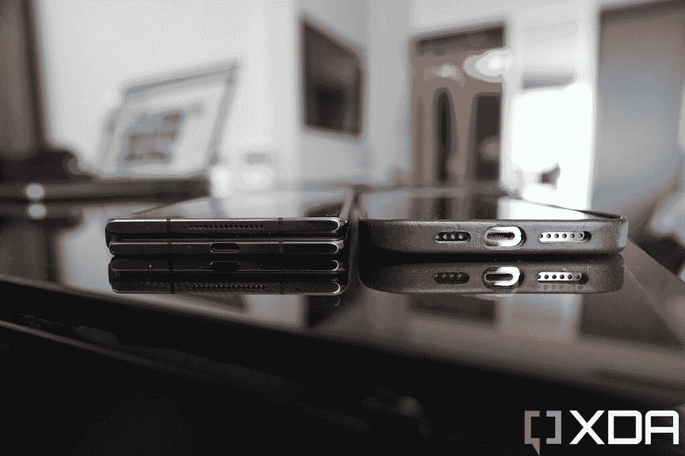
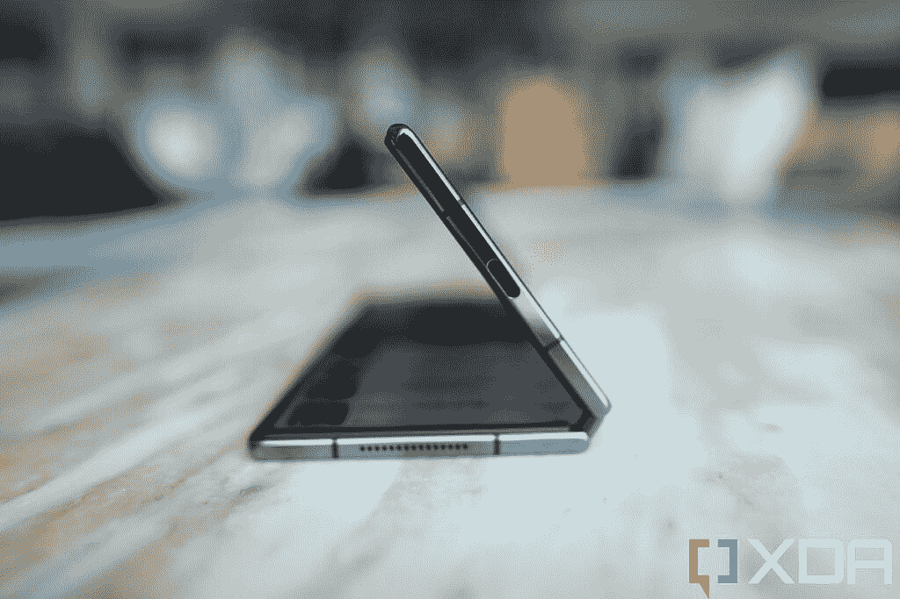

# 小米 Mix Fold 2 评测:为可折叠外形设定新标准

> 原文：<https://www.xda-developers.com/xiaomi-mix-fold-2-review/>

小米 Mix Fold 2 是第一款我更喜欢以折叠形式而不是展开形式使用的可折叠手机。这既是对小米硬件工程实力的证明，也是对中国品牌在仅仅一年后就放弃硬件决策的趋势的控诉。通常，这些年复一年的方向转变是朝着更好的方向发展，但有时它们可能会让产品线感觉脱节。再看小米 Mix Fold 2，比[小米自家 Mix Fold](https://www.xda-developers.com/xiaomi-mi-mix-fold-hands-on/) 更像是[华为 Mate X2](https://www.xda-developers.com/huawei-mate-x2-review/) 的续作。

但是，Mix Fold 2 仍然有很多令人喜欢的地方，包括特别是这是市场上最轻最薄的大型可折叠手机。在此之前，没有一款可折叠手机——至少没有双屏、内置折叠手机——在折叠状态下感觉如此时尚。

不幸的是，Mix Fold 2 目前只在中国正式销售，但其相对便宜的 8999 元人民币(1320 美元)的起价确实让进口成为了发烧友的一个选择。

 <picture></picture> 

Xiaomi Mix Fold 2

##### 小米 Mix Fold 2

如果你对可折叠感兴趣，但之前觉得它们太重太笨重，小米 Mix Fold 2 可能会让你感兴趣。不幸的是，这款手机目前只在中国销售。

* * *

## 小米 Mix Fold 2:规格

| 

规格

 | 

小米 Mix Fold 2

 |
| --- | --- |
| **打造** | 

*   铝合金框架
*   大猩猩玻璃 Victus 正面
*   颜色:

 |
| **尺寸&重量** | 

*   折叠后:161.6 毫米 x 73.9mm 毫米 x 11.2mm 毫米
*   展开后“161.6 毫米 x 144.7mm 毫米 x 5.4mm 毫米
*   262 克

 |
| **显示** | 

*   外部显示器:
    *   6.5 英寸三星 E5 有机发光二极管
    *   1000 尼特亮度
    *   2520 x 1080
    *   10 位颜色
    *   120 赫兹

*   主显示器
    *   8 英寸 LTPO 2.0 有机发光二极管
    *   10 位颜色
    *   2160 x 1914
    *   超薄玻璃

 |
| **SoC** | 高通骁龙 8 加第 1 代 |
| **闸板&存放** | 

*   12GB LPDDR5 内存+ 256GB UFS 3.1 存储
*   12GB + 512GB
*   12GB + 1TBGB

 |
| **电池&充电** | 

*   4500 毫安时
*   67W 有线快速充电支持

 |
| **安全** | 侧装式指纹扫描仪 |
| **后置摄像头** | 

*   主镜头:50MP IMX766，f/1.8，7P 镜头
*   超宽:1300 万像素 f/2.4，123 度 FoV
*   长焦:8MP 2X 长焦
*   徕卡真实外观和徕卡活力外观摄影风格
*   徕卡生动，自然，BW 自然，BW 高对比度过滤器

 |
| **前置摄像头** | 2000 万 |
| **端口** | USB 类型-C |
| **音频** | 

*   对称立体声扬声器
*   由哈曼卡顿调音
*   杜比全景声认证

 |
| **连通性** | 

*   双 5G
*   4G LTE
*   无线网络 6
*   蓝牙 5.2
    *   BLE 音频支持
    *   骁龙声音支持
    *   AAC/LDAC/LHDC/aptX 自适应

*   多功能 NFC

 |
| **软件** | 基于 Android 12 的 MIUI Fold 13 |
| **其他特性** |  |

***关于这个评测:**小米中国给我提供了一个 Mix Fold 2 来测试。这篇评论是在使用手机九天后写的。小米在这篇文章中没有任何投入。*

* * *

## 小米 Mix Fold 2:设计和硬件

*   极薄，展开时仅 5.4 毫米，折叠时仅 11.2 毫米
*   折叠时感觉更像平板手机，而不是以前的任何可折叠手机
*   铰链不能保持在中间折叠的位置
*   骁龙 8 加第 1 代

小米 Mix Fold 2 是 Galaxy Fold 系列的又一款双屏、内折叠书本式可折叠产品。这种外形通常优于华为使用的外部折叠单屏幕格式，因为软弯曲屏幕在不使用时受到保护。然而，这种形式体积较大，因为它需要两个显示器。至少在小米 Mix Fold 2 之前是这样。

在工程奇迹的壮举中，小米不知何故将 Mix Fold 2 的厚度在打开时减为 5.4 毫米，折叠时为 11.2 毫米。这意味着当 Mix Fold 4 打开时，它很可能是世界上最薄的平板电脑，只有像卓越 2 这样的电子墨水平板电脑可以声称更薄。当 Mix Fold 2 合上时，它几乎感觉不到比带外壳的大型现代旗舰手机厚，比如 [iPhone 13 Pro Max](https://www.xda-developers.com/apple-iphone-13-pro-max-review/) 。

 <picture></picture> 

Xiaomi Mix Fold 2 and iPhone 13 Pro Max with a first party case.

这种超薄的背后是相对较轻的(可折叠)重量 262 克(再次强调，仅比 iPhone 13 Pro Max 重一点)。考虑到外部屏幕的“正常”20:9 纵横比，我们有一款可折叠手机，折叠时感觉非常像普通的平板手机。

### 显示和表单

当 Mix Fold 2 打开时，主显示屏是一台 8 英寸、1914 x 2160、LTPO 2.0 OLED 面板。它由超薄玻璃覆盖，最高刷新率为 120Hz，看起来非常棒。虽然折叠点处的显示屏折痕远没有三星可折叠产品中的深槽那么明显，但小米的折叠点仍然比其他中国可折叠产品略显突出，如 [Oppo Find N](https://www.xda-developers.com/oppo-find-n-review/) 或 [Vivo X Fold](https://www.xda-developers.com/vivo-x-fold-hands-on/) 。

那么为什么我在一开始就说我更喜欢使用折叠形式的 Mix Fold 2 而不是展开形式的呢？这是因为 Mix Fold 2 的主屏幕具有大约 4:3.55 的长宽比。这种类型的屏幕不适合处理 Android 应用程序(稍后在软件部分会有更多介绍)，而且对角线为 8 英寸，对我来说单手握持有点太宽了。

你可能还记得，最初的小米 Mix Fold 有一个真正拉长的折叠形式，长宽比为 27:9。小米老板雷军当时的理由是，这样的设计让 Mix Fold 的主屏幕可以保持纵向方向，这是一种优势——他是对的！第一个 Mix Fold 的内部大屏幕的长宽比更容易单手使用，并以更好的比例显示应用程序。

这也是我之前提到的中国品牌在短短一年后似乎放弃想法的原因:雷大谈人像宽高比的优势，但一年后 Mix Fold 2 却逆转了方向。不要误会我的意思，Mix Fold 2 是*所以，比最初的 Mix Fold 更好看，更现代，但也许小米应该尝试继续建立在最初手机的想法和外形上，而不是走另一个方向。这不仅仅局限于硬件——最初 Mix Fold 引入的“PC 模式”桌面用户界面也被废弃了。不管你怎么说苹果和三星的回收设计，但这些公司对他们的设计理念很有信心，并至少在几年内保持一致(尽管公平地说，他们倾向于让他们在*呆几年太久)。**

### 关键

铰链感觉很坚固，当像三星的 Galaxy Z Fold 1 至 3 那样折叠时，不会从侧面伸出。但有一个明显的弱点:它不能保持在对折的位置，这意味着它不能实现所谓的“灵活模式”，即像笔记本电脑一样将可折叠手机保持在 L 形。三星开创了这个别出心裁的想法，Oppo 和 Vivo 的其他可折叠产品也纷纷效仿。这种 L 形使可折叠手机基本上可以作为自己的三脚架，用于免提照片和视频。

 <picture></picture> 

The Mix Fold 2's hinge cannot stay locked in this position the way other foldables can.

我个人经常使用 Flex 模式在不需要帮手或三脚架的情况下拍摄自己的照片，以及在路上进行免提视频通话。这里的省略很明显，也是我对小米 Mix Fold 2 最大的挑剔。

Mix Fold 2 省略了 Flex 模式，这是我对这款出色的可折叠产品的最大不满。

### 内部:SoC、内存、电池和其他位

尽管机身光滑，Mix Fold 2 仍然设法在内部塞进了 4500 毫安时的电池，再加上高能效的高通骁龙 8 加第一代，给了我出色的电池续航时间——下文将详细介绍这一点。在我的测试中，电池可以通过随附的 67W 充电砖充电，在 46 分钟内从 0-100%充满手机。

不过 USB-C 口还是 2.0，而不是更新的 USB 3.1。这意味着较慢的传输速度，以及无法将手机显示输出到外部显示器。

存储选项有 256GB、512GB 或 1TB，并且都配有 12GB 的 UFS 3.1 内存。指纹扫描仪嵌入侧面的电源键，上下各有两个对称的扬声器，由 Harmon/Kardon 调音。Mix Fold 2 内部的触觉引擎是固体的，但不像小米旗舰和中端手机中的 X 轴线性电机那样精确和牢固。我会说触觉是好的，只是不惊人。

* * *

## 小米 Mix Fold 2:相机

*   非常不错的主摄像头，固态超宽，变焦一般
*   缺少“灵活模式”是一个明显的疏忽

Mix Fold 2 有四个摄像头:一个 20MP 的前置摄像头，位于辅助显示器顶部附近的一个穿孔中，以及一个三镜头主摄像头系统，包括一个 50MP，f/1.8 主(宽)摄像头，一个 13MP，f/2.4 超宽摄像头和一个 8MP 2X 远摄变焦镜头，光圈为 f/2.6。内部主屏幕没有自拍摄像头。

纯靠硬件去，这显然不是小米最顶级的相机系统。上个月发布的小米 12S Ultra 配备了一个更大传感器的主摄像头，一个定制的八层镜头和一个 5X 潜望镜变焦镜头。但这不全是硬件的问题:小米近年来一直在努力改善其计算摄影，Mix Fold 2 仍然(显然)获得了在 12S Ultra 中首次亮相的徕卡调优。经过一周的使用和数百张照片，我可以说 Mix Fold 2 的相机非常擅长产生鲜艳的颜色，即使在困难的照明条件下也能找到合适的动态范围。让我们先来看看主相机系统拍摄的照片，加上最大数码变焦。

我们可以在上面的白天场景中看到，尽管逆光拍摄，相机仍然产生了出色的动态范围。我认为有时我们想当然地认为智能手机摄像头已经变得如此重要。如果我试图用“真正的”相机甚至是 2018 年的手机拍摄同一场景，它要么会完全炸毁天空，要么桌子区域会完全淹没在阴影中。晚上第二套，可以看到主摄像头和其他三张照片有色差。小米手机还没有完全掌握在所有镜头和情况下保持颜色一致。

小米的大部分计算摄影都是在拍照后进行的，这意味着如果我像下面这样将手机对准刺目的背光，取景器会显示一幅完全放大的图像。

但是主摄像头和超宽摄像头捕捉到的最终图像使用了 HDR 智能技术来制作平衡的镜头。我更希望小米的取景器能像 Pixel 手机一样，实时智能地进行处理，并向我展示取景器中的灯光效果。

我觉得主摄像头整体来说非常好，大尺寸图像传感器(无论如何都是可折叠的)，像素宁滨，小米的处理产生了美学上令人愉悦的夜拍，如下所示。尽管有时场景会变得明亮很多，以至于看起来不再像一张夜景照片。

超宽相机在白天也很好，但在晚上它会遇到常见的软细节问题，这些问题困扰着几乎所有非 Oppo Find X5 Pro 的超宽相机。

我对 Mix Fold 2 的相机唯一真正的不满是 2 倍长焦变焦镜头，这在 2022 年客观上是缺乏的。我甚至没有将 Mix Fold 2 的变焦与潜望镜变焦进行比较，但它也输给了 Galaxy Z Fold 4 的 3 倍长焦。

对了，本文展示的照片都是经过压缩的；我已经上传了全分辨率照片样本到下面的 Flickr 图库。

* * *

## 小米 Mix Fold 2:软件

*   在一个叫做 MIUI Fold 的特殊版本上运行
*   一些第一方小米应用针对平板电脑屏幕进行了优化，但许多第三方应用没有
*   需要 20 多分钟来安装谷歌，删除膨胀软件，并确保推送通知及时到达

小米 Mix Fold 2 在 Android 12 的基础上运行该公司 MIUI 的一个特殊版本，名为 MIUI Fold。Android 12L 或 13 的缺乏令人失望，但 MIUI Fold 是经过深思熟虑的，具有易于激活的多任务系统，允许以小浮动窗口模式快速启动应用程序。

然而，到目前为止，这款软件还没有三星的 Fold 系列软件那么完美。比如分屏多任务，只能垂直拆分两个 app，不能水平拆分。这对于大多数应用程序来说没问题，但对于 YouTube 或网飞等其他视频应用程序来说，能够水平分割要好得多，因为视频有更多的传播空间。看看 YouTube 视频目前在 MIUI Fold 上的分屏视图是什么样子。

尽管如此，我是一个经常带着手机在城里跑来跑去做工作和社交活动的人，我喜欢更大的画布——即使它通常需要两只手在平板电脑上使用。上周末，我在新加坡遇到了一个朋友，我在一个屏幕上用谷歌地图导航，而在另一个屏幕上向他问路。当然，我也可以在普通手机上这样做，但是地图区会太窄。我也喜欢用大屏幕阅读新闻稿和规格表。

如前所述，Mix Fold 2 仅在中国提供，因此该手机没有预装谷歌应用程序。然而，谷歌的移动服务框架在手机上，所以我所要做的就是安装谷歌 Play 商店(可以直接在小米自己的应用商店或受信任的第三方网站上获得)，然后我就可以开始安装中国以外的人使用的所有典型应用，如 YouTube、谷歌地图、脸书等。

也有相当多的中国应用膨胀软件，但几乎都可以卸载。对于那些选择进口的人来说，一个更大的潜在问题是由于激进的电池管理导致的延迟通知。这是几乎所有中国版本的手机软件都做的事情(这包括小米的 MIUI，Oppo 的 ColorOS，Vivo 的 OriginOS 等)。

但好消息是，你也可以解决这个问题，方法是进入设置，关闭你想及时收到通知的应用的电池优化。一旦我做到了这一点，我就能够像使用 iPhone 一样正常接收通知。总的来说，让中国版的 MIUI 在这里运行，看起来和行为都像一部国际安卓手机，确实需要 20-30 分钟(用谷歌应用取代中国应用，接收及时的通知等)。但这没什么，因为这款手机从一开始就没打算离开中国市场。

* * *

## 小米 Mix Fold 2:性能和续航

*   全天电池续航时间
*   平滑动画

骁龙 8 Plus Gen 1 的性能和电池续航时间基本不错。我已经频繁使用这款手机一个多星期了，在这段时间里，我几乎没有遇到任何问题，除了一次当我从一个小屏幕切换到一个大屏幕时，Gmail 死机了。动画流畅，应用程序启动迅速，手机即使在新加坡炎热的下午使用也很少发热，而且在我结束一天的工作之前，手机从来没有用完电池。这个中国版的 MIUI 不允许我检查屏幕打开时间，但我猜测它远远超过 7 个小时，因为我倾向于在非工作日使用类似的智能手机。

我确实对整体性能有些不满:正如在软件部分提到的那样，Mix Fold 2 无法横向分割应用程序(就像三星的 Folds 一样)，这意味着 YouTube 实际上无法同时与另一个应用程序一起使用。缺少灵活模式也让可折叠手机失去了无数的使用案例，比如免提自拍和集体照、时间流逝等。

* * *

## 小米 Mix Fold 2:结论

为了总结这篇评论，我必须回答三个问题:

*   小米 Mix Fold 2 是否为其所属的类别带来了新的东西？
*   小米 Mix Fold 2 比 Galaxy Z Fold 4 好用吗？
*   该不该买小米 Mix Fold 2？

第一个问题的答案是肯定的。小米成功地从一个大的双屏可折叠手机中减去了如此多的重量和分量，这是非常了不起的，并纠正了这些内置可折叠手机最早和最长的抱怨之一。正如我已经说过的那样，使用折叠形式的小米 Mix Fold 2 感觉就像使用普通的大型旗舰手机一样。这是三星的 Galaxy Z Fold 4 还没有实现的事情，因为铰链之间的间隙仍然需要设备感觉像金属硬壳玉米卷，而不是一个坚固的平板。

现在，第二个问题 Mix Fold 2 比 Galaxy Z Fold 4 好吗？-更棘手。毫无疑问，Mix Fold 2 的手感更好，不太明显的折痕也是小米的另一个胜利。主摄像头很接近，没有明确的赢家(至少目前如此)。但 Z Fold 4 拥有出众的多任务处理能力、灵活模式和更好的变焦镜头。因此，如果我必须选择一个赢家，在不考虑价格的情况下，我仍然会说 Z Fold 4 是整体上更好的设备。

即使你不能购买 Mix Fold 2，它的存在仍然很棒，因为它展示了可折叠的可能性

最后，该不该买 Mix Fold 2？如果这款手机在全球销售，并且在你的市场上可以买到，我会说绝对可以。但是因为大多数读者必须输入，这就变得更加棘手了。进口至少会在 1300 美元左右的零售价上增加几百美元，而且你不会得到任何保修，更不用说由于缺少频段，你将在你所在的地区获得完全的网络覆盖。在这种情况下，大多数买家最好购买 Z Fold 4，或者希望小米稍后在全球推出这款产品。不过，尽管如此，还是有手机发烧友会毫不犹豫地导入这款手机。XDA 的一个前同事进口了一个。我认识两个新加坡人。如果小米没有给我一个审查设备，我也会进口这个。但我们是一个非常小众的群体:可折叠爱好者。

即使阅读本文的大多数人不会购买这款设备，小米 Mix Fold 2 的存在仍然很棒，因为它向消费者展示了什么是可能的。由于缺乏全球竞争，也许三星可以凭借其更厚的设计再坚持一年。但是对于其他中国品牌呢？他们的下一个可折叠产品也必须变得更薄，至少接近 Mix Fold 2 的光滑度。厚重的折叠式手机已经没有回头路了。

 <picture></picture> 

Xiaomi Mix Fold 2

##### 小米 Mix Fold 2

小米 Mix Fold 2 在展开时的厚度仅为 5.4 毫米，是迄今为止最薄的可折叠产品。折叠时，它感觉比带外壳的典型旗舰手机厚不了多少。