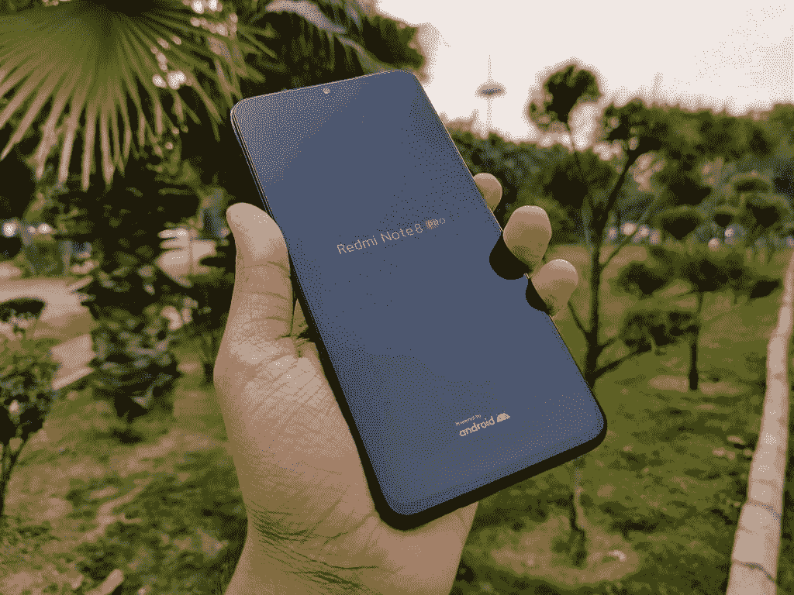

# 红米 Note 8 Pro 第一印象:小米的大胆一步

> 原文：<https://www.xda-developers.com/xiaomi-redmi-note-8-pro-first-impressions/>

Redmi Note 系列是小米最成功的产品系列，在全球销售了超过 1 亿台设备。这个系列被誉为多年来最物有所值的购买之一，这是因为[重新定义了消费者的期望](https://www.xda-developers.com/xiaomi-redmi-note-3-xda-review/)。红米 Note 导致了几年来几家原始设备制造商在印度市场的市场份额下降，最近，它迫使幸存者认真对待他们的游戏。虽然竞争对手总是希望小米会犯错，但该公司避免了过于冒险的操作，在每一代人中都提供了一个安全可靠的选择。但是随着新的红米 Note 8 Pro 的推出，小米做出了一个大胆的决定，忽略了高通骁龙这个可靠的避风港，而是将其 2019 年最重要的设备的命运交给了联发科。在路上，该公司还将赋予该设备一种新的设计，一种带有新的主要传感器的新相机设置，以及其他一些显着的改进。红米 Note 8 Pro 的包装如何？请跟随我们探索 Redmi Note 8 Pro 的第一印象！

关于这篇文章:小米印度已经借给我们小米 Redmi Note 8 Pro 的 8GB + 128GB 版本。本文图中的小米 Redmi Note 7 Pro 是我们个人购买的。这篇关于第一印象的文章从发布会、演示区和一天的使用中收集了最初的想法和观察结果。Arol Wright 为他即将到来的全面审查购买了一台小米 Redmi Note 8 Pro。本文中的所有思想和观点都是独立的，属于作者个人。

* * *

## 红米 Note 8 Pro:规格

| 

规范

 | 

红米 Note 8 Pro

 |
| --- | --- |
| **显示** | 

*   6.53 英寸 FHD+ (2340 x 1080)液晶显示器
*   19.5:9
*   水滴凹口
*   91.4%的屏幕与机身比例

 |
| **SoC** | [联发科 Helio G90T](https://www.xda-developers.com/mediatek-helio-g90-series-hyperengine-game-technology-launched/) :

*   2 个 Cortex-A76 @2.05GHz
*   6x Cortex-A55 @2GHz
*   Mali G76 GPU

 |
| **闸板&存放** | 

*   6GB LPDDR4X + 64GB UFS 2.1
*   6GB + 128GB
*   8GB + 128GB
*   专用 microSD 卡插槽

 |
| **电池** | 4500 毫安时 |
| **USB &充电** | 

*   C 型
*   18W 充电，支持:
    *   联发科泵快递
    *   USB 供电
    *   高通快充 4+

 |
| **连接性&附加功能** |  |
| **后置摄像头** |  |
| **前置摄像头** | 2000 万 |
| **安卓版本** | MIUI 10 下面的安卓 9 派 |
| **定价(印度)** |  |

### 

### 设计

小米红米 Note 8 Pro 动摇了红米 Note 系列的设计，将曾经在红米 Note 3 上发现的形式与红米 Note 7 Pro 上发现的构建材料合并。其结果是，这款设备不仅看起来高端，而且握在手中也非常舒适。Redmi Note 7 Pro 有一个相当“盒子”和扁平的设计，不能舒适地握在手中。相比之下，Redmi Note 8 Pro 虽然更高、更宽、更厚、更重，但其弯曲的侧面更适合长时间握持。背面的渐变也似乎是 Redmi K20 系列上的时髦渐变的更驯服和柔和的味道，因为它放弃了康宁大猩猩玻璃 5 面板下面的 3D 图案。我们收到的设备是伽玛绿色变体，尽管这种颜色通常呈现更蓝绿色的外观，在某些不适当的照明条件下几乎呈现蓝色。

与红米 Note 7 Pro 非常相似，红米 Note 8 Pro 采用了玻璃夹层设计，正面和背面都采用了康宁大猩猩玻璃。该设备框架的暴露部分由聚碳酸酯制成，尽管有 4，500 毫安时的大电池，但仍有助于控制设备的重量。聚碳酸酯的表面光滑而有光泽，与设备的其他美学元素和谐共存。

在 Redmi Note 8 Pro 的背面，你会立即注意到新的相机设置。整个模块从后面伸出来，堪比前代上的摄像头凸起。由于摄像头的位置和突出，当放在平面上并压在顶部边缘时，手机会抖动。这主要归咎于 6400 万像素的摄像头传感器和配套的镜头模块，这需要手机内有更多的空间，有些归咎于弯曲的边缘。并非所有相机都位于相机外壳中，2MP 专用微距相机位于主组件外部，并配有 LED 闪光灯。

在相机外壳内找到空间的是指纹传感器，在未经训练的眼中，它巧妙地呈现了第四个相机传感器的印象。小米没有在红米 Note 8 系列上选择内置指纹传感器，我们对这个决定感到高兴。传统的指纹传感器不仅可以控制设备的价格，还可以避免以前的一些失误。例如，小米 Mi A3 选择了显示器内指纹传感器，这反过来又需要使用 AMOLED 显示器；小米最终在 Mi A3 上采用了具有 PenTile 矩阵的 HD AMOLED 显示屏和相当慢的指纹传感器，给用户带来了两个世界中最糟糕的情况。谢天谢地，尽管 Redmi Note 8 Pro 上的指纹传感器面积略小于其前身，但它同样快速可靠，迄今为止我没有理由抱怨。指纹传感器的凸起唇需要几次尝试才能习惯，但你很快就能获得肌肉记忆的定位。

熟悉感继续延伸到前面，我们看到一个更大的 6.53 英寸 FHD+液晶显示器，支持 HDR。FHD+ LCD 是这个价格范围内智能手机显示屏最安全的选择——当 Redmi Note 7 Pro 采用相同的显示屏时，我们没有抱怨，我们当然也不会抱怨 Redmi Note 8 Pro 也采用了这一点。这种分辨率和显示技术的组合已经过多年的尝试和测试，没有理由干涉这款手机针对的大多数消费者的简单工作。虽然我希望阵容*最终*转移到 AMOLEDs，但我不介意坚持使用这些非常好的液晶显示器，如果它能让小米保持价格可控，避免犯类似小米 Mi A3 的错误。

小米确实在手机的边框上下了功夫，因为它的边框比红米 Note 7 Pro 更薄。这在下巴上最明显，现在下巴只比其他边缘稍微厚一点。小米声称屏幕与机身的比例为 91.4%，虽然我无法验证这个理论数字，但我对我手中的实际结果感到满意。事实上，底部边框足够薄，没有为 Redmi 品牌留下任何空间，这可以在 Redmi Note 8 常规变体的下巴上看到，我认为这是 Pro 的绝对胜利。然而，我特别不喜欢顶部咄咄逼人的曲线半径(这与底部也不一样)，因为它会侵蚀状态栏并移动通知图标——但由于显示边框会沿着设备的形状移动，所以在不破坏其他东西的情况下，没有太多办法可以补救这种情况。

该设备的正面还具有水滴凹槽，其中包含 200 万像素的前置摄像头。Redmi Note 8 Pro 还在相机旁边隐藏了一个白色的通知 LED。几款有水滴凹槽的手机已经简单地取消了通知灯，所以我很高兴小米坚持使用这个硬件组件。

说到小米没有放弃的其他硬件组件，你会发现设备底部的 3.5 毫米耳机插孔和设备顶部的 IR Blaster。保留这两个功能有一定的效用，即使小米销售自己的蓝牙音频配件系列，这可能受益于耳机插孔的转移。其他原始设备制造商当然可以在这里记下*笔记*。

该设备的底部也是 USB Type-C 端口、主麦克风和扬声器的所在地。顶部还容纳了副麦克风。设备的右侧容纳了音量摇杆和电源按钮，尽管是塑料制成的，但这两个按钮都令人满意。该设备的左侧有两个插槽:顶部的插槽用于第二个 nano-SIM，而底部的插槽用于主 nano-SIM 和 microSD 卡。印度版本有一个专用的 microSD 卡插槽，如果用户只打算购买 64GB 版本的设备，这应该会很方便。

对于红米 Note 8 Pro 和红米 Note 8，小米在包装盒中包括其 [18W 高通快充 3.0](https://store.mi.com/in/item/3192700003) 快速充电器。你还会得到一个硅胶透明外壳，这应该有助于为设备提供基本的保护。小米红米 Note 8 Pro 的防尘防水等级也是 IP52，所以只能防溅。

总体而言，小米 Redmi Note 8 Pro 采用了坚实的智能手机构建，并辅以智能和实用的选择。这款手机的人体工程学比它的前辈更好，并且很大程度上让人想起真正的 OG，Redmi Note 3。这款手机以所有正确的方式吸引了人们的注意力，而没有过度渲染其外观，实现了完美的中庸之道。我是小米在 Redmi Note 8 Pro 上取得的成就的粉丝，除了平坦的摄像头凸起，我不会改变下一部 Note 的设计。

* * *

### 表演

小米红米 Note 8 Pro 配备了一款[联发科 Helio G90T](https://www.xda-developers.com/mediatek-helio-g90-series-hyperengine-game-technology-launched/) ，联发科声称这款芯片组将游戏带入了预算段。在过去的几年里，联发科在智能手机市场的声誉是通过驱动廉价和廉价的设备建立起来的，这些设备并不打算提供超快的性能作为其关键卖点。相反，这些设备非常便宜，只是完成了工作。凭借 Helio G90T，联发科面临的最大挑战是摆脱性能不佳和散热管理不佳的标签，这些标签已经成为联发科名称和 Helio 品牌的同义词。联发科正在通过专注于提供强大游戏性能的 Helio G90T 来实现这一目标，这要归功于内置的 [ARM Mali G76](https://developer.arm.com/ip-products/graphics-and-multimedia/mali-gpus/mali-g76-gpu) 3EEMC4 GPU。他们相信他们的新 SoC 能够提供足够强大的打击力，以对抗来自高通的专注于游戏的 SoC[骁龙 730G](https://www.xda-developers.com/qualcomm-snapdragon-665-snapdragon-730g/) 之类的产品。还有什么比将它装在以出色的性能价值和散热管理著称的设备系列上更好的方式来展示他们对这款新 SoC 的信心和信任呢？因此，从联发科的角度来看，联发科和小米的合作似乎是有意义的，但这对小米有什么好处呢？

对于小米来说，向联发科 G90T 的转变带来了为大众提供愉快游戏体验的能力。联发科 G90T 的性价比比高通的产品更好，这反过来使小米能够提供强大的性能，并在不提高价格的情况下增加更多功能。例如，Redmi Note 8 Pro 还跳到了 LPDDR4X RAM 和 UFS 2.1 存储，这两者都非常有利于游戏体验。如果另一种选择是选择一款与之竞争的骁龙处理器，但内存和存储更差，我的答案不会是立即同意——这对联发科和小米来说都是一个好迹象。

小米红米 Note 8 Pro 立即提供了与红米 Note 7 Pro 相同的用户体验，红米 Note 7 Pro 采用了高通骁龙 675 SoC，没有理由让大众抱怨。我过去用过几款联发科 SOC，比如在 Elephone P8000 中发现的 [very budget MT6753，在 Elephone P9000](https://www.xda-developers.com/elephone-p8000-xda-review-be-surprised-but-keep-expecting/#performance) 中发现的[联发科 Helio P10 MT6755，以及在不太知名的 CREO Mark 1](https://www.xda-developers.com/elephone-p9000-review/) 上发现的[联发科 Helio X10 MT6795，G90T 并没有显示出这些处理器与它们各自的高通同行相比在代性能上的任何差异。在我预期的地方，用户体验既快又快，我经历的唯一缓慢可以安全地归因于 MIUI 的运行速度(明显只是因为我从一加 7 Pro 上的 OxygenOS 迁移过来)。Helio G90T 有了一个良好的开端，因为它似乎并没有成为许多人预期甚至希望成为的瓶颈。](https://www.xda-developers.com/creo-launches-update-focused-mark-1-in-india/)

为了帮助芯片组实现持续的游戏性能，小米 Redmi Note 8 Pro 采用了被动“液体冷却”，就我的理解，这是一种热管，通过将热量从主动产生热量的 SoC 转移到更宽、更冷的区域，以便更快地散热，从而帮助散热和管理设备的温度。这种想法是为了防止过多的热量积累(当散热速率小于热量产生速率时，热量积累就会发生)，这可能会导致热节流。因此，手机可以在更长的时间内保持其最佳性能。

我在红米 Note 8 Pro 上试用了几局《使命召唤手机》。游戏开始时默认的图形设置和帧率设置为高，但是你可以将它们都设置为很高，并启用所有其他的图形选项。即使在这些最大的设置下，游戏运行流畅，没有任何明显的丢帧或口吃。这种体验在所有比赛中保持一致，看不到真正明显的热节流指标。手机确实变热，显然是在 SoC 附近，但热量积累没有达到分散注意力或成为问题的水平。公平地说，我的一加 7 Pro 和骁龙 855 也因这些最大化的设置而变暖，红米 Note 8 Pro 的价格是它的三分之一，但提供了类似的游戏体验，降低了游戏玩家充分享受游戏所需的费用。

不过，充电对游戏的影响还有待观察。给设备充电会使电池发热，从而使散热所依赖的表面积变得不那么有效，加速了热量的积累，增加了热节流的可能性。谢天谢地，这款手机配备了一块 4500 毫安时的大电池，支持通过 USB 电源传输、联发科 PumpExpress 和高通快速充电 3.0 进行 18W 快速充电(手机中有一个[专用电源管理 IC](https://www.xda-developers.com/redmi-note-8-pro-teardown-confirms-quick-charge-3-0-support/)用于在非高通设备上启用高通专有的快速充电)，所以如果一切顺利，你可以调整和妥协。

由于我们计划对该设备进行更广泛的基准测试和持续游戏，因此我们保留对全面评估性能的完整意见，但我们的初步印象确实显示了对 SoC 的很大希望。

* * *

### 照相机

Redmi Note 8 Pro 是印度第一款配备 6400 万像素后置摄像头的小米设备，旁边还有三个传感器。 [64MP 三星 ISOCELL GW1](https://www.xda-developers.com/samsung-64mp-isocell-sensor-smartphones/) 传感器利用像素宁滨技术获得更亮更清晰的图像，如果您需要关注细节，还可以产生 64MP 的图像。广角任务由一个 800 万像素的拍摄者处理，辅以一个用于微距拍摄的 200 万像素专用相机和一个专用的 200 万像素深度传感器。

我试用这款相机的机会非常有限，所以我不会在这方面做出判断。我最初的观察仅限于专用的微距摄像头，它似乎没有什么吸引力，手机可以跳过它而不会错过任何实质性的东西。

* * *

### 软件和开发

小米红米 Note 8 Pro 自带 MIUI 10(准确的说是 10.4.2.0 PGGINXM build)，下面是 Android 9 Pie。在印度发布会上，小米还为中国以外的地区“推出”了 MIUI 11。奇怪的是，Redmi Note 8 Pro 正处于 MIUI 11 的第四阶段，预计将于 2019 年 12 月下半月推出。另一方面，小米 Redmi Note 8 被标记为第三阶段，预计将于 2019 年 11 月下半月推出，比 Pro 版本更新早一个月。

对于我们这些关心软件的人来说，这是一个令人失望的消息，因为它设定了 Note 8 Pro 及其联发科 SoC 在更新方面的预期基调。当被问及延迟时，小米发言人提到更新需要在新平台上进行彻底的测试，这必然会延长更新的开发周期。从本质上讲，即使是小米也需要适应并摆脱对高通 SOC 的过度依赖，后者在最近的预算范围内基本上主导了市场。我们希望该公司为此分配更多资源，因为这款设备对小米的产品组合至关重要，而且它有可能打破高通的主导地位，引入一些急需的竞争。

软件体验在很大程度上类似于小米其他设备上的 MIUI 9，只是少了一些依赖硬件的功能，如永远显示。我们将在我们的全面审查中进行更详细的讨论。

在印度体验中不同的是增加了亚马逊 Alexa 助手作为附加应用。Redmi Note 8 Pro 是第一款自带 Alexa 的小米设备，这并不是什么大不了的事情，因为你可以在其他手机上下载该应用程序。重要的是，红米 Note 8 Pro 支持联发科 G90T 提供的双唤醒词，这意味着你可以在设备上同时使用谷歌助手和 Alexa，选择用“*好吧谷歌*”或“*嘿 Alexa* ”来唤醒手机。Alexa 集成在表面下运行得更深，用户甚至可以在手机上使用语音命令在 Mi 电视上更换频道和播放内容，这是 Mi 产品生态系统内无缝合作的一个很好的接触。

就设备开发而言，的确，从历史上看，联发科设备的开发力度不如骁龙同类产品。米莎尔写了一篇很好的文章，解释了为什么会出现这种情况，主要的区别在于高通的 CodeAurora 论坛(CAF)的存在。联发科发布内核源代码，但只对其客户(原始设备制造商)开放。然后由 ODM 将内核源代码进一步传递给 OEM(设备修改者), OEM 再将它传递给客户。摩擦点通常位于 ODM 和 OEM 之间。过去依赖联发科 SOC 的较小 OEM 厂商没有足够的影响力或意愿推动 ODM 及时发布。尽管小米不是一家小型 OEM，但它在供应链中的存在将 ODM 和 OEM 合并为一个实体。这使得该公司已经[发布了小米红米 Note 8 Pro 的内核源代码](https://www.xda-developers.com/xiaomi-redmi-note-8-pro-mediatek-helio-g90t-kernel-sources-released/)。我确实告诉小米的高级官员，这些来源可能不完整，并建议他们严格根据公开发布的来源进行构建，以找出仍然存在的问题。他们已经承诺做同样的事情，并完成该设备的源代码。该公司对这一产品有很大的信心，我相信他们会不遗余力地确保它的成功。

**[小米红米 Note 8 Pro XDA 论坛](https://forum.xda-developers.com/redmi-note-8-pro)**

在我们的论坛上发现了一个非官方的 TWRP 建筑，虽然这看起来像是来自其他地方的镜像建筑，这让我们对链接到本文中的建筑缺乏信心。我们预计，一旦该设备在印度市场得到更广泛的应用，定制 rom 和恢复的发展速度将会加快。然而，就谷歌摄像头端口而言，还有更糟糕的消息:GCam 端口往往是面向骁龙的，在其他平台上取得的成功非常有限，无论是联发科、Exynos 还是麒麟。因此，期待谷歌相机端口在这款设备上完美运行并超越股票相机应用程序目前仍将是一个白日梦。我们正试图补救这种情况，但在现阶段作出评论还为时过早，所以我将不得不留给你一个悬念，很遗憾。

* * *

## 红米 Note 8 Pro:小米的勇敢之举

小米 Redmi Note 8 Pro 是小米尝试做一些勇敢的事情——与一个他们曾经批评自己的品牌进行一次信仰的飞跃；让消费者对一个鲜为人知的新芯片生产线充满信心；信任它，让它成为冠军产品系列的运营大脑。在如此重要的产品上离开高通一定是一个艰难的决定，但我们现在拿着小米最重要的智能手机，它更喜欢联发科芯片组而不是骁龙。只有红米 Note 王朝的继承人才能想到挑战高通的帝国，红米 Note 8 Pro 沿着这条道路前进，背后是风，心中是 Helio。

小米 Redmi Note 8 Pro 将于 2019 年 10 月 21 日在印度上市，6GB/64GB 版本的价格为₹14,999(～210 美元)，6GB/128GB 版本的价格为₹15,999(～225 美元)，8GB/128GB 版本的价格为₹17,999(～250 美元)。该设备将可通过 Mi.com、亚马逊印度和小米之家商店购买。